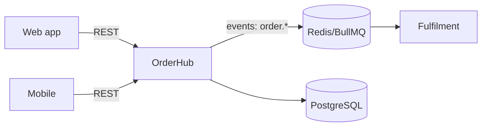

<!--
  destination: docs/context/architecture.md
  Layer: PROJECT context — loaded on demand (linked from AGENTS.md), not
  injected into every request. It can afford to be thorough, but it must stay
  true: agents trust this file over their own reading of the code.
  Owner: tech lead / architecture. Review cadence: quarterly, or on any
  structural change.
-->

# System Architecture — {Product Name}

## System context

<!-- 3–5 sentences: what the overall product does, who its users are, and where
this system sits in the larger landscape (upstream/downstream systems). Write
for a competent engineer from another team who has never seen this product. -->

## Components

<!-- One row per deployable/service. The "Entry point" column is for agents:
where to start reading. -->

| Component | Repo | Purpose | Owner | Entry point |
|---|---|---|---|---|
| Web app | `org/web` | Customer-facing storefront | Team Atlas | `src/app/routes.tsx` |
| OrderHub | `org/orderhub` | Order lifecycle API | Team Beacon | `src/api/routes/` |
| … | | | | |

## How the pieces talk

<!-- Keep the diagram at this altitude — services and protocols, not classes.
Below it, narrate the 2–3 flows that explain most of the system. -->

### Core flow: {e.g., placing an order}

<!-- Numbered narrative: request enters at X, validated by Y, state stored in
Z, event emitted to W. Name the actual modules/queues/tables. This paragraph
saves an agent an hour of tracing. -->

### Core flow: {e.g., refund}

## Environments

| Env | URL / access | Data | Deploys |
|---|---|---|---|
| dev | localhost via docker compose | seeded fake data | n/a |
| staging | … | anonymized snapshot | on merge to `main` |
| prod | … | real | tagged release, approval required |

## Cross-cutting rules

<!-- The 3–6 invariants that hold across all repos: auth model, idempotency
expectations, event naming, PII handling. Link to standards docs for depth. -->

## Decisions

Significant "why" lives in ADRs: `docs/context/decisions/`. Notable ones:

- `0007-idempotent-webhooks.md` — why all webhook handlers are idempotent
- …
