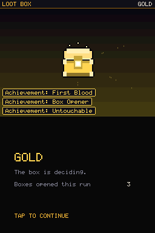

# Dungeon Crawler Carl — Book One

A **Nintendo DS game**. Not a DS-styled web page: a real `.nds` ROM that boots on
the hardware and on the emulators handhelds ship with, built for the
**Anbernic RG DS** and its two screens.

Earth's buildings have been repossessed by a game show. Carl went outside
barefoot, in boxer shorts, to catch his ex-girlfriend's cat. Everything above
ground collapsed while he was out there, which is the only reason he is alive.
Now he and Princess Donut are on floor one of eighteen, and four billion people
are watching.

```
dist/crawler-ds.nds     197 KB, no BIOS files, no DLDI patch, no save chip needed
```


*(Top screen and bottom screen, stacked, exactly as the DS outputs them.)*

---

## Play it on an Anbernic RG DS

1. Copy `dist/crawler-ds.nds` anywhere on the SD card.
2. Open it in the DS emulator the device came with (DraStic or melonDS — either
   is fine; the ROM is plain NTR homebrew with a standard 0x4000 header).
3. That is the whole setup. It needs no BIOS dump, no firmware image, no DLDI
   patch and no save chip: progress is carried by **recall codes**, so it
   behaves the same under every emulator.

It runs on anything else that runs DS software too — a flashcart on original
hardware, melonDS or DeSmuME on a desktop.

### Controls

The game is playable **entirely with buttons** or **entirely with the stylus**.
Both are always live.

| Button | In the dungeon | In a fight |
| --- | --- | --- |
| **D-pad up/down** | walk forward / back a tile | move the cursor |
| **D-pad left/right** | turn ninety degrees | move the cursor |
| **L / R** | sidestep without turning | — |
| **A** | use whatever you are standing on | confirm |
| **B** | — | back out of a menu |
| **START / X** | party, gear, achievements | — |
| **Y** | drink the cheapest healing item | — |

On the touch screen: a d-pad and four action buttons under the map, and one
button per command in a fight. Tapping an enemy's name picks it as the target.

---

## What it is

A first-person grid crawler in the shape the DS was built for — the maze on the
top screen, the map and your hands on the bottom one.

| | |
| --- | --- |
|  |  |
| **The floor.** Nested wall projections, per-floor palettes, side corridors that read as somewhere to go. The map draws itself as you walk. | **A fight.** Turn order by speed, six skills each, targets you can tap, and the show narrating over the top. |
|  |  |
| **The party.** Six attributes each, spent by hand on level-up, feeding every number in a fight. | **Loot boxes.** The show's entire economy, in four rarities. |

**Three floors, the arc of Book One.** The collapse and the tutorial floor; the
Works, where Mordecai turns up and classes get assigned; the Over City, where
there is a club and everything in it wants a piece of you. Sixteen briefings of
original prose in the System's voice, one boss per floor, and an ending.

**Systems.** Six attributes per hero with points you spend yourself; twelve
skills; gear in three slots; potions, bombs and revives; a Bopca-run shop; a
shrine; achievements that pay out in boxes; and a floor timer that eventually
stops being a suggestion.

**Recall codes instead of a save chip.** A System kiosk on each floor prints
sixteen characters. Type them in from the title screen — there is a keyboard on
the touch screen — and the run comes back: floor, levels, purse, achievements
and story. Attribute points are re-spent along each hero's own line, which is
the one thing the code does not carry.


---

## Everything in the ROM was made by code in this repo

No sprite was drawn in an image editor, no sample was recorded, no font was
licensed.

- **`tools/art/sprites.py`** — the cast. Each creature is a stack of ellipses,
  polygons and lines with one light source and an outline pass. 26 sprites.
- **`tools/art/font5x7.py`** — the font, drawn as ASCII art, seven rows of five
  cells per glyph, 104 glyphs including the System's arrows and pips.
- **`tools/mapgen.py`** — the floors. A perfect maze with rooms punched through
  it, extra loops, most dead ends pruned, then fixtures placed by walking
  distance from the entrance. It writes ASCII to `tools/floors/*.txt`, which is
  what the game actually reads — edit the text and the floor changes.
- **`src/core/audio.c`** — the soundtrack. Four PSG channels, four songs and
  nine effects, written as note tables. A few hundred bytes.
- **`tools/forge.py`** — turns all of it into `src/gen/art.c`, plus the ROM's
  banner icon and the preview sheets in `docs/art/`.


---

## Building it

The ROM is normally built with [devkitPro](https://devkitpro.org/). It was not
built that way here — devkitPro's servers are unreachable from this environment —
so the repo carries a script that assembles an equivalent toolchain from
upstream sources against your distribution's ARM compiler.

```bash
sudo apt install gcc-arm-none-eabi binutils-arm-none-eabi libnewlib-arm-none-eabi \
                 build-essential autoconf automake zlib1g-dev
cd crawler-ds
make sdk        # fetches libnds, the crt0/linker scripts and ndstool; ~12 seconds
make            # -> dist/crawler-ds.nds
```

**With devkitPro instead**, if you have it: the sources are ordinary libnds. Point
a standard `ds_rules` Makefile at `src/core`, `src/render`, `src/gen` and
`src/ds` for the ARM9 and `src/ds/arm7` for the ARM7, and it will build — with
one change, below.

### Three things worth knowing if you build DS homebrew

These cost a day to find and are the reason `tools/setup-sdk.sh` looks the way it
does.

1. **Link the ARM9 binary at `0x02004000`, not `0x02000000`.** devkitARM's
   historical linker script puts it at the bottom of main RAM, which is where a
   card's secure area lands; an emulator direct-booting the ROM will not start an
   ARM9 image there, and you get a white screen with no diagnostic. Modern
   devkitPro (calico) moved it for the same reason. The script patches
   `ds_arm9.mem` accordingly.
2. **Stock newlib needs a little glue.** devkitPro ships a patched newlib;
   against a distribution one you must supply `fake_heap_start`/`fake_heap_end`,
   `build_argv` and the reentrant file syscalls yourself, and stub
   `<sys/iosupport.h>`. libnds' `console.c` and `keyboard.c` want the full
   devoptab layer — this game draws its own text and its own keyboard, so they
   are simply left out of the library.
3. **Do not call `soundPlayPSG` from your frame loop.** It posts to the sound
   FIFO and then spins waiting for the ARM7 to answer. Called every frame it
   backs the FIFO up and the ARM9 waits forever — indistinguishable from a
   crash. `src/ds/audio.c` claims its four channels once, at silence, and after
   that only sends a FIFO word when a value actually changes.

---

## How it is tested

Two harnesses, both of which run without a DS.

```bash
make hosttest   # the game, on your desktop
make test       # the ROM, in an emulator
```

**`tools/hostsim`** compiles `src/core` and `src/render` — the same files the ROM
uses — against a stub platform layer, and plays the game with a bot that reads
the map and walks it. A full three-floor run takes about two seconds, so five
seeded playthroughs are a routine check that the game is still completable and
still roughly the right difficulty. It also checks the touch layout and
round-trips recall codes, including rejecting corrupted ones. Every screenshot in
`docs/shots/` comes from it.

**`tools/ndsbot`** drives the actual ROM. It loads DeSmuME's libretro core, feeds
it button presses and stylus taps from a script, writes PNGs, and — the useful
part — reads the game's own telemetry block **out of emulated main RAM** by
taking a save state and finding a magic number in it. So the assertions are
about real state ("floor 2", "Carl is level 3", "the frame counter is still
climbing") rather than about pixels, and they run against the ROM that ships.

```
$ make test
== boot
  ok   scene = 0
  ok   floor = 1
== the stylus alone can play it
  ok   steps > 4
== explore, fight, loot
  ok   battles_won >= 1
passed: 17 checks, 0 failures
```

---

## Layout

```
src/core/      the game: dungeon, battle, party, items, story, codes, audio
src/render/    the software renderer: corridor view, map, every screen
src/ds/        the DS: framebuffers, input, sound, and the ARM7 core
src/gen/       generated art and floor data (committed)
tools/art/     the sprite and font sources
tools/floors/  the three floors, as text you can edit
tools/hostsim/ the desktop build and its bot
tools/ndsbot/  the emulator harness
docs/          screenshots and art sheets
```

Both screens are plain 16-bit buffers in main RAM that the platform layer DMAs
to VRAM. Nothing is redrawn unless something visible changed — a turn-based
crawler is a still image most of the time — which is the difference between the
DS running this at 30 frames a second and at 60.

---

## Next version

The look gets a full pass: this build's art and UI are a working first draft, not
the finished thing. Everything the redesign needs is already isolated —
`tools/art/*` for the cast, `src/render/theme.h` for the palette, and one
renderer per screen — so it can be replaced without touching the game.

Also queued: ceiling detail on the lower floors, an encounter transition, and
floors four onward.

---

## Credit

This is an unofficial fan game. *Dungeon Crawler Carl* is by **Matt Dinniman**,
and Carl, Princess Donut, Mordecai and the premise are his. No text from the
books is reproduced here — every line the System speaks was written for this
ROM. See [LICENSES.md](LICENSES.md).
