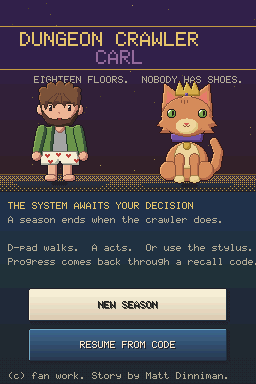
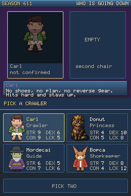
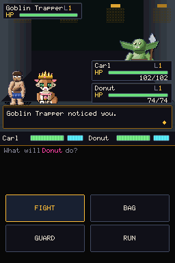
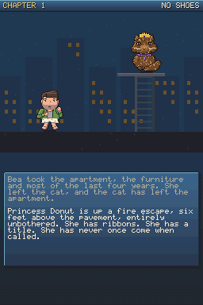
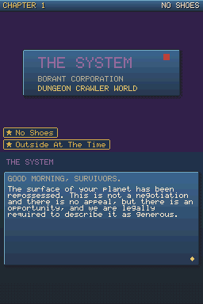
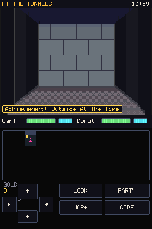
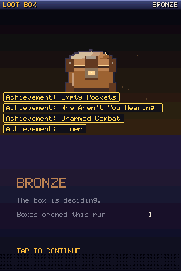
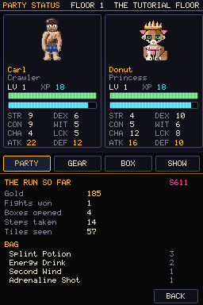
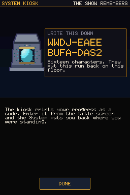
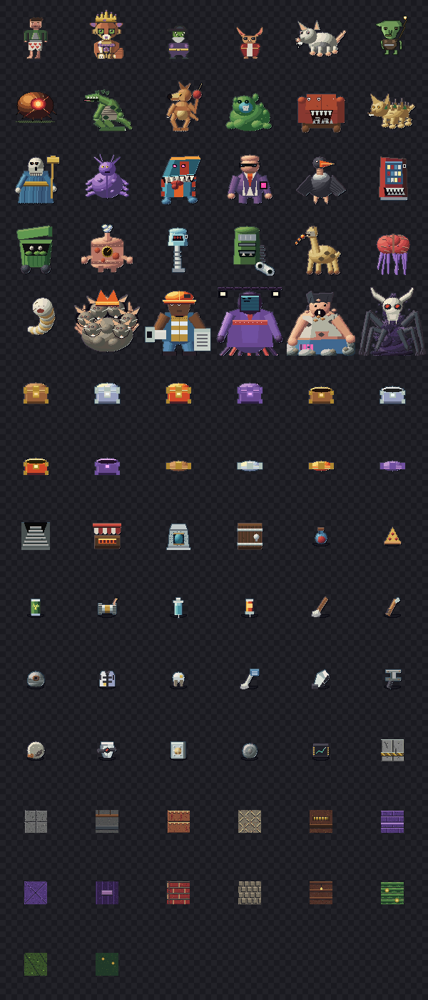

# Dungeon Crawler Carl — Book One

A **Nintendo DS game**. Not a DS-styled web page: a real `.nds` ROM that boots on
the hardware and on the emulators handhelds ship with, built for the
**Anbernic RG DS** and its two screens.

Earth's buildings have been repossessed by a game show. Carl went outside
barefoot, in boxer shorts, to catch his ex-girlfriend's cat. Everything above
ground collapsed while he was out there, which is the only reason he is alive.
Now he and Princess Donut are on floor one of eighteen, and four billion people
are watching.

```
dist/crawler-ds.nds     197 KB, no BIOS files, no DLDI patch, no save chip needed
```



*(Top screen and bottom screen, stacked, exactly as the DS outputs them.)*

---

## Play it on an Anbernic RG DS

1. Copy `dist/crawler-ds.nds` anywhere on the SD card.
2. Open it in the DS emulator the device came with (DraStic or melonDS — either
   is fine; the ROM is plain NTR homebrew with a standard 0x4000 header).
3. That is the whole setup. It needs no BIOS dump, no firmware image, no DLDI
   patch and no save chip: progress is carried by **recall codes**, so it
   behaves the same under every emulator.

It runs on anything else that runs DS software too — a flashcart on original
hardware, melonDS or DeSmuME on a desktop.

### Controls

The game is playable **entirely with buttons** or **entirely with the stylus**.
Both are always live.

| Button | In the dungeon | In a fight |
| --- | --- | --- |
| **D-pad up/down** | walk forward / back a tile | move the cursor |
| **D-pad left/right** | turn ninety degrees | move the cursor |
| **L / R** | sidestep without turning | — |
| **A** | use whatever you are standing on | confirm |
| **B** | — | back out of a menu |
| **START / X** | party, gear, achievements | — |
| **Y** | drink the cheapest healing item | — |

On the touch screen: a d-pad and four action buttons under the map, and one
button per command in a fight. Tapping an enemy's name picks it as the target.

---

## What it is

A first-person grid crawler in the shape the DS was built for — the maze on the
top screen, the map and your hands on the bottom one.

| | |
| --- | --- |
|  |  |
| **The draft.** Two of four go down each season. Nothing on the roster is strictly better than anything else, and the Bopca is a genuinely bad idea that sometimes works. | **A fight.** Laid out the way the DS Pokemon games do it — their box top-left, yours bottom-right, one message at a time, four commands on the touch screen. |
|  |  |
| **The cold open.** A street at three in the morning, a cat up a fire escape, and questions that expect an answer. Plays once a sitting. | **The announcement.** The surface has been repossessed, entry is voluntary, and the audience is already watching. |
|  |  |
| **The floor.** Nested wall projections, per-floor palettes, side corridors that read as somewhere to go. The map draws itself as you walk. | **Loot boxes.** The show's entire economy, in four rarities. |
|  |  |
| **The party.** Six attributes each, spent by hand on level-up, feeding every number in a fight. | **Recall codes.** A suspend, not a life: the show only prints one while the crawler is alive. |

**A roguelike, because the fiction already is one.** The dungeon is a game
show that reruns with new crawlers every season, so permadeath is not a
mechanic bolted on — it is the premise. Each run picks a season seed, generates
eighteen floors from it, and ends when the crawlers do. Depth is the score.

**Two crawlers go down per season, and you pick them.** Carl, Princess Donut,
Mordecai and the Bopca, each with their own stats and their own six moves; the
pair you take is the run's first real decision and it is made before anything
is known about the dungeon. Recall codes carry who went down, so resuming a
season gives you back the people who were in it.

**The collapse plays once a sitting.** Book One's cold open — Carl outside at
three in the morning after his ex's cat, the ninety seconds that kill everyone
who was indoors, and the offer that follows — runs before your first season and
is skipped after it, because it happens to everybody and it happens once.

Everything written for this game is original prose in the System's voice. No
text from the books is reproduced anywhere in it.

**Fights are laid out like the DS Pokemon games.** Battle on the top screen,
commands on the touch screen. Their health box top-left, yours bottom-right,
name and level and a bar that turns gold then red. One message at a time, typed
out, waiting to be read — a turn that resolves faster than you can follow it is
a turn nobody saw. FIGHT, BAG, GUARD, RUN in a two-by-two block.

**Systems.** Six attributes per hero with points you spend yourself; twelve
skills; gear in three slots; potions, bombs and revives; a Bopca-run shop; a
shrine; achievements that pay out in boxes; and a floor timer that eventually
stops being a suggestion.

**A new season every run.** All eighteen floors are generated when you descend,
from a seed the run picks at the title screen — rooms, corridors, the shop, the
shrine, the kiosk, the loot and the story beats all land somewhere different.
Floors grow and the bestiary scales with depth, so a floor-fourteen Bramble
Hound is the same drawing and a different problem.

**Neighbourhoods.** Book One describes the first floor not as one maze but as
squares of neighbourhoods bordered by wide passageways, each with its own local
mob — so that is what the generator builds. Every room is tagged, the top bar
says which one you are standing in (`F1 GOBLIN WORKSHOP`), and what jumps you
depends on where you are rather than only on how deep. The named ones on the
early floors are the book's; which creature stands in each is this game's own
bestiary, and nothing in it claims to be what is actually in the Goblin
Workshop.

**On what Book One actually covers:** floors one and two. The Over City is
where Book Two goes, and floors four to eighteen are this game's invention —
the show runs eighteen floors whatever the books have got to so far.
The way out is always the room farthest from the way in, sealed, with the boss
standing in its only doorway, so a floor is a journey that ends in a fight
rather than a corridor you might walk straight down. The run's season number
shows on the party screen and on the screen that tells you how it ended.

**Recall codes instead of a save chip.** A System kiosk on each floor prints
twenty characters. Type them in from the title screen — there is a keyboard on
the touch screen — and the run comes back: floor, levels, purse, achievements,
story, and the season seed, so you return to the same dungeon rather than
somebody else's. Attribute points are re-spent along each hero's own line, which
is the one thing the code does not carry.


---

## Everything in the ROM was made by code in this repo

No sprite was drawn in an image editor, no sample was recorded, no font was
licensed.

- **`tools/art/forge_tools.py`** — the drawing toolkit. Forms are shaded by a
  real lambert term against one key light, so the highlight lands off-centre
  instead of filling the middle of every shape. Ramps move in hue as well as
  value (`tools/art/palettes.py`): shadows drift toward a cool ambient, highlights
  toward a warm key, which is the difference between a lit material and five
  shades of the same plastic. Two passes finish every sprite — a cool rim light
  on the edges facing away from the key, and an outline that takes its colour
  from the material it wraps rather than being a flat black key line. Faces are
  placed pixel by pixel with `stamp()`, because nothing procedural reads as a
  face. Coats meet along `feather()`, which interlocks two materials with
  tongues of fur so a boundary reads as hair instead of a shelf; `soften_edges()`
  anti-aliases a curve by stepping the inside corner of each staircase one down
  its own ramp; and `taper_line()` draws a whisker that fades instead of a line
  that scratches.
- **`tools/art/cast.py`, `bestiary.py`, `props.py`** — the 26 drawings
  themselves: the party at 56×72, the bestiary at 72×72, the bosses at 96×96 and
  the furniture at 40×40.
- **`tools/art/font5x7.py`** — the font, drawn as ASCII art, seven rows of five
  cells per glyph, 104 glyphs including the System's arrows and pips.
- **`src/core/mapgen.c`** — the floors, built on the DS itself when you
  descend. Rooms are placed and joined in sequence, which makes the floor
  connected by construction; then the exit room is sealed, one doorway is cut
  into it, and the boss is put in that doorway. Sealing can strand a branch
  whose only corridor ran along the ring, so anything the flood cannot see is
  dug back in — by breadth-first route rather than an L, because an L can be
  blocked at both elbows by the ring and then every repair pass retries the same
  blocked route. `hostsim --mapsweep` checks four thousand seeds on every test
  run: a layout that looks fine and has its stairs behind a wall is a dead run,
  and it is exactly what a generator produces once in a few hundred tries.
- **`src/core/audio.c`** — the soundtrack. Four PSG channels, four songs and
  nine effects, written as note tables. A few hundred bytes.
- **`tools/forge.py`** — turns all of it into `src/gen/art.c`, plus the ROM's
  banner icon and the preview sheets in `docs/art/`.



---

## Building it

The ROM is normally built with [devkitPro](https://devkitpro.org/). It was not
built that way here — devkitPro's servers are unreachable from this environment —
so the repo carries a script that assembles an equivalent toolchain from
upstream sources against your distribution's ARM compiler.

```bash
sudo apt install gcc-arm-none-eabi binutils-arm-none-eabi libnewlib-arm-none-eabi \
                 build-essential autoconf automake zlib1g-dev
cd crawler-ds
make sdk        # fetches libnds, the crt0/linker scripts and ndstool; ~12 seconds
make            # -> dist/crawler-ds.nds
```

**With devkitPro instead**, if you have it: the sources are ordinary libnds. Point
a standard `ds_rules` Makefile at `src/core`, `src/render`, `src/gen` and
`src/ds` for the ARM9 and `src/ds/arm7` for the ARM7, and it will build — with
one change, below.

### Three things worth knowing if you build DS homebrew

These cost a day to find and are the reason `tools/setup-sdk.sh` looks the way it
does.

1. **Link the ARM9 binary at `0x02004000`, not `0x02000000`.** devkitARM's
   historical linker script puts it at the bottom of main RAM, which is where a
   card's secure area lands; an emulator direct-booting the ROM will not start an
   ARM9 image there, and you get a white screen with no diagnostic. Modern
   devkitPro (calico) moved it for the same reason. The script patches
   `ds_arm9.mem` accordingly.
2. **Stock newlib needs a little glue.** devkitPro ships a patched newlib;
   against a distribution one you must supply `fake_heap_start`/`fake_heap_end`,
   `build_argv` and the reentrant file syscalls yourself, and stub
   `<sys/iosupport.h>`. libnds' `console.c` and `keyboard.c` want the full
   devoptab layer — this game draws its own text and its own keyboard, so they
   are simply left out of the library.
3. **Do not call `soundPlayPSG` from your frame loop.** It posts to the sound
   FIFO and then spins waiting for the ARM7 to answer. Called every frame it
   backs the FIFO up and the ARM9 waits forever — indistinguishable from a
   crash. `src/ds/audio.c` claims its four channels once, at silence, and after
   that only sends a FIFO word when a value actually changes.

---

## How it is tested

Two harnesses, both of which run without a DS.

```bash
make hosttest   # the game, on your desktop
make test       # the ROM, in an emulator
```

**`tools/hostsim`** compiles `src/core` and `src/render` — the same files the ROM
uses — against a stub platform layer, and plays the game with a bot that reads
the map and walks it. A full three-floor run takes about two seconds, so five
seeded playthroughs are a routine check that the game is still completable and
still roughly the right difficulty. It also checks the touch layout, round-trips
recall codes including rejecting corrupted ones, and sweeps four thousand season
seeds to prove every generated floor can actually be finished. Every screenshot
in `docs/shots/` comes from it.

`hostsim --map <seed>` prints a season's three floors as text, with any floor
the party cannot reach marked `?`. Three separate generator bugs were each
found by looking at that output rather than by reasoning about the code.

**`tools/ndsbot`** drives the actual ROM. It loads DeSmuME's libretro core, feeds
it button presses and stylus taps from a script, writes PNGs, and — the useful
part — reads the game's own telemetry block **out of emulated main RAM** by
taking a save state and finding a magic number in it. So the assertions are
about real state ("floor 2", "Carl is level 3", "the frame counter is still
climbing") rather than about pixels, and they run against the ROM that ships.

```
$ make test
== boot
  ok   scene = 0
  ok   floor = 1
== the stylus alone can play it
  ok   steps > 4
== explore, fight, loot
  ok   battles_won >= 1
passed: 17 checks, 0 failures
```

---

## Layout

```
src/core/      the game: dungeon, battle, party, items, story, codes, audio
src/render/    the software renderer: corridor view, map, every screen
src/ds/        the DS: framebuffers, input, sound, and the ARM7 core
src/gen/       generated art and floor data (committed)
tools/art/     the sprite and font sources
tools/hostsim/ the desktop build and its bot
tools/ndsbot/  the emulator harness
docs/          screenshots and art sheets
```

Both screens are plain 16-bit buffers in main RAM that the platform layer DMAs
to VRAM. Nothing is redrawn unless something visible changed — a turn-based
crawler is a still image most of the time — which is the difference between the
DS running this at 30 frames a second and at 60.

---

## Next version

The cast has had its pass — proportions, lighting, hand-drawn faces — and the
screens were re-laid-out around it. The **UI** is next: the panels, the HUD and
the type are still the working first draft the art used to be. Everything that
redesign needs is isolated: `src/render/theme.h` holds every colour, and each
screen has its own function in `src/render/render.c`, so it can be replaced
without touching the game underneath.

Also queued: ceiling detail on the lower floors, an encounter transition, and
floors four onward.

---

## Credit

This is an unofficial fan game. *Dungeon Crawler Carl* is by **Matt Dinniman**,
and Carl, Princess Donut, Mordecai and the premise are his. No text from the
books is reproduced here — every line the System speaks was written for this
ROM. See [LICENSES.md](LICENSES.md).
