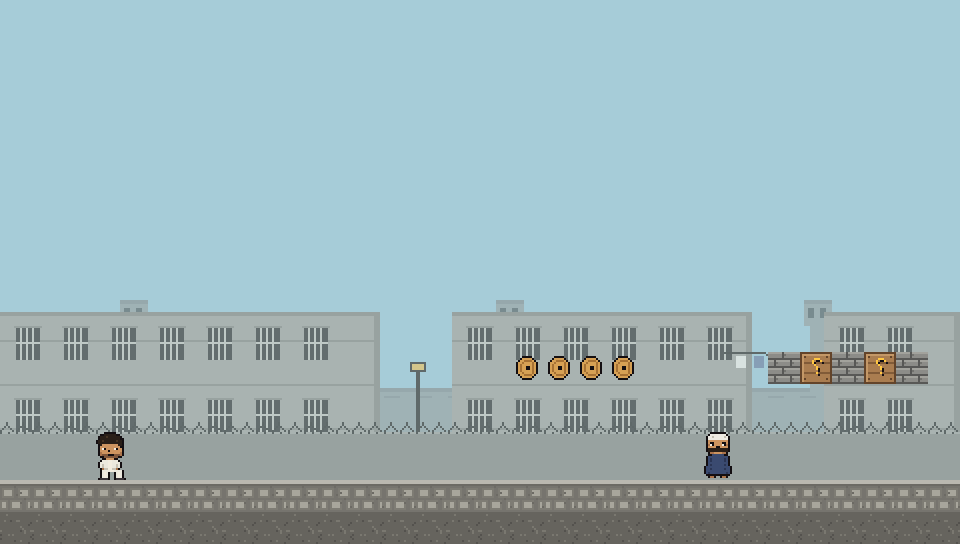
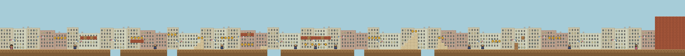
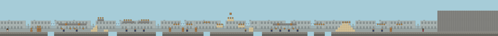
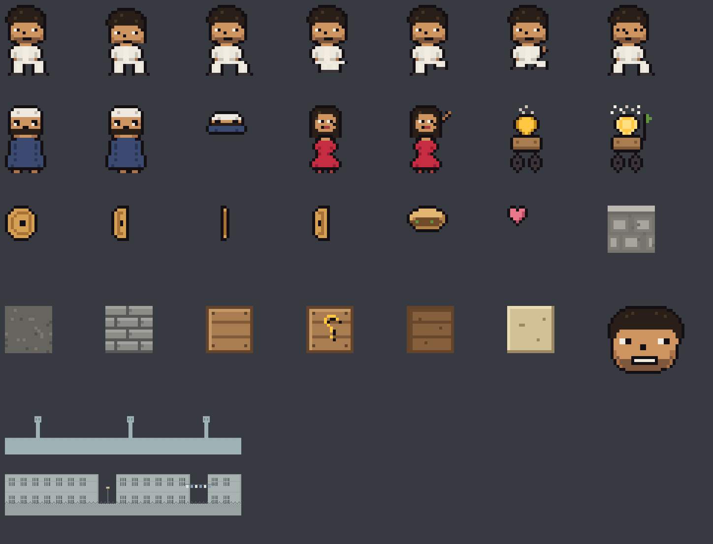

# اللمبي: مغامرات الحارة 🎮

لعبة منصّات (platformer) بيكسل-آرت أصلية لنظامي **macOS وWindows**، مستوحاة من فيلم
الكوميديا المصري **«اللمبي» (٢٠٠٢)** وبروح ماريو الكلاسيكية. اجري وانط بالـلمبي من أول
الحارة لغاية ما توصل لنوسة — والفكة اللي في السكة، لمّها!



> لعبة معجبين غير رسمية. كل الرسوم والأصوات مصنوعة من الصفر داخل المشروع —
> لا تستخدم أي مواد من الفيلم.

## العب في المتصفح — على أي جهاز 🌐

النسخة الثالثة من اللعبة ملف HTML **واحد** مكتفٍ بذاته (~70 كيلوبايت):
المحاكاة، الرسوم، والموسيقى بتتولّد جوّا الصفحة نفسها — من غير أي تحميلات خارجية.

```bash
python3 tools/build_web.py     # → web/ellemby.html
open web/ellemby.html          # أو افتحه بأي متصفح — أو ارفعه على أي استضافة
```

- يشتغل على الموبايل بأزرار لمس ✋
- استنى ٧ ثواني على شاشة البداية وهتشوف **عرض تجريبي** — البوت بيلعب قدامك زي
  ماكينات الأركيد زمان (أو افتح `ellemby.html?demo=1` مباشرة)
- اختبارات المحاكاة نفسها بتتشغّل بـ node: ‏`node web/test.js`

## التشغيل على macOS (13+)

نسخة macOS أصلية بالكامل: Swift + SpriteKit + AppKit، بدون أي اعتماديات خارجية.

> 📖 **دليل كامل للتثبيت على MacBook Air (M1–M5) خطوة بخطوة — شامل حل Gatekeeper
> والنسخة الجاهزة للتنزيل:** [docs/INSTALL-macOS.md](docs/INSTALL-macOS.md)

الطريقة السريعة للمطورين:

```bash
cd el-lemby-platformer
swift run ElLemby        # أو: make run
```

لبناء تطبيق `.app` وتثبيته:

```bash
make icon app            # → dist/ElLemby.app (أضف UNIVERSAL=1 لنسخة عالمية)
make install             # → /Applications/ElLemby.app
```

وتقدر تفتح المشروع في Xcode مباشرة: `open Package.swift`. كما إن كل تشغيلة CI
ناجحة بترفع تطبيقًا جاهزًا (artifact باسم `ElLemby-macos`) — بدون أي أدوات بناء.

## التشغيل على Windows (10/11)

نسخة Windows أصلية بالكامل: C‏# ‏+ WinForms + GDI+ (‏.NET 8، بدون أي حزم خارجية) —
بنفس الرسوم والأصوات والمرحلة، ونفس إحساس الحركة بالظبط.

```powershell
cd el-lemby-platformer\windows
dotnet run --project ElLemby.App        # يتطلب .NET 8 SDK
```

ولبناء ملف `exe` واحد تنقله لأي جهاز Windows:

```powershell
dotnet publish ElLemby.App -c Release -r win-x64 --self-contained -p:PublishSingleFile=true -o publish
```

اختبارات المحاكاة والمنطق تشتغل على أي نظام (Windows/Linux/macOS):

```bash
dotnet run --project windows/ElLemby.Tests
```

## التحكم

| المفتاح | الفعل |
|---|---|
| ← → أو A / D | المشي |
| المسافة أو ↑ أو W | النط (اضغط أطول تنط أعلى) |
| P أو Esc | إيقاف مؤقت |
| M | كتم الصوت |
| ⌘Q | خروج |

انط فوق البلطجية عشان تكسّبهم، وخبط الصناديق اللي عليها «؟» من تحت — فيها فكة،
وواحد فيهم فيه **ساندوتش فول** يديك ضربة حماية زيادة. ولما تلاقي **عربية الفول**
في السكة، المسها — دي نقطة تفتيش: لو خسرت روح بترجع من عندها مش من أول المرحلة.

اللعبة فيها مرحلتين: **«الحارة»** ثم **«شارع السوق»** — الأرواح والنقاط بتكمل
معاك من مرحلة للتانية.

## The game (English)

A native pixel-art side-scroller (left → right) for **macOS and Windows**,
inspired by the Egyptian comedy film **El-Lemby (2002)**, with classic Mario
feel: run/jump physics with coyote time & jump buffering, stompable enemies
(neighborhood thugs), coin pickups (الفكة), ؟-crates, a foul-sandwich
power-up, **foul-cart checkpoints** (touch the عربية فول to respawn there),
a countdown timer, lives, and a goal NPC (Nousa). Two stages ship today —
«الحارة» and the harder «شارع السوق» — with lives and score carrying across.

Everything is Arabic-first: HUD, menus, and Eastern Arabic numerals. Input is
keycode-based, so it works identically on Arabic keyboard layouts.

Three frontends share the same generated assets and level files:

- **Web** — a single self-contained ~70 KB `web/ellemby.html` (canvas + a JS
  port of the gameplay sim + **WebAudio chiptune synthesized in-page** from
  the same note data — no audio files shipped). Touch controls on phones,
  and an arcade **attract mode**: idle 7s on the title and the test-suite
  bot plays a live demo. `node web/test.js` runs the full sim/bot suite.

- **macOS** — Swift + SpriteKit + AppKit (`swift run ElLemby`, macOS 13+).
  Step-by-step install/setup/launch guide for MacBook Air (M-series) —
  including the prebuilt `ElLemby-macos` CI artifact and Gatekeeper notes:
  [docs/INSTALL-macOS.md](docs/INSTALL-macOS.md).
- **Windows** — C# + WinForms + GDI+ on .NET 8, zero NuGet packages
  (`dotnet run --project windows/ElLemby.App`). The gameplay lives in a
  platform-neutral simulation library (`windows/ElLemby.Core`) with custom
  AABB/tile physics tuned to the same constants as the SpriteKit build, so
  the two versions play identically — and the sim is fully unit-tested,
  including a bot that must complete stage 1 on every test run
  (`dotnet run --project windows/ElLemby.Tests`, runs on any OS).

## بنية المشروع | Project layout

```
el-lemby-platformer/
├── Package.swift                  # SwiftPM: مكتبة ElLembyCore + تنفيذي ElLemby
├── Sources/
│   ├── ElLemby/main.swift         # نقطة الدخول
│   └── ElLembyCore/
│       ├── App/                   # نافذة AppKit والقائمة
│       ├── Core/                  # الثوابت، الحالة، النصوص العربية
│       ├── Art/                   # تحميل الرسوم + الألوان
│       ├── Audio/                 # المؤثرات والموسيقى
│       ├── World/                 # قارئ المراحل + باني العالم
│       ├── Entities/              # اللمبي، البلطجي، الفكة، نوسة…
│       ├── Scenes/                # البداية، اللعب، النتيجة + HUD
│       └── Resources/             # sprites/ sfx/ music/ levels/
├── Tests/ElLembyTests/
├── web/                           # نسخة المتصفح (ملف واحد، صوت مولّد داخل الصفحة)
│   ├── src/                       # المحاكاة + الراسم + المشاهد + البوت (ES modules)
│   ├── test.js                    # نفس منظومة الاختبارات تعمل بـ node
│   └── ellemby.html               # الناتج النهائي — افتحه والعب
├── windows/                       # نسخة Windows (‏.NET 8، بدون حزم خارجية)
│   ├── ElLemby.Core/              # محاكاة اللعب الكاملة + قارئ المراحل (يشتغل على أي نظام)
│   ├── ElLemby.App/               # نافذة WinForms + راسم GDI+‎ + صوت MCI
│   └── ElLemby.Tests/             # ٥٣ اختبارًا — منها بوت يكمّل المرحلة كاملة
├── tools/                         # مولّدات الأصول (Python، بدون اعتماديات)
│   ├── generate_assets.py         # كل البيكسل-آرت → PNG
│   ├── generate_sfx.py            # مؤثرات ومقطع موسيقى «حجاز» → WAV
│   ├── build_level1.py            # يبني المرحلة ١ → level1.txt
│   └── render_level.py            # يرسم المرحلة صورة للمراجعة
└── docs/                          # DESIGN.md + الصور
```

## تعديل المرحلة | Editing the stage

المراحل ملفات نصية بسيطة — حرف واحد لكل بلاطة 16×16
(`Sources/ElLembyCore/Resources/levels/level1.txt`):

```
.  هواء      G  أرضية     D  ردم       B  طوب
X  صندوق     =  حجر رملي   ?  صندوق فكة  F  صندوق فول
o  فكة       P  بداية اللمبي  E  بلطجي   N  نوسة (النهاية)
```

```
C  نقطة تفتيش (عربية الفول)
```

عدّل الملفات يدويًا، أو عدّل `tools/build_level1.py` / `tools/build_level2.py`
وشغّلهما من جديد. عاين النتيجة بدون ماك عن طريق `python3 tools/render_level.py`:





## الأصول | Asset pipeline

كل الرسوم والأصوات **مولّدة برمجيًا** وقابلة لإعادة التوليد:

```bash
make assets   # python3 فقط — بدون Pillow أو numpy
```



## خارطة الطريق | Roadmap

راجع [docs/DESIGN.md](docs/DESIGN.md) للتصميم الكامل. أبرز الخطوات الجاية:

- [x] ~~مرحلة ثانية: شارع السوق~~ + نقاط تفتيش (عربية الفول) ✅
- [ ] مراحل جديدة: الميكروباص، الفرح 🎊
- [ ] خط عربي بيكسلي للواجهة بدل Geeza Pro
- [ ] حركات خاصة للمبي (الجري السريع، «اللمبي-ستايل» تعليقات صوتية)
- [ ] زعيم مرحلة (الفتوة) + أنواع أعداء إضافية
- [ ] حفظ التقدّم، وشاشة اختيار مراحل
- [ ] دعم يد التحكم (Game Controller framework)
