# Slice log

Each slice cuts through every layer (art generator → pack → engine → gameplay → UI → save → tests) and ends
playable. The plan is in [`slices.md`](../../_bmad-output/planning-artifacts/qahira/slices.md). This file records
what each slice actually delivered and how it was verified.

## Slice 0 · First Light

**Delivered**
- **Engine:** the libretro core (GLES 3.2 on Android, GL 4.1 core on the Mac) and `qhost`, the SDL2 dev frontend
  (a window or headless).
- **Renderer:** forward lighting with lights binned into screen tiles (64 per frame), GPU skinning from a bone
  texture, instanced batches, HDR with a six-level bloom, and an ACES-graded composite.
- **UI:** SDF text (Inter), rounded panels, rings and orbs.
- **Asset pipeline:**
  - the Warrior: 15.5k triangles, skinned to the shared 22-bone rig;
  - eight procedural clips: idle, run, slam, swing, warcry, dodge, hit, death;
  - a two-handed maul held through IK;
  - three generated downtown Cairo street tiles with colliders and lights.
- **Gameplay:** the Warrior moves with the stick, slams, swings, warcries and dodge-rolls down a generated street,
  colliding with buildings, lamps and crates. A rumble pulse fires on impact.
- **Save states:** the whole sim state, versioned.

**Verified**

| Check | Result |
|---|---|
| `tools/build_all.sh` regenerates art, pack, Mac build and Android build from scratch | pass |
| All shaders compile as GLSL ES 3.00 (`glslangValidator`) | pass (0 failures) |
| Android core: aarch64, exports all 25 `retro_*` symbols, links only system libraries (GLESv3, EGL, log, android, m, dl, c) | pass |
| Headless bot `walk`: walks up the street, round-trips a save state, asserts distance and restored position | pass (10.5 m) |
| Render check: screenshot at frame 90 | pass (build/screenshot.png) |
| RetroArch on macOS | blocked by a RetroArch macOS driver bug (see ENGINE.md); qhost covers the same API |
| On-device checks (RP6) | pending, see [RP6.md](RP6.md) |

## Slice 1 · One Fight

**Delivered**
- **Stat engine:** the modifier engine and the damage pipeline (GDD §8), with golden unit tests in `qtests`.
- **Ghouls:** generated with eight clips, as three kinds:
  - a swarmer that claws;
  - a Grave Bruiser that does a telegraphed two-armed slam;
  - a Bile Spitter that kites and leads its shots.

  Rares roll two mods, a generated name and a gold rim.
- **Warrior kit:**
  - **Crushing Blow:** every third hit in a row cracks the ground.
  - **Earthshatter:** a slam that leaves three cracks.
  - **Rallying Shout:** builds Break in nearby enemies and gives 40% more damage on the next three hits.
  - **Aftershock:** detonates every crack in range.
  - **Dodge roll**, and a **life flask** on the rear button (M1 → L3).
- **Break:** hits fill a meter; when it's full the target is stunned, then takes 50% more damage.
- **Hit feel:** hit-stop, camera shake, knockback, hit flashes and rumble.
- **Items:**
  - item bases and tiered affixes, with generated rare names;
  - drops and loot beams;
  - a tooltip that shows the DPS change against the equipped weapon;
  - equip with the D-pad.
- **XP and levels.** Death shows "You fell in the long night" and lets you rise again at the start.
- **HUD:** life and mana orbs, a skill bar with position-based button glyphs, a rare target frame with mods and a
  Break meter, crit numbers, loot labels.
- **Location:** a generated Khan el-Khalili souq with lamps, lantern racks, spice sacks, brass trays and mashrabiya.
  The fight runs from the street into the souq.
- **Sound:** all synthesised; 19 effects, Cairo night ambience, and a maqam Hijaz loop on oud, qanun, ney, darbuka
  and riq. A 32-voice mixer in the core.
- **Save states:** the whole world state.

**Verified**

| Check | Result |
|---|---|
| Unit tests (`qtests`) | pass, 6 golden cases |
| `fight` bot: clears all 18 ghouls including the rare, equips its rare drop, round-trips a save state mid-fight | pass (level 3, 0 deaths) |
| `walk` bot | pass |
| Audio capture during the fight (`--wav`) | peak 0.78, RMS −21 dBFS, no clipping |
| Shaders as GLSL ES 3.00 | pass |
| Android core builds | pass |
| On-device feel review | pending (RP6) |

## Slice 2 · One Zone

*From the rooftop hub down into the City of the Dead, through Umm al-Ghūla, and home.*

**Delivered**
- **The rooftop ahwa (hub):**
  - Amm Sayed, the ahwa keeper, on the shared rig with an idle clip, beside his counter; a street cat;
  - the stair down to the zone, and the town portal back when one is open;
  - a fade between areas, the area's name as a banner, and its own music and ambience.
- **The City of the Dead (zone):**
  - generated per visit on a 4×6 grid of 16 m cells: a biased random walk from the entrance gate to the boss court,
    three side branches, and a landmark;
  - cells are built from seven canonical necropolis tiles (end, straight, corner, tee, cross, entrance, court),
    two variants each, rotated in quarter turns;
  - the landmark is an open court around a qubba (a small domed canopy on four columns) over an old cenotaph, with
    a sabil basin. It holds the Lamplighter's cache, guarded by a rare pack;
  - branch dead ends hold rare or magic packs; monster density rises with depth.
- **Umm al-Ghūla, Mother of the Ghouls (boss):**
  - a new rig variant (2.45 m, hunched) with hair, a tattered shroud, a necklace of bones and talons, and eight
    clips;
  - phase 1: claw combos (telegraphed cone, two hits) and leap-slams (telegraphed landing, clamped to her court);
  - at 55% life she summons five ghouls from the graves ("Rise, my children");
  - phase 2: 25% faster, and a wail every 11 s (7.5 m, chaos damage scaled to the hero's life) that leaves her
    exhausted, a 3 s Break window;
  - Break builds at half rate and lasts longer. She keeps to her court: if the hero truly escapes (or dies) she
    walks home and heals;
  - she drops four items, four currencies (always a Gilded Piastre) and a heap of dinars; an exit portal opens in her
    court.
- **Belongings:**
  - a 12×5 inventory, with PoE item sizes (a maul is 2×4, a ring 1×1) and column-first placement;
  - a nine-slot paper doll (two rings);
  - five crafting currencies. They carry street names but do plain PoE jobs, and the tooltip always says which:
    Blue Bead (transmute), Pinch of Salt (augment), Coffee Grounds (alteration), Saffron Thread (alchemy), Gilded
    Piastre (regal);
  - dinars (gold). Currency and dinars drop as their own ground loot and are picked up by walking over them.
- **Loot filter:** Story, Standard, Strict and Uber presets, switchable in the menu or with D-pad Right in the field.
  Hidden items are not drawn, labelled or selectable.
- **Menu hub (Start):**
  - Inventory, Character and Loot Filter tabs on L1/R1;
  - a cursor that walks cells and treats each item as one stop;
  - item cards with the ±DPS against what you wear, and the equipped piece beside them;
  - South to equip, unequip or use a held currency; North to drop;
  - the world pauses while it's open.
- **Vendor:** Amm Sayed's wares, nine items restocked on each visit, beside your belongings. Sell from your
  inventory, and buy items or currency with dinars.
- **Portal and map:**
  - D-pad Up opens a town portal. The zone instance stays alive, with its monsters, loot and cache, while you're on
    the rooftop, and the portal leads back to the same spot;
  - D-pad Down toggles an overlay map of explored cells, fogged neighbours, the portal, the exit, the cache and the
    boss.
- **Death:** you rise at the zone entrance. A boss you were fighting heals and returns to her court, and her brood
  sinks back into the ground.
- **Character file:** `qahira.character` in RetroArch's save directory. It holds level, XP, equipment, inventory,
  currency, dinars and the filter preset. It's written atomically when you arrive home, close the menu, level up
  or quit.
- **Save states v4:** add the areas, the kept zone instance, interactables and the boss's phase and home. The level
  and NPCs are rebuilt from the saved layout on load.
- **Engine:**
  - an A* nav grid on the level (0.5 m cells rasterised from the colliders, string-pulled paths);
  - distance culling of level tiles;
  - NPC collision.
- **Fix:** skills now aim where the stick points. Before, they aimed where the body faced, which after a dodge is
  the roll direction, so the next swings hit empty air. The zone bot found it: fixing it took the run from 3 deaths
  in 418 s to 0 deaths in 163 s.
- **Audio:**
  - the necropolis night (wind, crickets, a far dog);
  - a maqam Saba zone theme on qanun;
  - a driving boss track in Kurd at 128 bpm;
  - ten new effects: portal, dinars, currency, craft, sell, inventory full, the chest, her wail, her leap, and the
    summoning.

**Verified**

| Check | Result |
|---|---|
| Unit tests (`qtests`) | pass, 12 cases (6 new: inventory placement, every currency's rules, mask rotation, 300 generated zones are connected with dead-end courts, the nav grid, the character file round trip) |
| `zone` bot: a fresh character goes hub → stair → zone, portals home and back to the same streets, opens the cache, fights Umm al-Ghūla (with a save state round trip mid-fight, in phase 2), takes the exit portal home, sells to and buys from the vendor (checking the arithmetic), and round-trips the character file | pass (13 cells, level 5, 71 kills, 0 deaths, 163 s of game time) |
| `fight` bot, now equipping through the inventory menu | pass (18 ghouls, 0 deaths) |
| `walk` bot, now on the rooftop | pass |
| `tour` (screenshots of every screen) | rooftop, inventory, character sheet, filter, vendor, zone, map, boss |
| Shaders as GLSL ES 3.00; Android core builds | pass |
| On-device feel review | pending (RP6) |

| | |
|---|---|
| 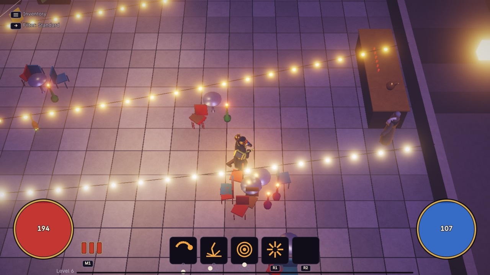 | 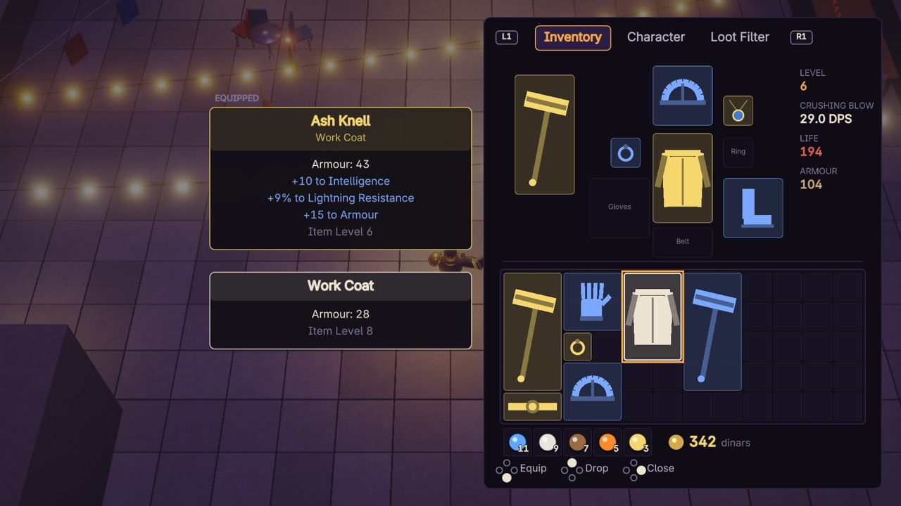 |
| 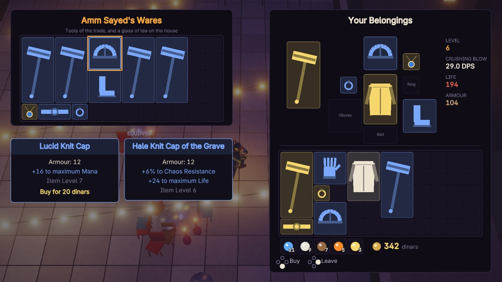 | 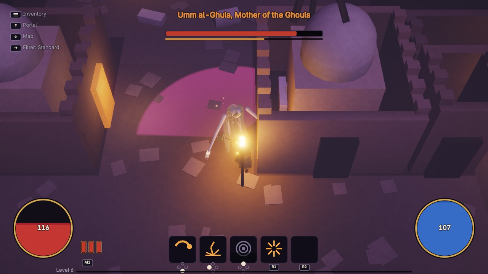 |

**Known gaps (carried forward)**
- Monsters still chase in straight lines. The nav grid exists, but only the bots use it so far.
- Items still have no unique bases. Uniques come with the Act I content in Slice 4.
- The boss tuning comes from the bot, which is a middling player. It needs a human pass on the device.

## Slice 3 · One Sky

*The Book of Fixed Stars, first draft, with a second class.*

**Delivered**
- **The passive tree, v1** (`tools/tree/build_tree.py`, `game/tree.*`):
  - 131 stars laid out as the real sky: the Pole, Draco round it, the Ecliptic, eleven constellations drawn from their
    star patterns with Arabic star names as notables, and two lunar-mansion keystones (al-Dabaran, al-Simak);
  - the validator (reach, keystone distance, spacing, no crossing edges, notable power bands, stat hoarding) fails the
    build, and now also checks each class's **Recommended Path** (the Warrior's takes 21 points, the Sorcerer's 24);
  - PoE's allocation rules, keystones, Hirz (energy shield) and checksummed build codes.
- **The Stars screen** (`game/sky.*`), on hold of Select, with the world paused:
  - a magnetised stick cursor that jumps to the nearest star in the push direction, and D-pad walking along edges;
  - right stick to pan, L2/R2 through three zooms, L1/R1 between planned notables;
  - South previews the cheapest path with its cost and a stat delta (DPS of the main skill, life, Hirz, mana, armour,
    EHP, resistances, attributes), and again to stage it. Start applies, East cancels;
  - **the planner**: West plans a path in turquoise ghost stars, and West on a planned star cuts the plan there. In the
    field a tap of Select places the next planned star (the HUD names it), so a level-up is one press;
  - **search** by keyword chips (Life, Hirz, Fire, Spell, Keystone ...): matching stars glow;
  - **respec**: South on a held star stages a refund if the rest stays connected. It is free before level 20; after,
    each refund costs a Rosewater Vial and 5 dinars per level;
  - **build codes** as text and a **QR code** (`ui/qr.*`: byte mode, level M, versions 1-10, mask by penalty); import
    a code with an on-screen keyboard (it becomes a plan), or plan the class's Recommended Path in one press;
  - **touch**: tap a star to aim at it, tap again to act; drag to pan.
- **The Sorcerer**, a second class (`game/classes.*`):
  - generated on the shared rig (`tools/art/characters/sorcerer.py`): an astronomer in a long plum coat and a turquoise
    head wrap, round brass glasses, a satchel of star charts; 10.9k triangles and ten clips;
  - her staff: ashwood with a brass astrolabe head (mater, rete and pointers) and a lamp of turquoise light;
  - **four Talismans**, set up and pay off: *Ember Bolt* (fire projectile, can Ignite), *Arc* (lightning that chains
    three times, can Shock), *Frost Glyph* (a glyph that Chills and pulses cold; spells cast inside it deal 30% more),
    and *Falling Star* (a delayed impact: 60% more to Chilled or Frozen enemies, and a glyph it lands in bursts for three
    pulses at once);
  - Intelligence, Hirz and spell damage on staves and on new armour bases; eight new sounds for the spells.
- **Talismans and Wafq** (`game/skills.*`), PoE2's gem model:
  - a Talisman has a level, an attribute requirement and 2-5 Wafq slots; two bars of five (hold L2 for the second);
  - **six Wafq**, each drawn as its real magic square, the planetary squares of the old books: Saturn (30% more
    damage), Jupiter (gain 25% as extra Fire), Mars (20% more speed), the Sun (area), Venus (+2 projectiles or chains,
    20% less damage) and Mercury (more Break, Freeze, Shock and Ignite). A Wafq that does not fit a Talisman does
    nothing, and each sits in one Talisman at a time;
  - Blank Talismans and Wafq drop; a Blank carves any Talisman at its level, or raises one you have; the Brass Stylus
    adds a slot. Any class can use any Talisman: the Warrior got cast clips, the Sorcerer staff swings and slams.
- **Elemental ailments** on monsters: Ignite (fire over time), Chill (slow), Freeze (a buildup to a full stop) and
  Shock (they take more damage), with frost, flicker and ember visuals.
- **Why?** (`game/menu_tabs.cpp`): the Character tab puts a cursor on every number; North shows every modifier behind
  it and where it came from (an item, a star, a Wafq, the class, the level, attributes). The main skill's DPS is shown
  as the GDD §8 pipeline, step by step.
- **The title screen** (`game/title.*`): the black sun over a skyline of domes and minarets, four character slots (the
  Slice 2 save becomes slot 1), a class choice for a new character, and delete on two presses.
- **The build simulator** (`tools/buildsim.cpp`, `qbuildsim`): for each class at levels 10, 20 and 30, the Recommended
  Path against 200 random builds on the same six sets of rare gear. It flags a Recommended Path more than 2 sd below
  the crowd, any build more than 4 sd above it, a random build 50% ahead on DPS and EHP at once, and a path that weakens
  as it levels, and writes `build/buildsim_report.md`.
- **CI** (`.github/workflows/qahira.yml`, Linux): Blender art under the `bpy` module (cached on the generators' hash),
  the tree and its validator, the pack, the shaders, the build, the unit tests, the build simulator and six bots.
- **Linux builds:** the dev host, core, tests and bots build and run on Linux (software GL under Xvfb for screenshots).
- **Saves:** the character file v3 (Talismans, bars, Wafq, Blanks, the plan, a currency count; v1 and v2 files still
  load) and save states v6 (ailments, glyphs, hero bolts).

**Verified**

| Check | Result |
|---|---|
| Unit tests (`qtests`) | pass, 22 cases (6 new: every Wafq is a magic square and orders 3-9 are too; Wafq change the numbers as stated; any class can use any skill; plans follow the tree and place one star per press; character file v3; QR finders, timing and format) |
| QR codes decode | the encoder's output for 10- to 210-character strings (versions 1, 4, 6, 8, 10) decodes in zbar |
| Tree validator | pass: 131 stars; keystones in 8/17 (Warrior) and 9/18 (Sorcerer) points; Recommended Paths reachable |
| Build simulator | 0 flags; e.g. the Sorcerer's Recommended Path at level 30: 193 DPS against a crowd of 162 +/- 28 |
| `sky` bot (the exit): a level-31 Sorcerer opens the sky with Select, plans 30 stars with the stick magnet (the D-pad along edges when the magnet misses), places them one Select at a time, pays for a refund at level 31, and round-trips the build code | pass: 30 stars in 3.3 s of game time (rule: under 2 minutes) |
| `sorcerer` bot: the Slice 2 zone run as a Sorcerer, casting only through the controller | pass: 161 s, level 4, 64 kills, 0 deaths, save state mid-boss |
| `title` bot: a new Sorcerer from the title by button presses, her file, a delete on two presses, a new Warrior | pass |
| `walk`, `fight` and `zone` bots (the Warrior) | pass |
| Shaders as GLSL ES 3.00 | pass |
| On-device feel review | pending (RP6) |

| | |
|---|---|
| 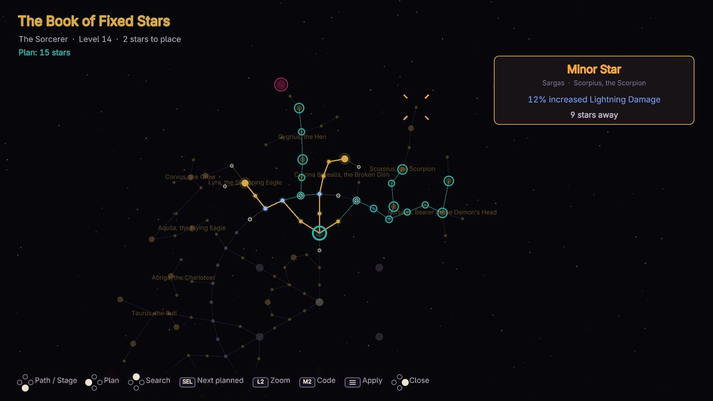 | 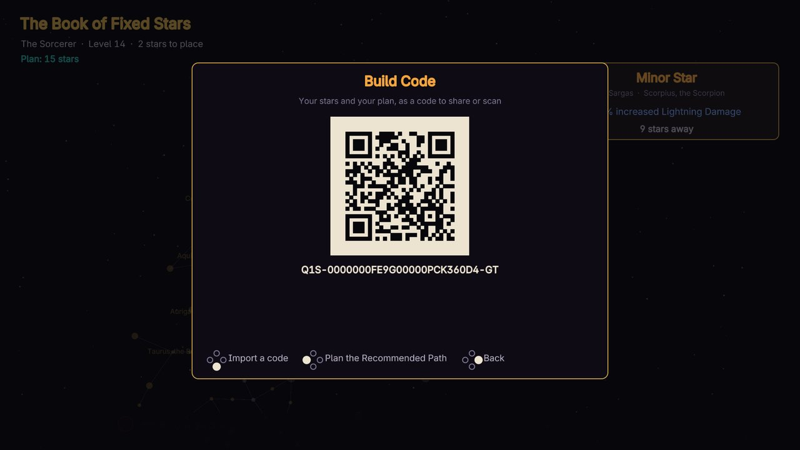 |
| 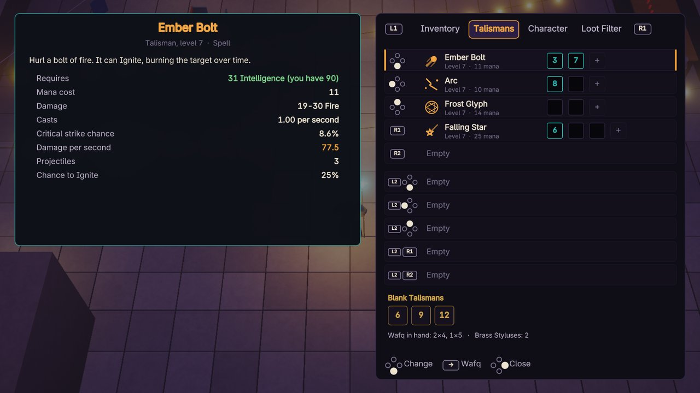 | 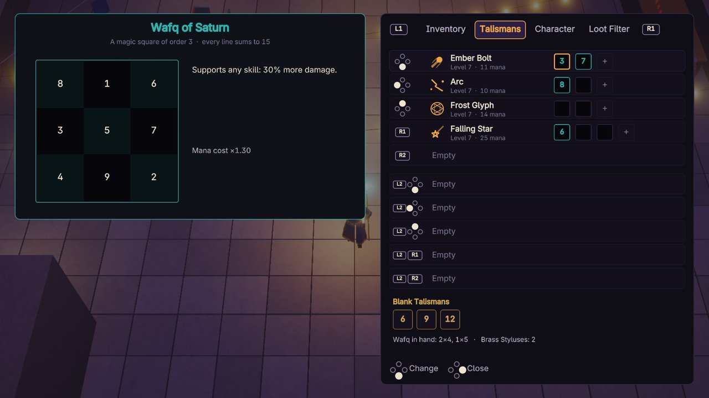 |
| 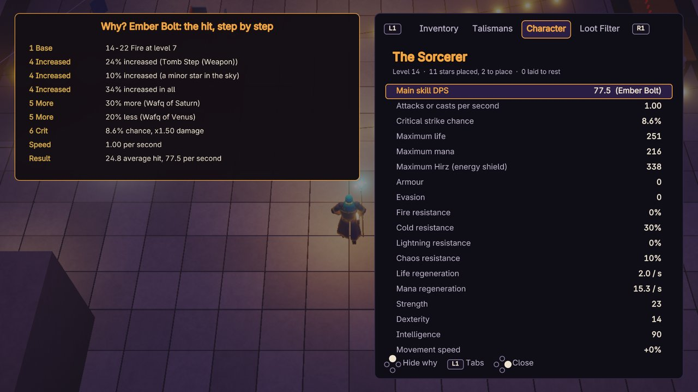 | 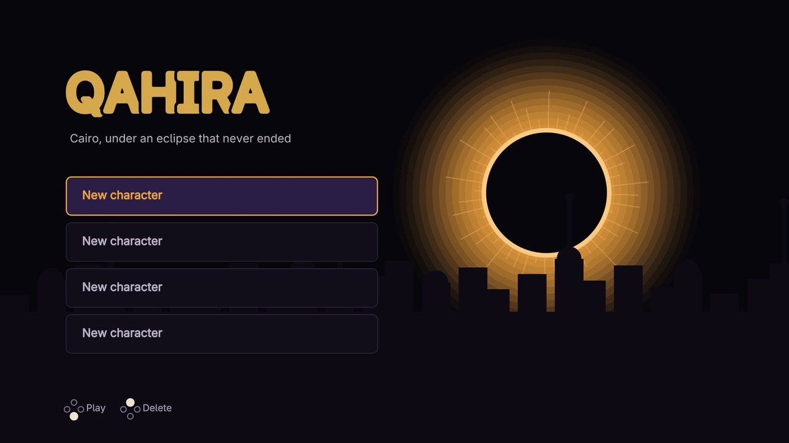 |
| 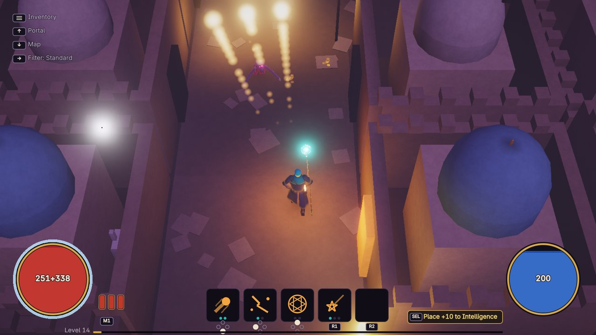 | 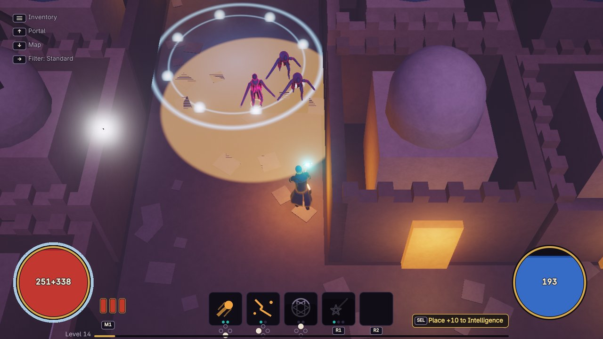 |

**Known gaps (carried forward)**
- The tree has no Masteries or attribute-choice stars yet, and no saved loadouts; they widen with the sky in later
  slices.
- Each class has one body type.
- The Stars screen's constellations are drawn as their star lines only; al-Sufi's figure drawings are not generated
  yet.
- Monsters still chase in straight lines.

## Slice 4 · Act I, Cairo in Twilight

*A fresh character plays from the rooftop to the Mokattam cliffs.*

**Delivered**
- **Six regions** (`tools/art/env/kit.py`, `regions.py`) on one shared cell kit, so any region's cells join: Downtown
  (Wust el-Balad), the Metro under Tahrir, Khan el-Khalili, al-Muizz Street, the Mokattam cliffs and the Bab Zuweila
  gate. 78 tiles, each region with its own entrance, boss court and landmark (the old cinema, a stalled train, the
  coppersmith's workshop, a sabil-kuttab, a radio mast). A test walks from the entrance to every cell of twenty layouts
  per zone, and to every monster each zone spawns.
- **The campaign** (`game/acts.*`): seven zones in a table (area levels 2 to 12), each with its region, music,
  ambience, spawns, elite, boss and the way on. **Waypoints** at every entrance and on the rooftop stair; a boss's death
  opens its court's gate to the next zone and records that zone's waypoint.
- **The Bab Zuweila trial**, the First Trial of Ascendancy: the gatekeeper seals your amulet as the toll, and gives it
  back when you leave; the Ifrit of Bab Zuweila grants two ascendancy points.
- **Six bosses, as data** (`BossDef`): Umm al-Ghūla moved onto the table, joined by the Iron Microbus (a possessed
  microbus that charges down a telegraphed line and throws out cable jinn), the Si'lah of Sadat Station (blinks and
  bolt volleys), al-Nasnas al-Kabir (leaps and a slam ring), the Ifrit of Bab Zuweila (fire pools, a nova, volleys) and
  the Qutrub of the Quarries (a pack leader that leaps and howls).
- **New monsters:** Cable Jinn, Dish Sentinels (a possessed satellite dish whose beam telegraphs its line), Si'lah
  (leapers), Nasnas (half-men that hop) and Qutrub (grave wolves). Monsters now path round walls on the nav grid, and
  each family dies in its own sound.
- **A lighting pass:** the regions' lamps, neon and tube lights were blowing out to white in the bloom (emission is
  multiplied by 18 in the shader); their emission goes through one scale now.
- **Art and sound:** the five creatures, the dish, the microbus and Usta Hassan the coppersmith
  (`characters/jinn.py`); six new pieces of music, each in its own maqam and rhythm (baladi, saidi, wahda, ayyub,
  maqsum); the Metro's and the cliffs' ambience; five death voices.
- **Two ascendancies** (`game/asc.*`, the menu's Ascendancy tab): **Ironclad** for the Warrior (Endurance Charges on
  Break or warcry, no knockback, armour against elemental hits, slams that punish Broken enemies) and **Stormbinder**
  for the Sorcerer (spell crits always Shock, Binding Cold, Ailment Weaver, Storm Mantle, the Conductor). Thirteen
  nodes each, a node needs its parent, a refund costs a Rosewater Vial; Endurance Charges show on the HUD.
- **Crafting** (`game/inventory.cpp`, `game/crafting.*`):
  - five new currencies with PoE's rules: Khamsa, Bakhoor Ash, Broken Tea Glass, Drop of Attar and the Ifrit's Ember
    (corruption: unchanged, an implicit, a mod burnt brighter, or remade; sealed either way);
  - six **Spice Blends** that add a mod of their family;
  - four **Coffee-Cup Omens**, read from the purse to bend the next craft;
  - **the Coppersmith's Bench** in Khan el-Khalili: sixteen recipes (three with the bench, the rest from each zone's
    cache and boss), one exact bench mod per item for dinars, and a free way to take it off. Usta Hassan moves up to
    the roof once you have found him;
  - the purse scrolls, and currencies arrive over the act (each has a minimum area level).
- **Twenty uniques and Poster Scraps** (`game/uniques.*`): each unique is the prop of an invented golden-age film, with
  its poster, year, cast and tagline. Scraps drop from bosses, rares and the Downtown cinema's billboard; the fourth
  scrap of a poster gives you what it shows. Uniques also drop, rarely, on their own.
- **The Journal** (a menu tab): quests with their rewards, the **codex** (an entry the first time you meet each
  monster family and each mechanic), and the posters, drawn with the quarters you lack torn away.
- **XP** now grows with the area level and falls off once you outgrow an area.
- **The waypoint list** includes a trial once its gate has opened, so a trial can be retried after levelling elsewhere.
- **Saves:** the character file v4 (waypoints, quests, the toll, recipes, the codex, Omens, the ascendancy, scraps, and
  items with corruption, unique and bench flags; v1–v3 still load) and save states v7 (Endurance Charges, boss move
  timers, interactable targets).
- **Bots:** `act1` (the exit), plus `bestiary`, `tour4` and `tour5` for screenshots. The pilots sidestep beams and
  fire pools as well as telegraphs, give up on an enemy they cannot reach, and navigate the inventory round wide items.
  CI runs `act1` on every push and nightly.

**Verified**

| Check | Result |
|---|---|
| Unit tests (`qtests`) | pass, 32 cases (10 new: zones walkable from the entrance and every spawn reachable; Khamsa, Glass and the Omens; Blends add their family; the Ember corrupts and seals; the bench adds one exact mod; the twenty uniques and Attar; ascendancy parents; character file v4; a hand-written v3 file still loads) |
| `act1` bot (the exit): a fresh Warrior from the rooftop through Downtown, the Metro, the Khan (the bench), al-Muizz, the Bab Zuweila trial, the City of the Dead and the Mokattam cliffs; it wears what it finds, places its stars and takes its ascendancy nodes | pass: level 13, 2 deaths, 273 kills, 18 minutes of play, 13 recipes learned. Earlier runs found the walls this slice then fixed: the Ifrit's fire pools covered the ground round it (smaller, shorter pools now), the trial fell out of the waypoint list, and an unreachable enemy could hold a pilot against a wall |
| `act1` as a Sorcerer | pass: level 13, 0 deaths, 253 kills, 11 minutes of play |
| `zone` and `sorcerer` bots (now in Downtown), `walk`, `fight`, `sky`, `title` | pass |
| Build simulator, tree validator, shaders | pass (0 flags: the Warrior's Recommended Path now takes the Lion's Heart third, which lifts its level-10 EHP from 2 sd under the crowd to level with it) |
| On-device feel review | pending (RP6) |

| | |
|---|---|
| 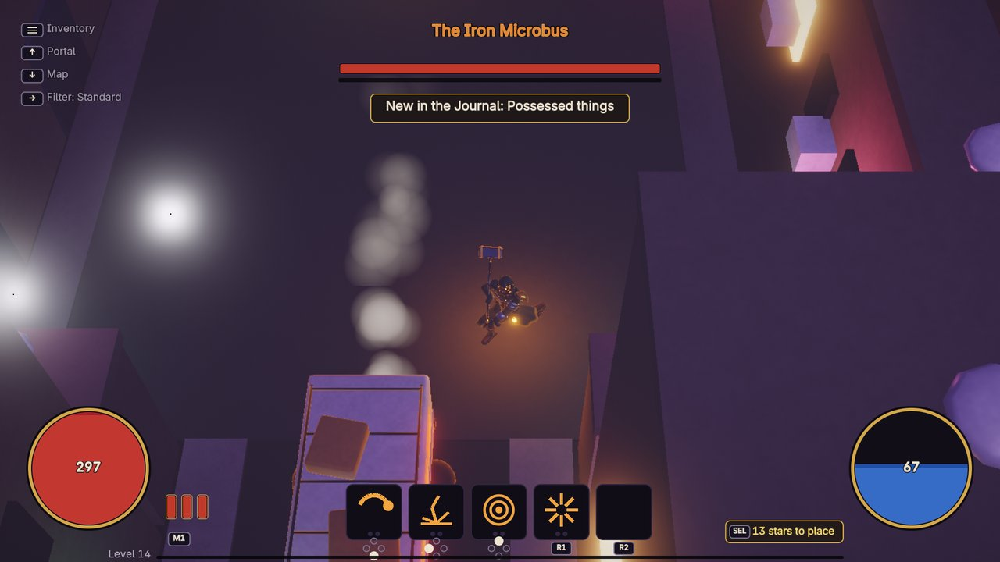 | 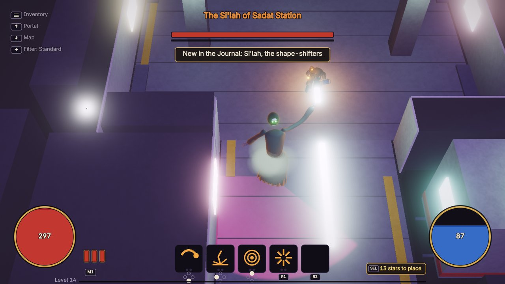 |
| 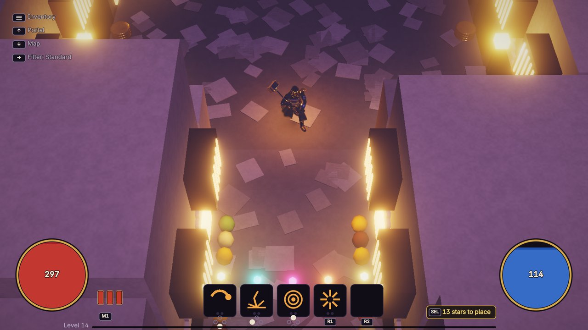 | 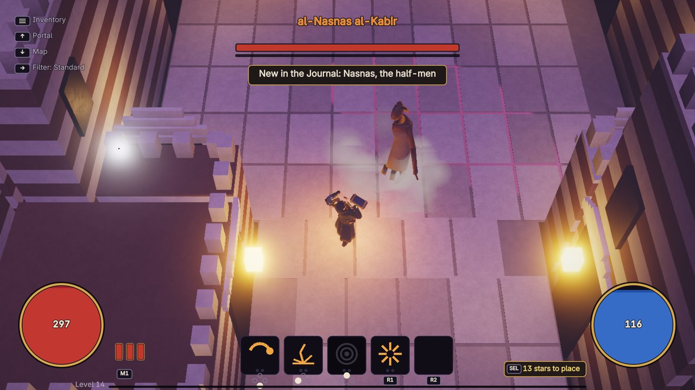 |
| 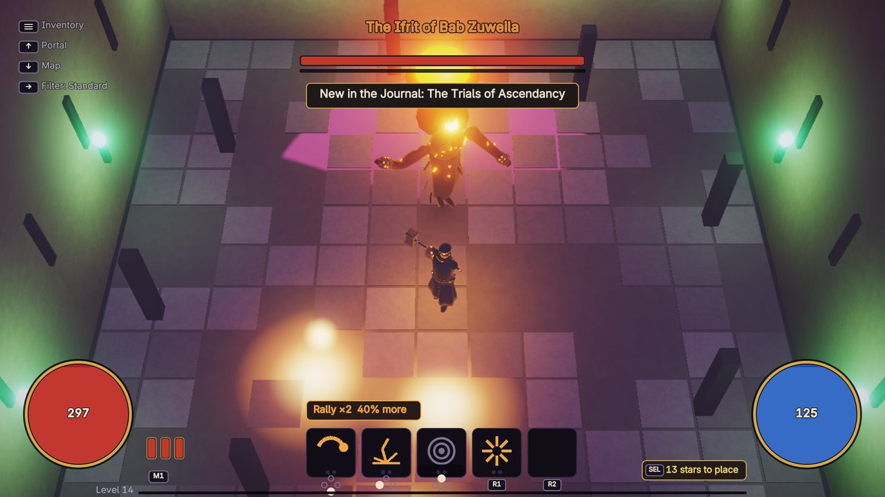 | 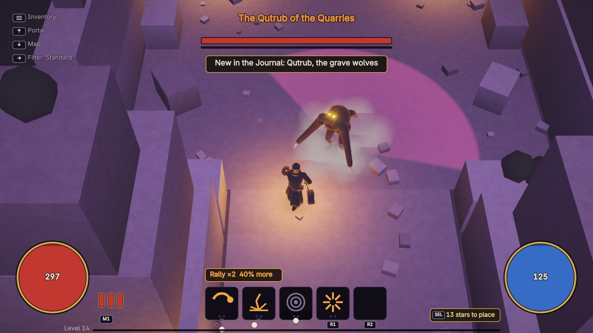 |
| 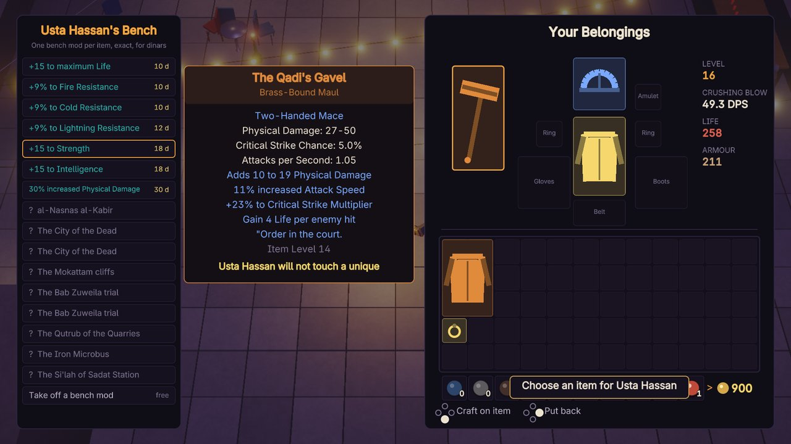 | 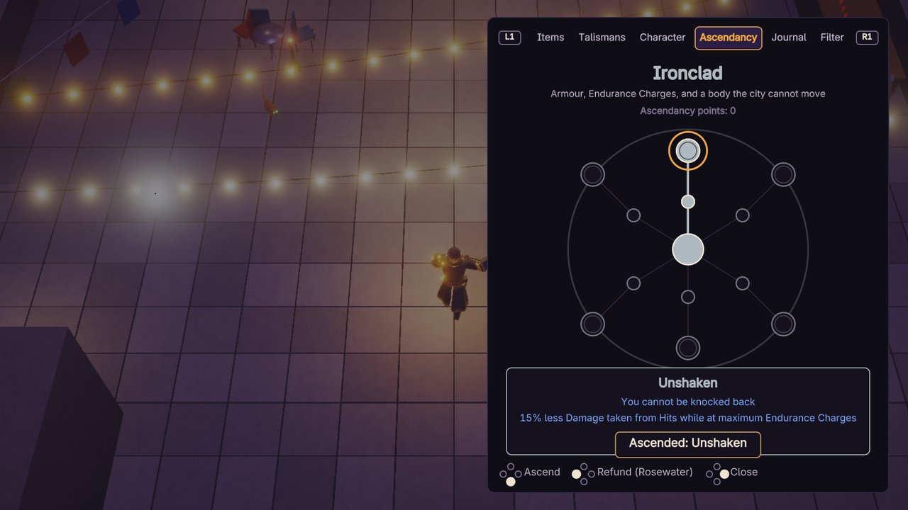 |
| 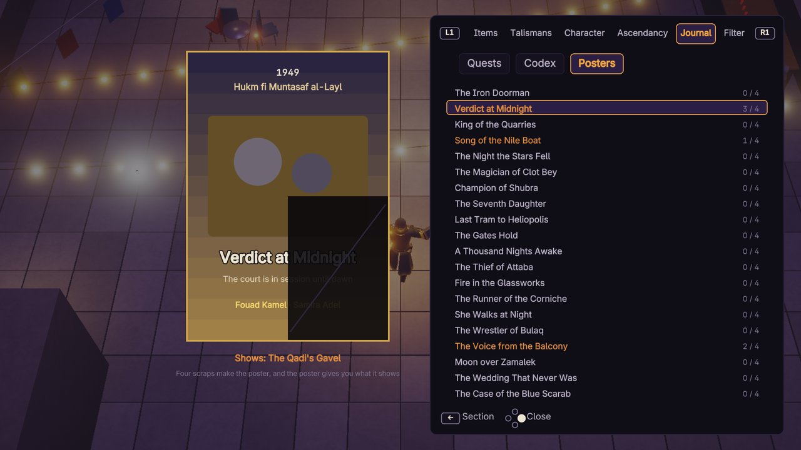 | |

**Known gaps (carried forward)**
- One ascendancy per class so far (the GDD has three); later trials add their points in Acts III, V and VI.
- The bots spend passive and ascendancy points by calling the same functions the screens call, not by pressing
  through them (`tour4` presses through the Ascendancy tab and the bench).
- Recipes are learned where they are found; there is no recipe item to carry or trade.
- Posters are drawn by the UI; the GDD's painterly poster renders from 3D scenes are not generated yet.
- The Khan has no boss: a rare and its pack guard the way on to al-Muizz.
- Possessed objects are rigid meshes that sway; they do not deform.

## Slice 5 · The First Chart

*The endgame loop, proven early on Act I's tilesets.*

**Delivered**
- **The Map of al-Idrisi** (`game/atlas.*`, `game/atlas_ui.*`): after Act I a chart table stands on the rooftop. It
  opens al-Idrisi's round world as he drew it for King Roger in 1154, south at the top and so east on the left, with
  the Sea of the Rum across it, the Nile running up the page, and the eclipse's path as a dark band. Sixteen sites on
  four Climes, from al-Iskandariya and Qus to Tunis, Balarm and Sabta, each with a line from the map's margin and its
  master. The stick's magnet walks the cursor between sites; South picks a chart; L1/R1 turns to the Astrolabe.
- **Charts** of the First to Fourth Climes (map items, area levels 14 to 17), with nine chart mods: more life, more
  damage, more monsters, more magic and rare packs, fire on their hits, less maximum resistance, faster monsters, more
  rarity, a likelier Haboob. Each mod also means 8% more items. The street currencies work on charts too.
- **Chart runs:** the chart is spent, the site generated at its Clime's level with its mods on every monster; its
  master always drops charts, rares sometimes do, and finishing a site reveals the sites its roads lead to and gives an
  Astrolabe point. Act I's end gives four charts and reveals the First Clime.
- **The Haboob**, the first mechanic: a wall of sand rolls north across the site in about two minutes. Inside it the
  fog closes in and turns to sand, sand jinn ride in with it, and a meter fills with time and kills; when it has passed
  it leaves currency, dinars and, after a long stay, a chart. A HUD panel shows the storm and its meter, and which way
  it is when you are out of it.
- **The Astrolabe**, the atlas tree: twenty nodes on four pointers of an astrolabe's rete (Suhail for charts, al-Simak
  for the storm, al-Shi'ra for riches, al-Nasr for the road).
- **The Sand Jinn**, generated on the shared rig: a figure of blown sand over a turning column.
- **`qchartsim`**, the simulation half of the exit: 600 players from the end of Act I, each run's kills counted from
  the real spawner over the generated tiles, charts drawn by the game's own rules. It found a dead end (two Second Clime
  sites led only to Ayla, which led nowhere), and the first drop rules, which were far too generous.
- **Zones take their tint:** each zone's `env_tint` now colours its fog and ambient light (it was defined in Slice 4
  but never applied).
- **Saves:** the character file v5 (sites revealed and finished, the Astrolabe; v1–v4 still load) and save states v8
  (the chart run and its Haboob).
- **Fixes the new bots found in older code:** an arrival spot beside a portal could be a pocket between two blocks
  (the hero now arrives on the portal when there is no clear line to the spot); the Iron Microbus was too hard for the
  game's first boss; two drops on one spot could hold a pilot forever; a pilot wedged on a corner now sidesteps. And
  every zone's arrival spot stood just north of the entrance cell's southern block, which hid the hero from the camera;
  the hero now arrives past the cell's centre, on the open side. That fix changed the Warrior pilot's route in the
  `zone` run: it met the Iron Microbus at level 2 and rolled out of every swing telegraph, never landing a hit. The melee
  pilot now trades blows against a boss's cone while above 60% life, as a player does, and still steps out of circles
  and charges.

**Verified**

| Check | Result |
|---|---|
| Unit tests (`qtests`) | pass, 36 cases (4 new: every site reachable from the First Clime along roads that never lead down a Clime; charts roll and read back only chart mods, gear never does, and currency works on charts; the Astrolabe's parents and the drop rules; character file v5) |
| `charts` bot (the exit): a level-14 character as Act I leaves one runs charts through the map screen, choosing sites and charts with the stick, until it finishes a Fourth Clime site | pass (Warrior): Fas after 13 runs, 10 sites, 9 Astrolabe nodes, 6 Haboobs, 0 deaths |
| `charts` as a Sorcerer | pass: Tunis after 10 runs, 4 Haboobs, 0 deaths |
| `qchartsim` (the exit's simulation) | 0 flags: median 10 runs to finish a Fourth Clime site, 90th percentile 16, 0.5% of players run out of charts; charts gained per run 1.6 (First Clime) to 2.1 (Third) |
| `act1` (Warrior and Sorcerer), `zone`, `sorcerer`, `walk`, `fight`, `sky`, `title` | pass |
| Build simulator, tree validator, shaders | pass |

| | |
|---|---|
| 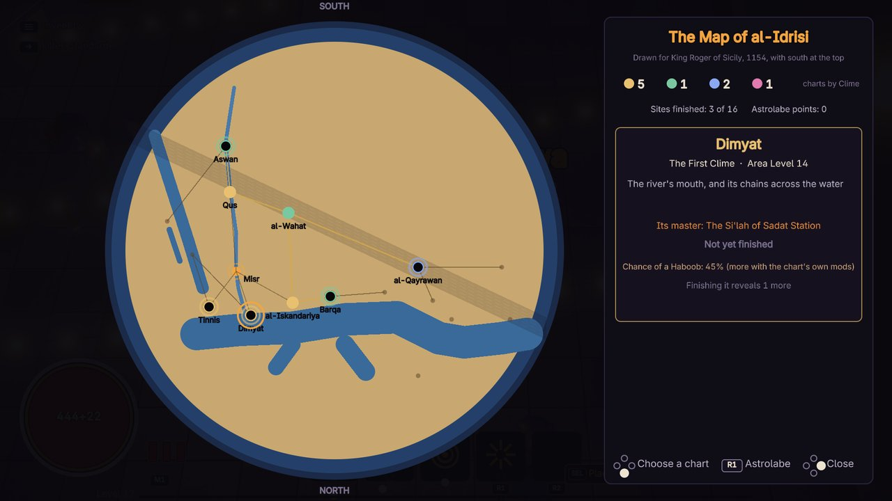 | 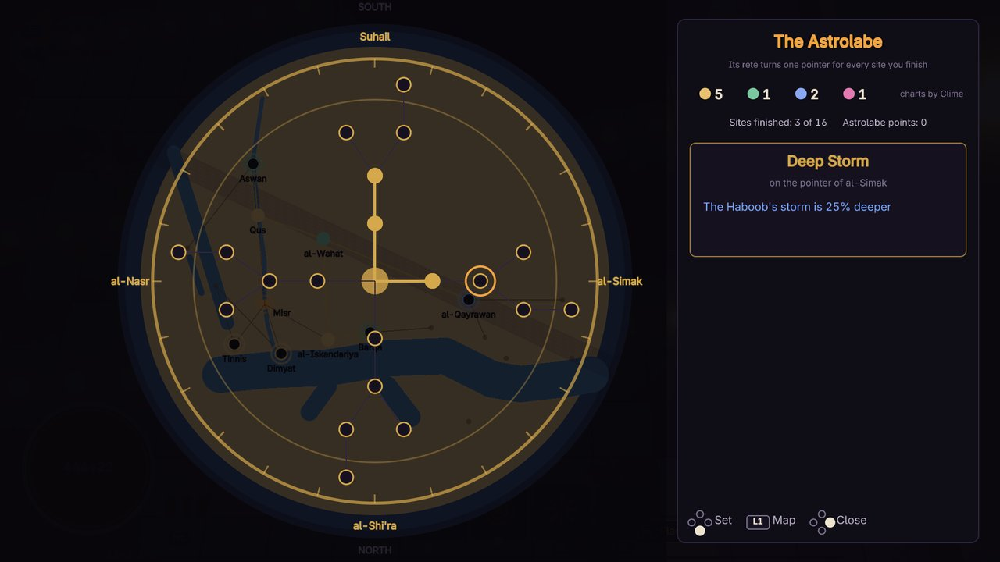 |
| 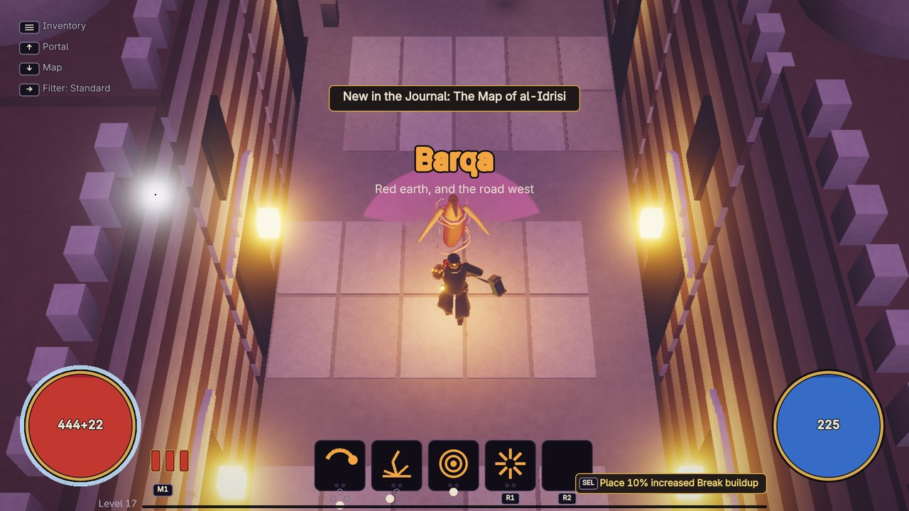 | 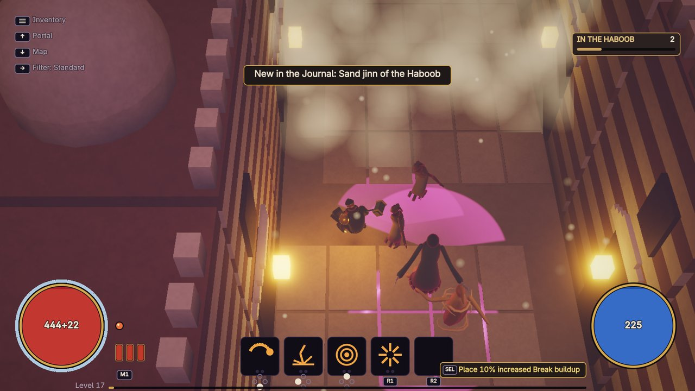 |

**Known gaps (carried forward)**
- Four Climes of seven; charts to the Sixteenth tier, and the pinnacles, come in Slice 9.
- One mechanic (the Haboob); Mārid Rifts, Excavations and Zar Nights arrive in Slices 6–8.
- Omens cannot yet be pressed into charts (GDD §10).
- Sites use Act I's regions and bosses; each later act adds its own.
- The map is drawn by the UI; al-Idrisi's own linework (the climes' bands, his mountains and rivers) is not traced.

## Slice 6 · The Nile to Luxor

*One act, one class, two ascendancies, its piece of the sky, and one endgame piece.*

**Delivered**
- **The Ranger**, a third class (`game/classes.*`, `tools/art/characters/ranger.py`):
  - a tracker from the oases of the Western Desert: a hooded cloak the colour of the dunes, a leather jerkin, an indigo
    scarf over the mouth, a falconer's gauntlet and a quiver of reed arrows; 13.4k triangles and twelve clips on the
    shared rig, including a side-on draw-and-loose (`shoot`) and a high loose for the rain (`shoot_up`);
  - a recurve bow of horn and mulberry held in the left hand, and a reed arrow for the projectiles;
  - **bows** (four bases, level 1 to 18) and evasion armour (six bases), with rolled evasion, projectile, poison and
    bow-crit mods; **bow skills need a bow** (the Talisman card says so, and the hero says "Needs a bow");
  - **four Talismans:** *Split Arrow* (a fan of three), *Falcon's Mark* (the enemy's next three attack hits are
    Critical Strikes), *Rain of Arrows* (three volleys on the spot) and *Scorpion's Kiss* (a heavy arrow, 60% to Poison);
  - **evasion** (a chance to take no damage from a hit, against the monsters' accuracy, which grows with the area;
    capped at 75%; pools and blasts cannot be evaded), **poison** (stacks: each poisoning hit adds its own, chaos over
    two seconds) and **Frenzy Charges** (4% more damage and speed each; a Marked enemy's death gives one).
- **The Ranger's sky** (`tools/tree/build_tree.py`): the Ecliptic closed into a ring, Sagittarius, Lepus and Pegasus,
  and the keystone *al-Balda, Point Blank* (projectile attacks deal up to 40% more close in, and less far away).
  171 stars now; the first 131 kept their ids (a test pins them).
- **Two ascendancies for the Ranger**, and a choice (`game/asc.*`, `game/menu_act1.cpp`): at the First Trial a class
  with two shows both, side by side with their notables, and the character takes one for good.
  - **Marksman:** marks that last longer and cover more hits, Marked enemies take more damage, the long shot, crits
    that grant Frenzy, a Mark that passes on at a death, and an extra projectile.
  - **Outrider:** speed, poisons that hit harder and last longer, a waterskin flask that refills itself, evasion,
    Frenzy on kill, and poisons that spread when their bearer dies.
- **Act II, the Nile to Luxor** (`game/acts.cpp`), levels 14 to 25, six zones on five new regions
  (`tools/art/env/regions2.py`):
  - **the River Road** (the Nile bank: towpaths of silt, feluccas at their moorings, cane and date palms, a waterwheel);
  - **Kafr al-Nakhl** (a village of Upper Egypt: mud brick and whitewash, blue doors, pigeon towers, a sycamore in the
    square);
  - **the Ibrahimiya Canal**, and **El Naddaha, the Caller**: the woman in the canal who calls you by name. Her Call
    draws you to her; she opens pools of black water under you, sinks and rises beside you, and brings marids;
  - **Karnak, the Hypostyle Hall** (papyrus columns in rows, fallen drums, an obelisk) and **the Ram of the Avenue**, a
    possessed ram-headed sphinx that charges down its avenue and wakes the statues;
  - **the Valley of the Kings** (pale cliffs in strata, tomb doors, the diggers' lamps and baskets);
  - **the Deep Tomb** (painted corridors under a ceiling of yellow stars on blue) and **the Marid of the Deep Tomb**.
    When it dies, one coil of something vast slides through the pit beyond the burial hall. Act II is over.
  - New monsters: the River Marid and the Marid Caller (cold water, pools), Possessed Statues (black granite kings) and
    Tomb Ghouls. Four new pieces of music (the Sa'idi rhythm of the south; slower below ground) and three ambiences
    (the river at night, wind through the columns, the tomb).
  - Three quests (+1 passive star each); the Mokattam's far court now leads on to the River Road.
- **The Marid Rifts**, the endgame piece: once Act II is over, a chart may hold a tear in the air. Walk up to it and it
  opens for twenty seconds, widening while marids come through; what dies in it leaves **Marid Splinters**. Fifty fuse
  into a **Rift Seal**, which opens **the Rift Lord's court** from the chart table (West). The Rift Lord always drops a
  unique.
- **The codex** gains the marids, El Naddaha, the statues and tomb ghouls, marks/poison/Frenzy, evasion, and the rifts.
- **The HUD:** Frenzy Charges beside the Endurance Charges, icons for the four new Talismans, a Mark's sigil on its
  bearer, poisoned enemies tinged green, the rift's panel and the rain's landing ring. Staves and bows have their own
  inventory icons.
- **Saves:** the character file v6 (the ascendancy chosen; v1–v5 still load) and save states v9 (poison, marks, Frenzy,
  arrows, the rift).
- **Fixes along the way:**
  - the Map of al-Idrisi read the stick as one of four directions, so a site that lay diagonally could not be reached
    (the Ranger's `charts` run found al-Wahat unreachable from al-Iskandariya); the cursor now follows the stick's own
    direction within a 55° cone;
  - the HUD and the build simulator counted all three of Split Arrow's projectiles as one target's damage; DPS is now
    one projectile's, as in PoE, and the Talisman card says "each";
  - the build simulator's outlier rule now also asks that the outlier beat the Recommended Path by 5% (a random Warrior
    build 4% above the path, in a crowd with a small spread, had flagged);
  - a rare's name took its second word from one list of maul words, so a bow could be a "Hammer"; bows, staves and
    gear now have their own words (drawn with the same two rolls, so no item changes its mods);
  - an item's tooltip compared DPS "with Crushing Blow" whatever your main skill was; it now names yours, and a weapon
    that cannot use your main skill (a maul for a bow skill) shows the loss.

**Verified**

| Check | Result |
|---|---|
| Unit tests (`qtests`) | pass, 43 cases (6 new: the Ranger with a bow and without one; evasion against deeper monsters and its cap; poison stacks, a Mark's crits and the Frenzy at its death; two ascendancies, the choice and character file v6; Act II's road; rift currency never drops at random) |
| `act2` bot (the exit): a character as Act I leaves one plays Act II through, River Road to the Deep Tomb | pass: the Warrior in 11.4 minutes (level 13 to 23, 0 deaths, 311 kills), the Sorcerer in 7.4 (0 deaths), the Ranger in 6.4 (0 deaths) |
| `rifts` bot (the endgame piece): after Act II, a chart with a rift; its splinters make a seal; the seal opens the Rift Lord's court; the Rift Lord dies | pass: 18 splinters from one rift made the seal; the Rift Lord died 3.5 minutes in, 1 death |
| `act1` as the Warrior, the Sorcerer and the Ranger | pass: the Warrior in 10.4 minutes (0 deaths), the Sorcerer in 9.6 (0), the Ranger in 15.5 (1) |
| `charts` (Warrior and Ranger), `zone` (Warrior, Sorcerer, Ranger), `walk`, `fight`, `sky`, `title` | pass |
| Tree validator | pass: 171 stars; the Ranger reaches its keystones in 9/18/19 points; its Recommended Path takes 23 |
| Build simulator | 0 flags; the Ranger's Recommended Path at level 30: 316 DPS against a crowd of 235 +/- 46 (the Warrior's 332, the Sorcerer's 193) |
| `qchartsim` | 0 flags (unchanged: median 10 runs to the Fourth Clime) |

| | |
|---|---|
| 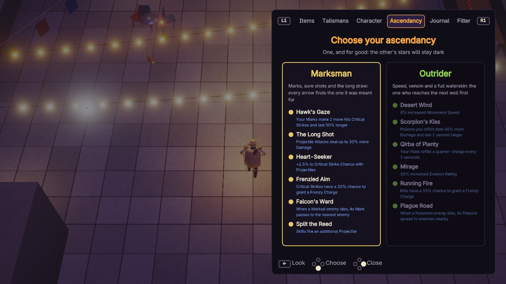 | 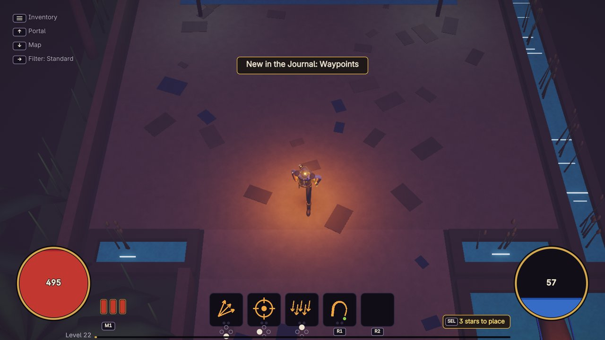 |
| 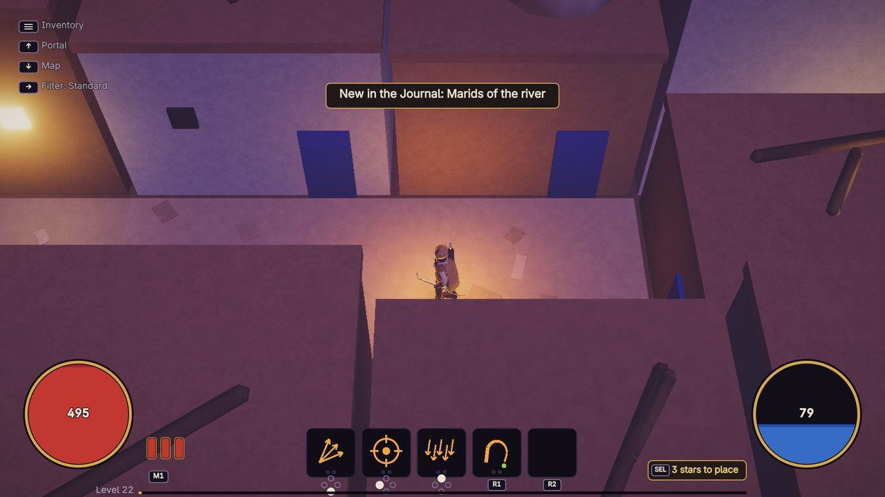 | 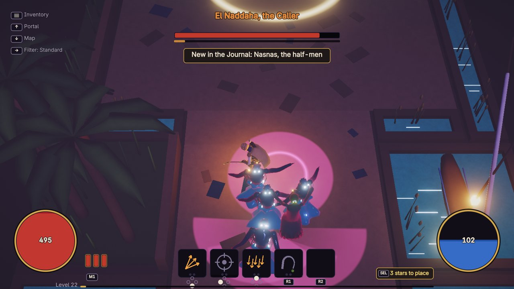 |
| 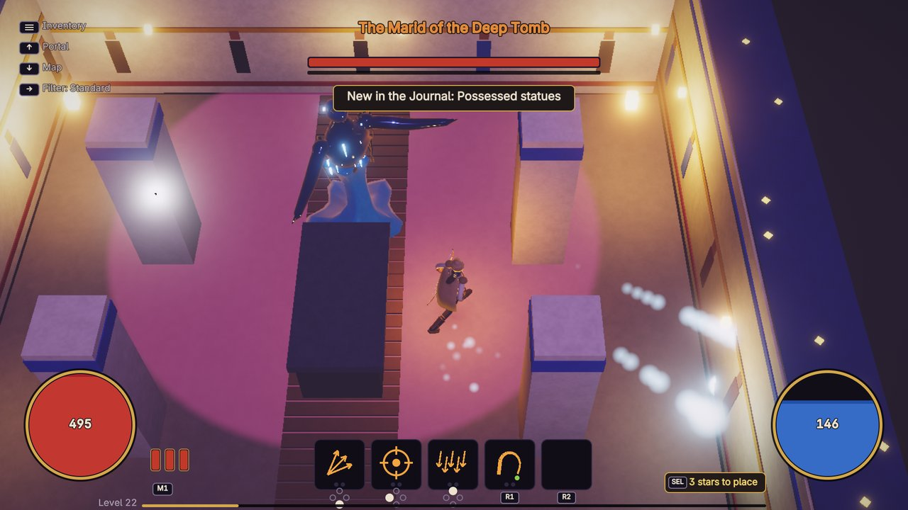 | 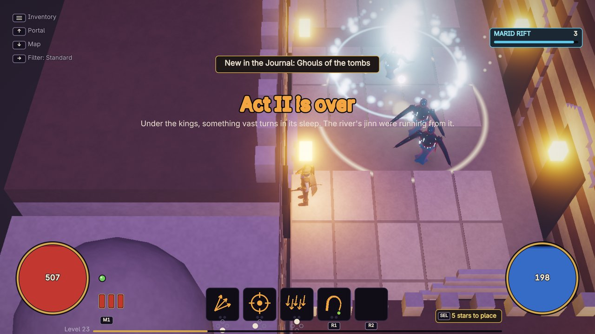 |

**Known gaps (carried forward)**
- The Ranger's bowstring does not draw back (the bow is one rigid mesh), and loosed arrows are not seen on the string.
- Mārid Rifts have no Astrolabe nodes of their own yet, and the Rift Lord's court is one room on the tomb's tiles.
- Act II has no side zone or second trial (Trial II comes with Act III).
- Audio is stored as 16-bit WAV: the pack is now 110 MB, 65 MB of it music and ambience. A compressed format is due.
- The Beastmaster (the Ranger's third, companion ascendancy) is not in the launch set (GDD §4).
- Act II may be too gentle: every class's bot plays it through with no deaths (the bot starts with a rare in every
  slot). Its tuning waits for the on-device feel review.

## Slice 7 · The Western Desert

*One act, one class, two ascendancies, its piece of the sky, and one endgame piece.*

**Delivered**
- **The Mercenary**, a fourth class (Strength and Dexterity; `game/classes.*`, `tools/art/characters/mercenary.py`):
  - a guard from a Garden City bank who kept working when the banks stopped: an olive field jacket with the sleeves
    pushed up, a dark red scarf, cargo trousers and boots, a bandolier of the sphero-conical clay pots of Fustat (the
    naphtha grenades the Mamluks used), and a crossbow slung across the back; thirteen clips on the shared rig,
    including a two-cut `combo`, an overarm `throw` and a crossbow `shoot` from the shoulder;
  - a straight double-edged sword with a brass guard, a crossbow, and a clay grenade for the thrown pot;
  - **swords** (four bases, one-handed, 1x3 in the bag) and **crossbows** (three, two-handed, 2x3), and hybrid armour
    with both armour and evasion (six bases); rolled bleed, sword-speed, crossbow and grenade mods;
  - **the weapon swap**: a second weapon slot, on the back (`EQ_WEAPON2`). A skill that needs the other weapon swaps it
    into hand (a leather slide and a click), and the weapon on the back gives nothing until it is in hand. A crossbow
    found goes on the back, not in the sword's place. The skill bar shows those skills ready;
  - **four Talismans:** *Crescent Cut* (a sword arc that builds a combo: every third cut in a row is a crescent, wider,
    60% more damage, always Bleeding), *Riposte* (two thrusts at one enemy: 80% more against the Bleeding, and the
    second bursts the bleed, all its damage at once), *Naffata* (a pot of naphtha thrown in an arc that bursts where
    it lands and can Ignite) and *Quarrel* (a heavy crossbow bolt that pierces two enemies and can cause Bleeding);
  - **Bleeding** (70% of a hit's physical damage over five seconds; the strongest bleed holds) and **piercing**
    projectiles (they pass through enemies, never striking one twice).
- **The Mercenary's sky** at 6 o'clock, between the Warrior's Great Dog and the Ranger's Hare: **Hydra** (al-Shuja',
  with Alphard, *al-Fard, the Solitary One*), **Crater** (al-Batiya, the Jar: grenades) and **Carina** (with Canopus,
  *Suhayl, the Star of the South*: armour, evasion and life), and the keystone **al-Han'a, the Brand** (your hits always
  cause Bleeding; bleeding you cause deals 30% less). 192 stars; the first 171 keep their ids.
- **Two ascendancies for the Mercenary**, chosen at the First Trial:
  - **Duelist:** a hit taken readies Riposte, Bleeding enemies take more damage, more damage to rares and uniques,
    sword crits, life back from a bleeding kill, and a crescent every second cut;
  - **Demolitionist:** Naffata throws a second pot, grenades Ignite and reach further, heavier and piercing bolts,
    enemies killed by a grenade burst, fire resistance, and grenades that come back faster.
- **Act III, the Western Desert** (`game/acts.cpp`), levels 26 to 35, six zones on four new regions
  (`tools/art/env/regions3.py`):
  - **the White Desert** (chalk towers weathered into mushrooms and tents on pale sand, flint underfoot);
  - **the Great Sand Sea** (dune ridges, wind-rippled troughs, bleached bones) and **Umm al-Dab', the Hyena of the Sand
    Sea**: in the old stories a hyena's gaze bewitches the traveller, who follows it laughing into its den. Her stare
    draws you to her (a Call), and the pack laughs with her;
  - **Siwa** (the salt-and-mud kershef of old Shali in ruins, palm groves, spring pools, salt pans), with a gate in its
    far court to **Bab al-Futuh, the Second Trial**: the gatekeeper takes your body armour, and **the Iron Mamluk**, an
    empty suit of Mamluk armour the gate's jinn wear, must kneel. Two more ascendancy points;
  - **Shali**, the old town melting in a rain that never came;
  - **the Hill of the Oracle**, and **the Sand-Wraith of Siwa**: a hooded shroud of blown sand with two points of light
    inside and a crown of salt, which throws burning sand and opens pits of it. When it scatters, Act III is over, and
    **every resistance is 30% lower** from then on (GDD §9).
  - New monsters: hyenas (al-Dab'), salt jinn, ghouls of the sands, sand shades that throw burning sand, and the empty
    armour of the gate. Two pieces of music (the desert, slow on the ney; Siwa's gardens, brighter on the qanun) and
    the desert's ambience (wind over open sand, grains hissing off a crest, and now and then a dune singing).
  - Three quests (+1 passive star for each of the hyena and the wraith, two ascendancy points for the trial); the Deep
    Tomb's far court now leads on to the White Desert.
- **The Excavations**, the endgame piece: once Act III is over, a chart may hold one. A surveyor's stake stands near
  the way in, and a line of four scrapes runs from it towards a buried chamber. Set a blasting charge in each, go back
  to the stake and fire them: they go off down the line, one after another, hurting whatever stands by them, and the
  last blows the sand off the chamber's doorway. Its guardians climb out of the dust (an Empty Armour and the site's
  own); kill them and search the chamber for **Relics**. Relics never drop at random: **Amm Ramadan**, an old
  antiquities dealer who came up to the rooftop from Siwa, barters for them (uniques, rares above your level, charts of
  the Fourth Clime).
- **The codex** gains bleeding and the weapon swap, the hyenas, salt jinn, ghouls of the sands, sand shades, the
  gate's armour, the resistance penalty, and the Excavations.
- **Saves:** the character file v7 (the weapon swap slot, and waypoints in 64 bits: the zones outgrew 32; v1–v6 still
  load) and save states v10 (bleeding, piercing bolts, grenades in flight, the swap, the Excavation). The keystone and
  ascendancy rules are 64 bits too, for the six ascendancies still to come.
- **Fixes along the way:**
  - the inventory's DPS was labelled "Crushing Blow" for every class; it names your main skill;
  - DPS, the tooltip's comparison and the bots' upgrades now rate a skill with the weapon it would be used with: a
    crossbow is weighed by Quarrel and compared with the crossbow, the sword by Crescent Cut with the sword;
  - Amm Sayed "sold" Marid Splinters and Rift Seals for nothing; he has none of those;
  - Scorpion Sting's card always said it pierces; now that projectiles can, it pierces one enemy;
  - the build simulator gave every class but the Sorcerer a maul: each class now gets its own kind of weapon (the
    Ranger's numbers below are with a bow);
  - monsters' thrown bolts took their colour from nothing: cold ones are blue, fire ones orange;
  - the waypoint list grew past the screen; it scrolls, twelve rows at a time;
  - the class screen fits four classes.

**Verified**

| Check | Result |
|---|---|
| Unit tests (`qtests`) | pass, 51 cases (8 new: the Mercenary's swap to the crossbow on his back and back again, a found crossbow going on the back; bleeding and Riposte's burst; piercing bolts never hitting twice; Duelist, Demolitionist and al-Han'a; Act III's road, Trial II and the resistance penalty; character file v7 with the swap slot and waypoints past 32; relics never dropping at random; an Excavation's charges on a walkable line, fired only when all are set) |
| `act3` bot (the exit): a character as Act II leaves one plays Act III through, the White Desert to the Hill of the Oracle, Trial II included | pass: the Warrior in 10.3 minutes (level 24 to 33, 0 deaths, 314 kills), the Mercenary in 12.1 (1 death), the Sorcerer in 8.7 (0), the Ranger in 8.3 (0) |
| `digs` bot (the endgame piece): after Act III, a chart with an Excavation; every charge set and fired, the guardians killed, the chamber searched, the relics bartered with Amm Ramadan | pass: 3 relics dug up and bartered, 0.8 minutes, 0 deaths |
| `act1` as the Mercenary (from level 1) | pass: 13.4 minutes, 2 deaths (the Warrior 12.8 and 1, the Sorcerer 9.0 and 0, the Ranger 18.0 and 1) |
| `act2` as every class | pass: the Warrior in 12.2 minutes (0 deaths), the Sorcerer 8.6 (0), the Ranger 15.2 (1), the Mercenary 11.1 (0). The Ranger is slower than in Slice 6 (6.4): swords and crossbows now share the weapon drops, and her first better bow came at level 19 |
| `charts` as the Warrior and the Mercenary | pass: the Fourth Clime after 12 runs and 8 runs, 0 deaths each |
| `zone` (Warrior, Sorcerer, Ranger, Mercenary), `rifts`, `walk`, `fight`, `sky`, `title` | pass |
| Tree validator | pass: 192 stars; the Mercenary reaches its keystones in 9/12/13/23 points; its Recommended Path takes 17 |
| Build simulator | 0 flags; at level 30 the Mercenary's Recommended Path makes 333 DPS against a crowd of 317 +/- 82 (the Warrior 310, the Ranger 259 with a bow, the Sorcerer 201) |
| `qchartsim` | 0 flags (median 10 runs to the Fourth Clime) |

| | |
|---|---|
| 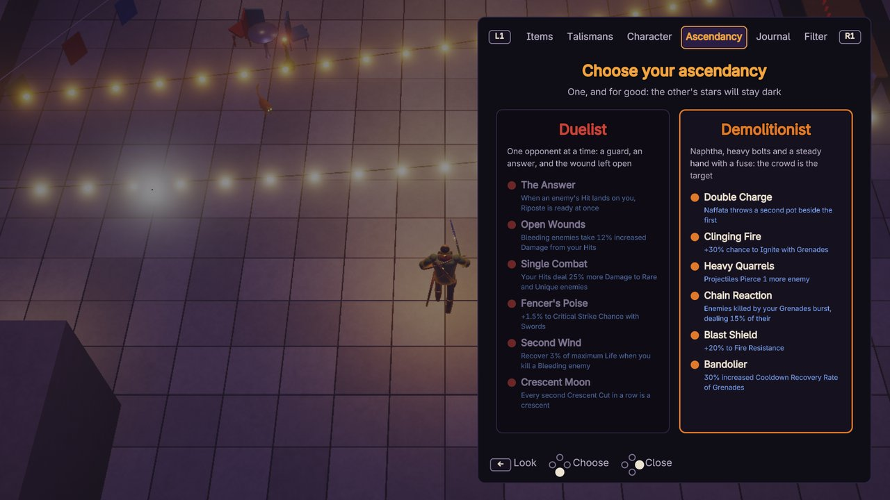 | 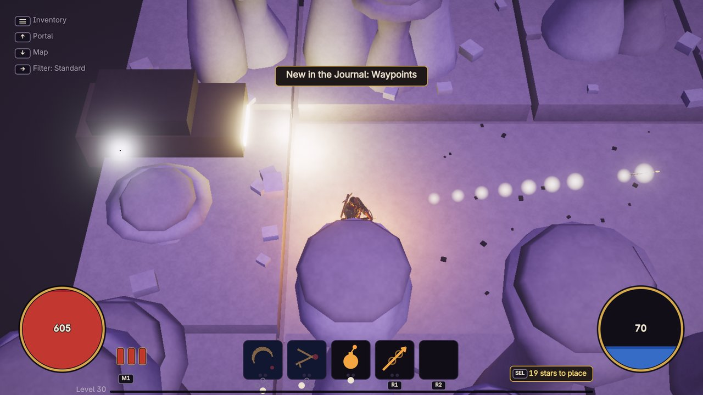 |
| 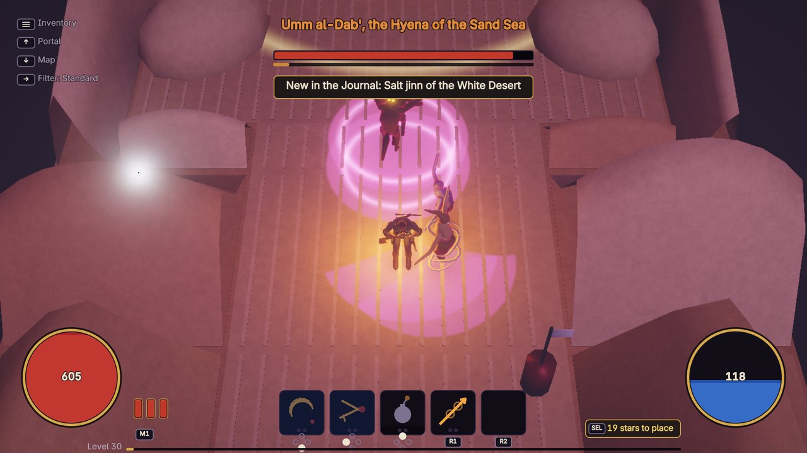 | 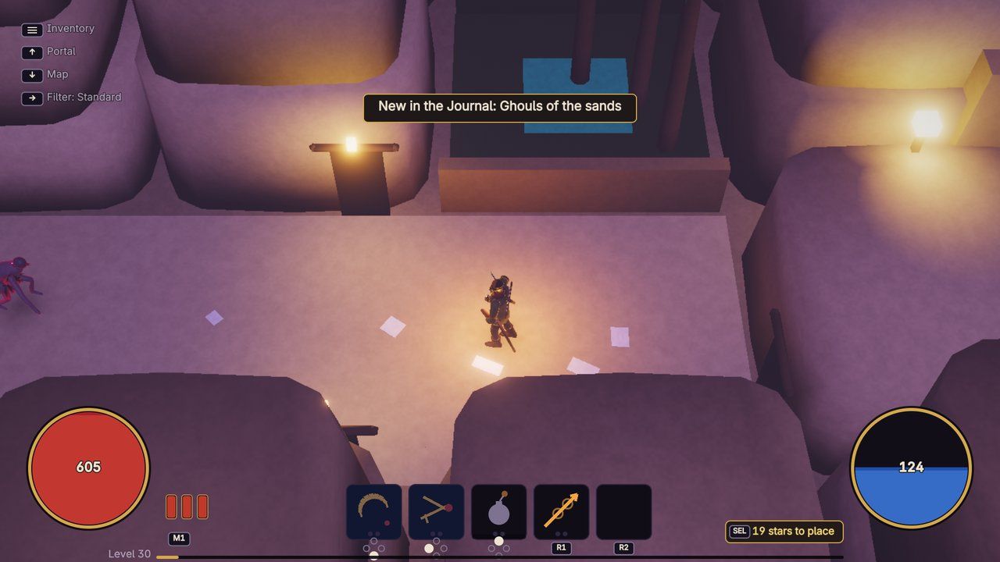 |
| 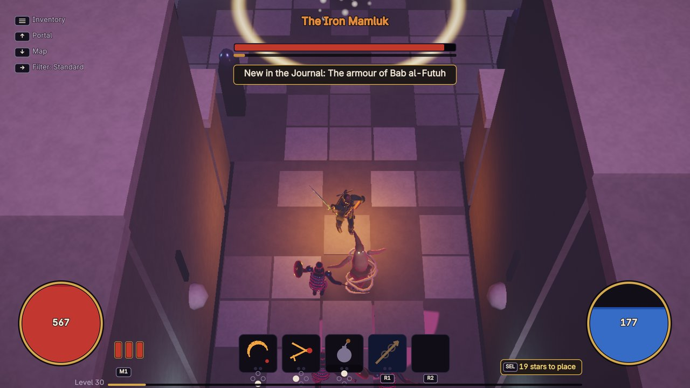 | 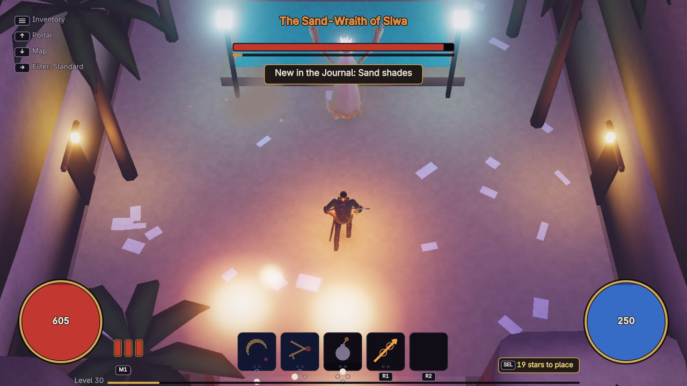 |
| 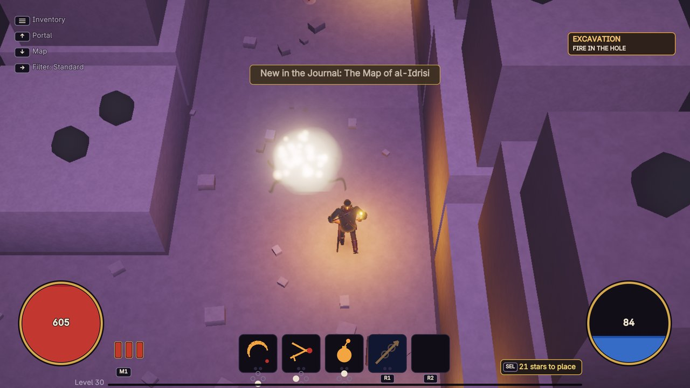 | 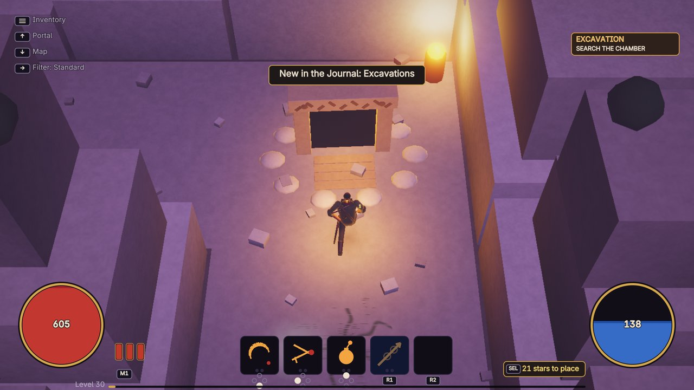 |
| 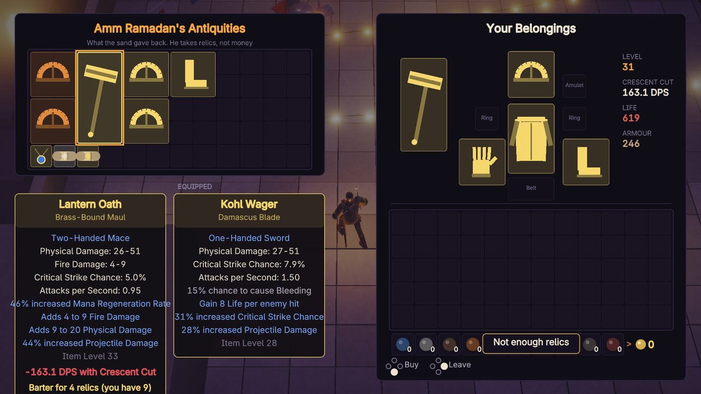 | |

**Known gaps (carried forward)**
- The Vanguard (the Mercenary's third, banner-and-block ascendancy) is not in the launch set (GDD §4).
- Crossbow ammunition kinds (PoE2's) are one kind here: Quarrel. Grenades have one kind: Naffata.
- The weapon swap has no button of its own: skills swap. A manual swap is a small addition when a skill set wants it.
- Excavations have no Astrolabe nodes yet, and Amm Ramadan's stock is small (two uniques, five rares, two charts).
- Acts II and III may be too gentle for a character with a rare in every slot (the bots start so); tuning waits for
  the on-device feel review.
- Audio is stored as 16-bit WAV: the pack is now 127 MB. A compressed format is due.

## Slice 8 · The Maghreb Coast

*One act, one class, two ascendancies, its piece of the sky, and one endgame piece.*

**Delivered**
- **The Shadow**, a fifth class (Dexterity and Intelligence; `game/classes.*`, `tools/art/characters/shadow.py`):
  - a runner of the Tunis medina's rooftops, who carried whatever was paid for across the old city by night and never
    touched the lanes: a short hooded burnous of indigo over a dark tunic, a litham drawn to the eyes, sirwal gathered
    at the shin, wrapped forearms, a red sash with a curved dagger in a brass sheath, and a belt of pouches for traps;
  - **daggers** (four bases, 1x2, the later two with increased critical strike chance) in hand and **quarterstaves**
    (three, 1x4, two-handed) on the back, swapped in by the skill that needs one; hybrid armour with evasion and Hirz
    (six bases); rolled dagger-crit, quarterstaff-speed, trap, chaos and crit-multiplier mods;
  - **four Talismans:** *Viper's Kiss* (a quick stab: a 30% chance to Poison, and a dagger's crits always Poison),
    *Snare of Sparks* (a thrown trap that arms as it lands and bursts in lightning when an enemy comes near; three out
    at once, the oldest goes), *Black Sand* (a bolt of chaos that Withers: each stack, 6% more chaos damage taken,
    poison included) and *Whirling Staff* (the quarterstaff whirled round you; its crits grant **Power Charges**, 40%
    increased critical strike chance each).
- **The Shadow's sky** at 1 o'clock, between the Ranger's Pegasus and the Sorcerer's Perseus: **Andromeda** (with
  Alpheratz, *Surrat al-Faras, the Horse's Navel*: dagger damage and crit; Mirach, *the Girdle*: poison; Almach,
  *'Anaq al-Ard, the Caracal*: evasion, Hirz and speed) and **Cassiopeia** (Schedar, *the Breast*: quarterstaves and a
  Power Charge; Caph, *the Dyed Hand*: traps; Ruchbah, *the Knee*: crits), and the keystone **al-Sharatan, the Two
  Signs** (your crit multiplier also applies to poison; your hits deal 30% less). 215 stars; the first 192 keep their
  ids.
- **Two ascendancies for the Shadow**, chosen at the First Trial:
  - **Nightblade:** hits on an enemy below 35% of its life are crits, a crit that kills grants a Power Charge, a
    fourth Power Charge, poison and dagger speed;
  - **Mystic** (as GDD §4 has it: the quarterstaff and its charges): quarterstaff hits gain 8% of their physical damage
    as lightning, and 8% as cold, for each Power Charge; a fourth Power Charge; a Hirz that recharges twice as soon and
    comes back on a kill; chaos resistance; and the staff's reach and damage. Traps belong to the Trapwright, the
    third ascendancy, which is not in the launch set.
- **Act IV, the Maghreb Coast** (`game/acts.cpp`), levels 36 to 46, six zones on four new regions
  (`tools/art/env/regions4.py`; no mosque stands in any of them):
  - **Ghadames, the Covered City** (whitewashed houses with triangular crenellations, lanes roofed with palm beams);
  - **Chott el-Djerid** (a salt crust cracked into polygons, pink brine, a causeway) and **Sarab, the Mirage**: the
    jinn of the heat-shimmer, who shows travellers water on the horizon, blinks away and throws lightning;
  - **Tozeur** (buff brick in raised diamonds, palm groves and their channels);
  - **the Medina of Tunis** (whitewashed walls, green and blue studded doors, souq vaults) and **the Iron Door of the
    Souq**: one of the medina's great studded doors, torn from its wall, with a jinn in it;
  - **the Souq of the Chechia-Makers**, red felt caps on every hook;
  - **the Sebkha of Sijoumi** and **the Ghula of the Salt**, Umm al-Ghula's kin risen from the brine, with her brood of salt
    ghouls. When she
    crumbles into brine, Act IV is over.
  - New monsters: salt ghouls, mirage jinn that throw lightning from afar, and the souq's Si'lah. Two pieces of music
    (the salt flats on the ney, the medina on the qanun) and the Chott's ambience.
  - Three quests (+1 passive star each); the Hill of the Oracle's far court now leads on to Ghadames.
- **The Zar Nights**, the endgame piece: once Act IV is over, a chart may hold a drum circle, three drummers seated
  round a rug with bendirs on their knees. Sit down at the drum and the Zar begins. The music turns to the Zar's (saba,
  the ney over the ayyub rhythm), and the site's creatures come to the drums in waves. Every death inside the circle
  feeds the rhythm, which runs down on its own and faster as the night goes on. Each time it fills, the circle falls
  into a **trance** (every drum at once, the ney's cry) and pays out. Play the song to its end (45 seconds) for one
  more reward; let the rhythm fail and the drummers stop. The drummers are shown as musicians, and nothing more.
- **The codex** gains traps, Wither and Power Charges, the ghouls of the salt, the mirages, the Iron Door, and the Zar
  Nights.
- **Saves:** save states v11 (traps, Wither, Power Charges) and v12 (the Zar Night).
- **Also:** the Sultan's Maul (level 27), since the Warrior's mauls stopped at the Citadel Maul (level 18).
- **The bots:**
  - they pilot the Shadow: the knife in melee, snares on crowds and the tough, Black Sand at range, the staff when
    surrounded, and bosses kited with traps and Black Sand (through the ranged pilot);
  - `act4` and `zar` are new; a death now logs what killed it, and `QAHIRA_BOSS_TRACE=1` follows a boss fight;
  - fixes the new content exposed:
    - menus are steered by a search over the menu's own moves: a wide item at the bottom of Amm Ramadan's stock
      trapped the old rule, and the `digs` bot stalled;
    - the `rifts` bot clears what is close before its portal home, since a portal needs calm;
    - kiting bends round a boss's court, since a boss led past its leash walks home and heals;
    - the Zar's waves come only from points with a clear line to the circle, never from behind a wall;
    - in a chart, a pilot too hurt to trade with the site's master and with its flask dry backs off until its life
      comes back (it had dodged for ever at half life).

**Verified**

| Check | Result |
|---|---|
| Unit tests (`qtests`) | pass, 62 cases (11 new: the Shadow's quarterstaff on the back and the swap both ways; a trap landing, arming, bursting, and the oldest going; Black Sand's Wither, its 60% at ten stacks and on poison, its fading; quarterstaff crits and Power Charges, a dagger crit's poison; al-Sharatan's 30% less and its crit poison; the Nightblade's crits on the wounded and its Power Charge on a killing crit, the Mystic's lightning and cold by Power Charge; save state v11; Act IV's road; a Zar Night's rhythm, waves in sight of the circle, trance, payout and save state; a failed night paying nothing; Zar Nights only after Act IV) |
| `act4` bot (the exit): a character as Act III leaves one plays Act IV through, Ghadames to the Sebkha of Sijoumi | pass: the Warrior in 11.2 minutes (level 34 to 42, 0 deaths, 296 kills), the Shadow in 17.0 (4 deaths), the Mercenary 12.0 (2), the Sorcerer 7.0 (0), the Ranger 8.5 (0) |
| `zar` bot (the endgame piece): after Act IV, a chart with a Zar Night; the drum sat at, the circle held, a trance, the pay-out picked up | pass: al-Iskandariya, 1 trance, 21 kills in the circle, the rhythm failing near the end; 1.6 minutes, 0 deaths |
| The Shadow through the earlier acts | `zone` pass; `act1` pass (37.0 minutes, 11 deaths, most of them to bosses); `act2` pass (14.7 minutes, 0 deaths); `act3` pass (16.2 minutes, 5 deaths) |
| Every earlier bot | pass: `walk`, `fight`, `zone` (all five classes), `sorcerer`, `sky`, `title`, `rifts` (1.5 minutes), `digs` (0.8), `act1` (Warrior 9.1 min / 0 deaths, Sorcerer 7.9 / 0, Mercenary 19.3 / 3, Ranger 24.6 / 7), `act2` (Warrior 11.7, Sorcerer 7.1, Ranger 14.7, Mercenary 13.5; 0 deaths each), `act3` (Warrior 10.9, Sorcerer 9.4, Ranger 6.8, Mercenary 12.1; 0 deaths each), `charts` (Warrior after 8 runs, 0 deaths; Mercenary after 7, 4 deaths) |
| Tree validator | pass: 215 stars; the Shadow reaches its keystones in 9/13/13/17/24 points; its Recommended Path takes 15 |
| Build simulator | 0 flags; at level 30 the Shadow's Recommended Path makes 350 DPS against a crowd of 277 +/- 78 (the Warrior 413 with the Sultan's Maul, the Mercenary 363, the Ranger 259, the Sorcerer 181) |
| `qchartsim` | 0 flags (median 10 runs to the Fourth Clime) |

| | |
|---|---|
| 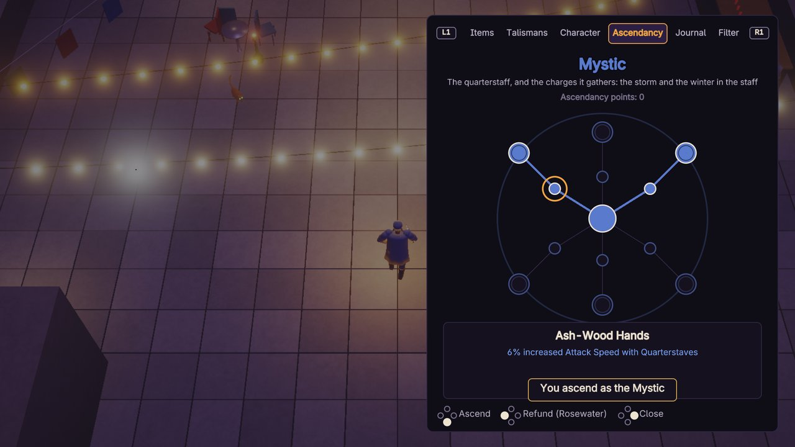 | 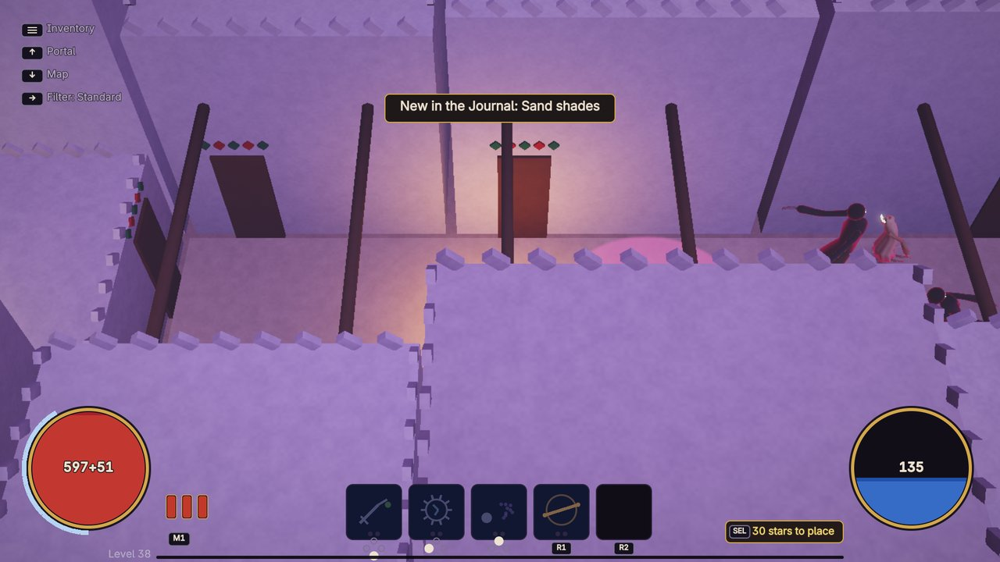 |
| 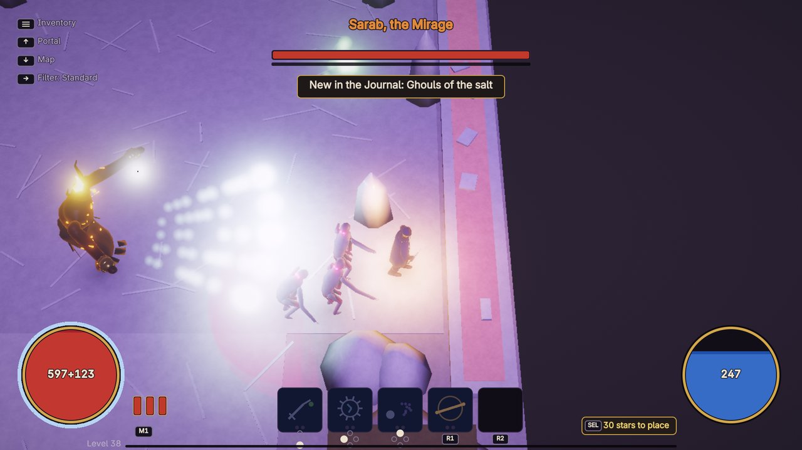 | 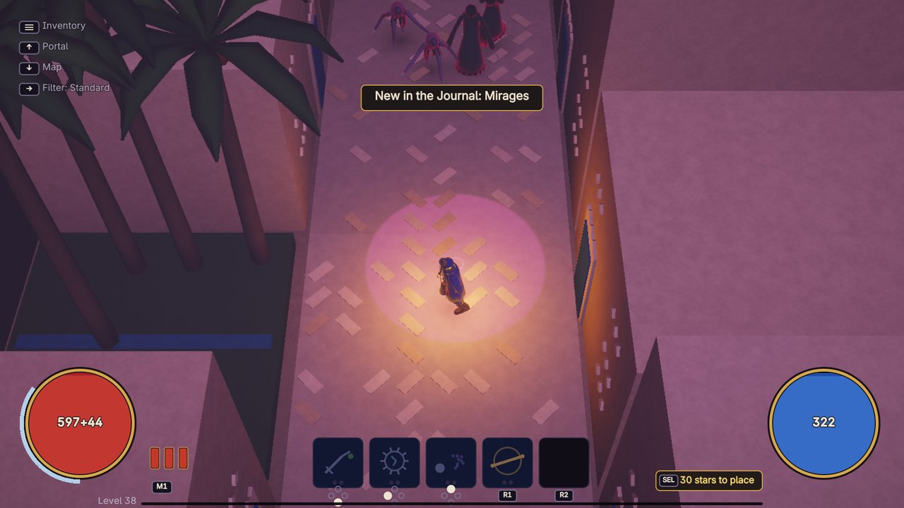 |
| 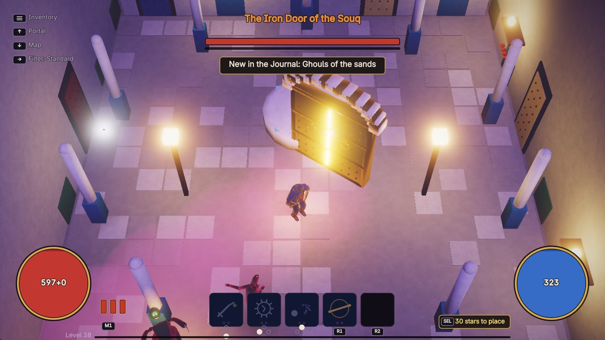 | 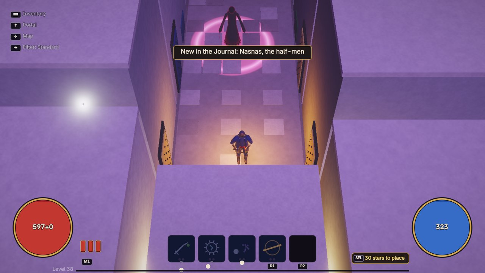 |
| 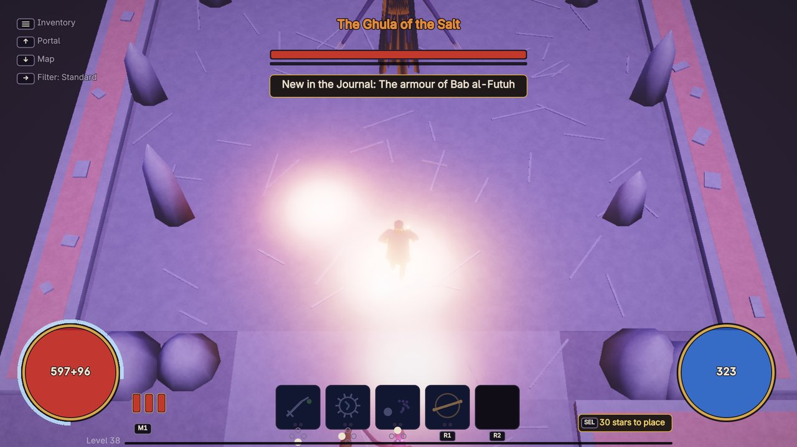 | 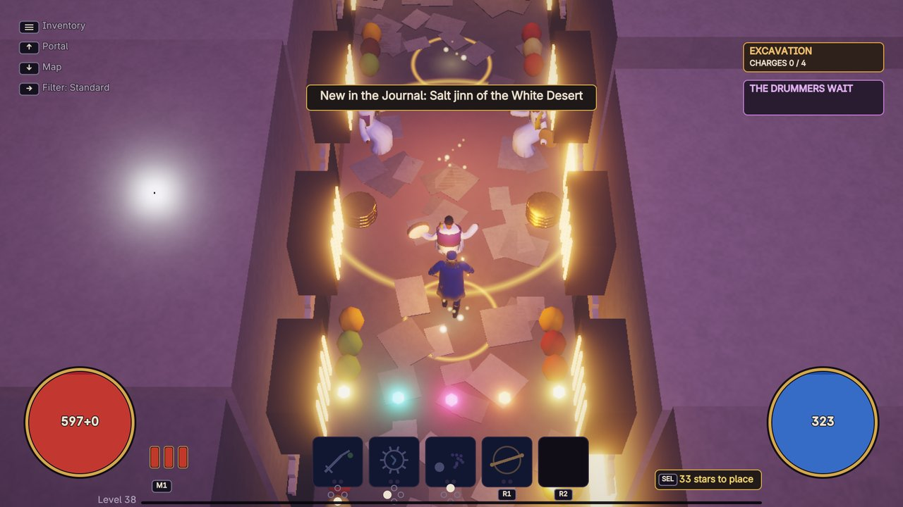 |
| 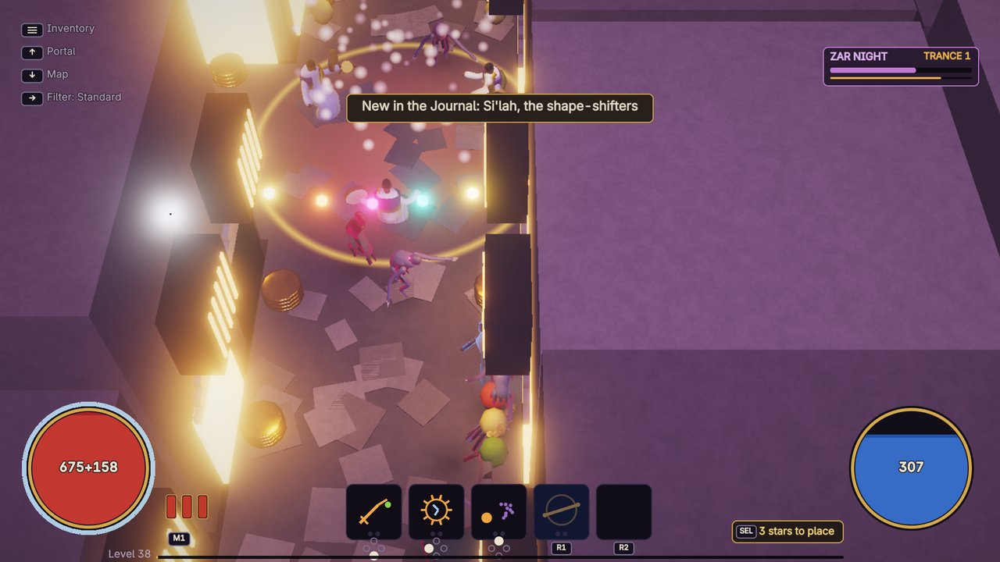 | |

**Known gaps (carried forward)**
- The `charts` bot as the Shadow does not finish: in al-Iskandariya it chases al-Nasnas al-Kabir round a corner and
  never gets a clear line. A pathing fault in the pilot, not the game; the Shadow's charts are not a CI step.
- The Shadow's `act1` is slow and deadly for the bot (37 minutes, 11 deaths). Its poison DPS is real but not counted by
  the summaries the bot upgrades by, and its life (about 230 at level 10, against the Warrior's 280) leaves little room against Act I's bosses.
- Claws, and the Shadow's third ascendancy (the Saboteur's mines) are not in the launch set. Traps have one kind.
- Zar Nights have no Astrolabe nodes yet, and the trance's pay-out is currency; a Zar-only reward (a charm, a
  Nazar) waits for Slice 9's Nazar slots.
- Audio is stored as 16-bit WAV: the pack is 152 MB.

## Slice 9 · The Atlas and the Strait

*One act, one class, two ascendancies, its piece of the sky, and one endgame piece: charts to the Sixteenth, and the
first pinnacle.*

**Delivered**
- **The Templar**, a sixth class (Strength and Intelligence; `game/classes.*`, `tools/art/characters/templar.py`):
  - an officer of Cairo's old Khedivial fire brigade, who kept the city's signal fires lit when the rest of the brigade
    was gone: a brass fireman's helmet with a comb crest, a long double-breasted coat of dark blue wool with brass
    buttons and red collar tabs, a signal lantern at his belt. Nothing he wears or carries is a religious sign;
  - **maces** and **sceptres** (1x3; a sceptre's implicit is increased elemental damage), armour-and-Hirz bases;
  - **four Talismans:** *Ember Strike* (60% of the blow converted to fire; it can Ignite), *the Beacon* (an aura held
    up or put away: a quarter of your mana reserved for 15% increased elemental damage and +12% to the elemental
    resistances), *Signal Fire* (a brazier on a tripod that throws fire at the nearest enemy for 8 s; one at a time)
    and *Brazier Slam* (half the slam converted to fire; the ground burns for 4 s, hurting enemies on it and mending
    you on it);
  - **Block:** a chance to turn a whole hit aside (capped at 75%).
- **The Templar's sky** between the Warrior's and the Sorcerer's: **Hercules** and **Boötes**, with the keystone
  **al-Iklil, the Crown** (every kind of hit damage is fire, and 15% less of it). 231 stars; the first 215 keep their ids.
- **Two ascendancies for the Templar**, chosen at the First Trial:
  - **Zealot:** enemies on your burning ground take 20% more damage, Signal Fire leaves burning ground where it
    stands, Ignite, fire damage, fire attacks' speed and more;
  - **Warden:** a Block recovers 2% of your life, the Beacon reserves no mana, more Block, aura effect, armour, life
    regeneration and resistances.
- **Act V, the Atlas and the Strait** (`game/acts.cpp`), levels 46 to 56, seven zones on four new regions
  (`tools/art/env/regions5.py`; no mosque stands in any of them):
  - **the Tanneries of Fes** and **Fes el-Bali**: ochre walls, hides drying on the roofs, the dye pits;
  - **Chefchaouen, the Blue City**, and **Bu Ghettat, the Presser**, who sits on sleepers' chests;
  - **Jemaa el-Fnaa at Night**, the grills still burning with nobody at them, and **Dukhan, the Smoke of the Stalls**;
  - **Bab al-Nasr**, the Third Trial (the toll is your gloves), and **the Bronze Mamluk** who guards it;
  - **the Kasbah of Tangier** and **the Sea Walls of the Strait**, where **Aisha Qandisha** stands in the surf. When
    she goes down into the sea, Act V is over.
  - New monsters: the dyers' ghouls, blue nasnas, smoke jinn, the marids of the Strait and the Bronze Armour. Three
    pieces of music and two ambiences (the night market, the sea walls).
- **The endgame piece: charts to the Sixteenth, and the Marid King.**
  - Once Act V is over, charts climb past the Fourth Clime: the Fifth, Sixth and Seventh Climes, then the nine
    **Reaches of the Encircling Sea**, a level a tier (area levels 54 to 65). Above the Fourth the climb is slower (a
    chart a tier up 7% of the time, a tier down 14%).
  - **Sixteen more sites** (32 in all) on two roads out of the Fourth Clime: south from Fas over the sand, through
    Marrakush, Sijilmasa, Awdaghust and Ghana, and on round the southern edge of the world by Kawkaw, the Mountains of
    the Moon, Sufala, Qumr, Maqdishu, Adan and al-Waq-Waq to **al-Bahr al-Muhit**, the Encircling Ocean, on the rim of
    the map; and east from Balarm and Tunis over the sea, by Saraqusa, Iqritish and Dimashq, to Baghdad. Their zones
    reuse every act's regions; their masters are the acts' bosses.
  - The masters of the **Fourteenth Reach and up** drop **King's Pearls**. Four of them, spent at the chart table
    (North), open **the Throne of the Marid King**: a drowned hall of columns under the Encircling Sea (level 68).
    The Marid King has every marid's move, calls you to him across his hall, raises his court in the second half, and
    always drops two uniques.
  - The map screen shows all sixteen tiers' charts in two rows, the pearls held, and the Throne on North. Three
    Astrolabe nodes (a tier up more often; two for the pearls). The codex gains the Reaches and the Marid King.
- **Saves:** save states v13 (the Beacon, totems, burning ground) and v14 (a chart run's highest tier); the character
  file v8 (waypoints for 128 zones: the zones passed 64 with the Reaches' sites). A character from before the map
  grew has its finished sites' roads drawn again on loading.
- **Simulation:** `qchartsim` runs the Reaches too, from Act V's end until four pearls open the throne.
- **The bots:**
  - they pilot the Templar (the Beacon up, Signal Fire by the tough or a crowd, Brazier Slam into a pack, Ember Strike
    otherwise);
  - `act5`, `reaches` and `king` are new; `tour10` takes the screenshots;
  - fixes the new content exposed: the chart back-off from a site's master gives up after 15 s (a master that reaches
    far never let life come back); in the throne, a pilot held by something out of reach goes to the King.

**Verified**

| Check | Result |
|---|---|
| Unit tests (`qtests`) | pass, 73 cases (new: the Templar's sceptre and Ember Strike's conversion; the Beacon held up and put away; Signal Fire and burning ground; Block; al-Iklil, the Zealot and the Warden and a save state that keeps the Beacon up; Act V's road; sixteen tiers of charts with their own bases, levels and sites; charts past the Fourth only after Act V; the King's Pearls from the last Reaches' masters, in the rules and in the world; the throne; waypoints for 128 zones through the character file) |
| `act5` bot (the exit): a character as Act IV leaves one plays Act V through, Fes to the sea walls of the Strait, Trial III included | pass: the Warrior in 11.0 minutes (level 43 to 54, 2 deaths, 381 kills), the Templar in 9.2 (0 deaths), the Sorcerer 9.2 (0) |
| `reaches` bot (the endgame piece): after Act V, charts from the Fifth Clime until a site of the Eighth Reach is finished | pass: Ghana after 10 runs, 22 sites, level 58 to 62, 4 deaths, 21 minutes |
| `king` bot (the pinnacle): four King's Pearls at the table, the throne, the Marid King | pass as the Warrior (1.3 minutes, 0 deaths) and the Sorcerer (1.0, 0). Not yet as the Ranger, Mercenary, Shadow or Templar: see Known gaps |
| The Templar through the earlier acts | `zone` pass; `act1` 9.0 minutes, `act2` 8.3, `act3` 8.8, `act4` 9.6; 0 deaths each |
| Every earlier bot | pass: `walk`, `fight`, `zone` (all six classes), `sorcerer`, `sky`, `title`, `rifts` (5.5 minutes, 4 deaths in the Rift Lord's court; the same before the Reaches went in), `digs` (0.8), `zar` (1.1, 5 trances), `charts` (Tunis after 9 runs, 0 deaths), `act1` (11.5 min, 0 deaths), `act2` (10.8, 0), `act3` (10.8, 0), `act4` (13.3, 0) |
| Tree validator | pass: 231 stars |
| Build simulator | 0 flags; at level 30 the Templar's Recommended Path makes 344 DPS against a crowd of 282 |
| `qchartsim` | 0 flags: the early map, median 9 runs to the Fourth Clime; after Act V, median 44 runs to open the throne (to the Eighth Reach 15, the Twelfth 30, the Sixteenth 42), 0% stalled |

| | |
|---|---|
| 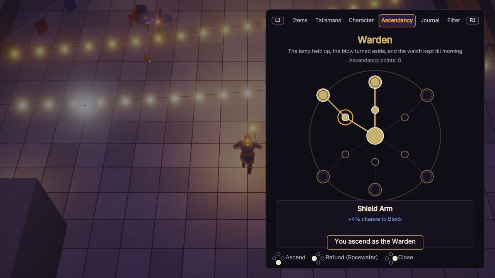 | 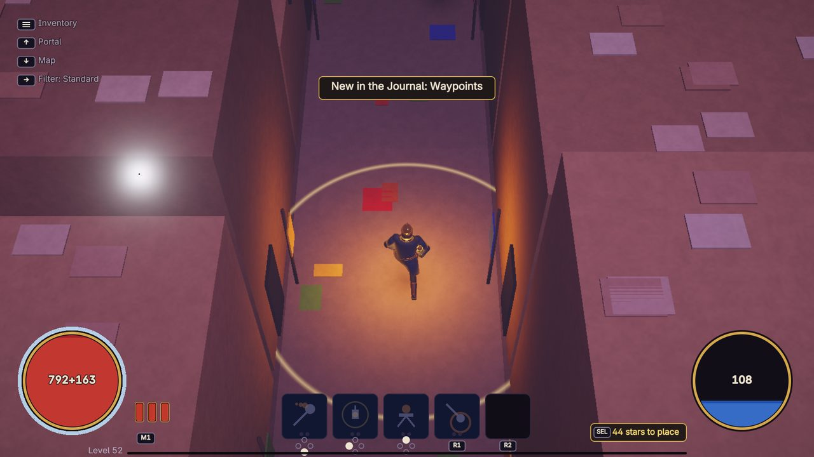 |
| 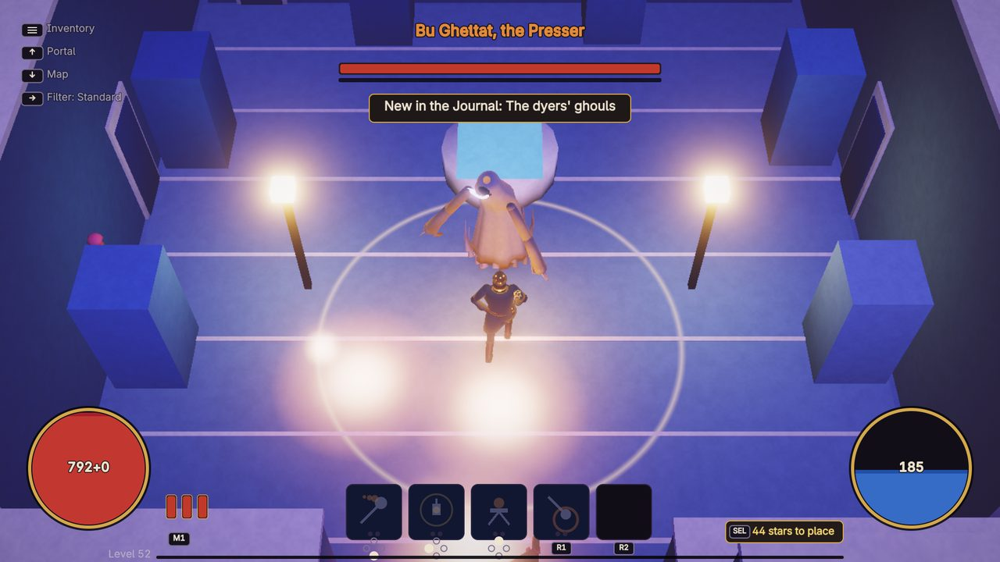 | 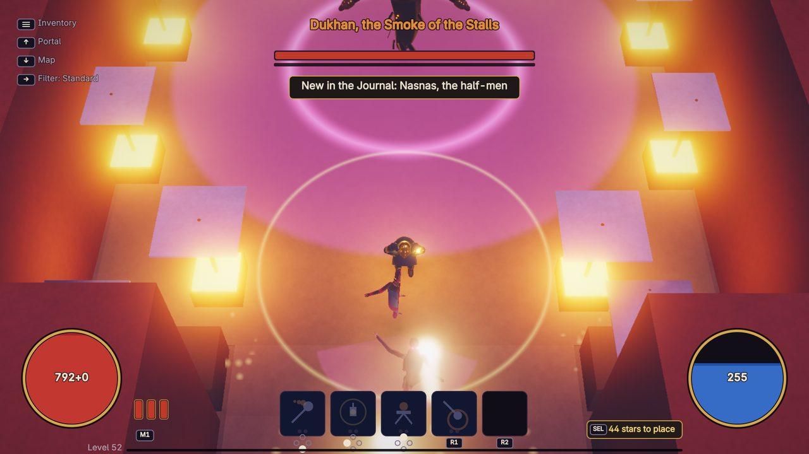 |
| 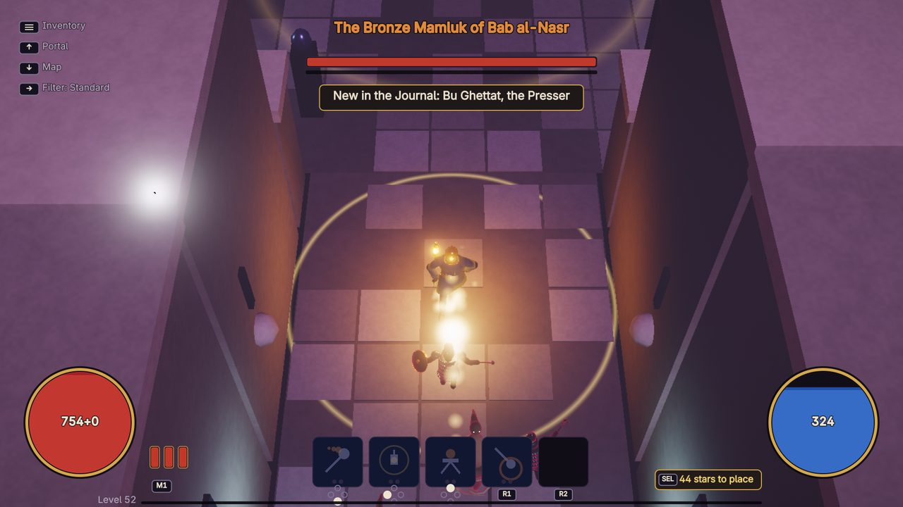 | 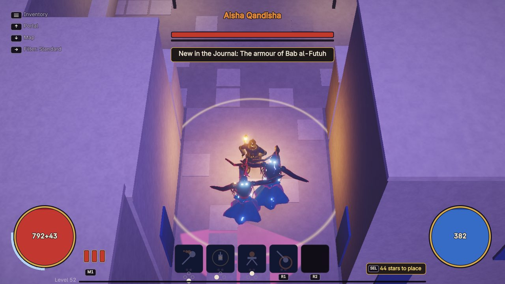 |
| 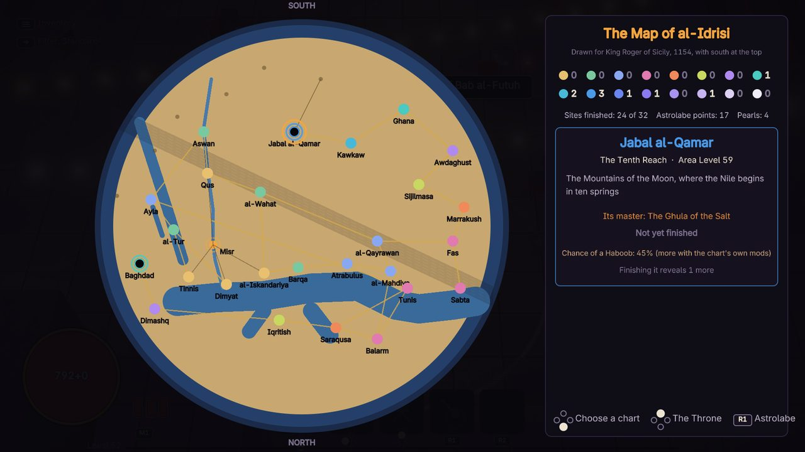 | 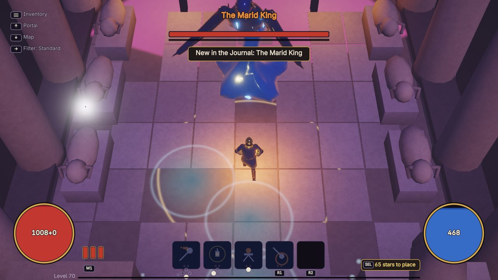 |
| 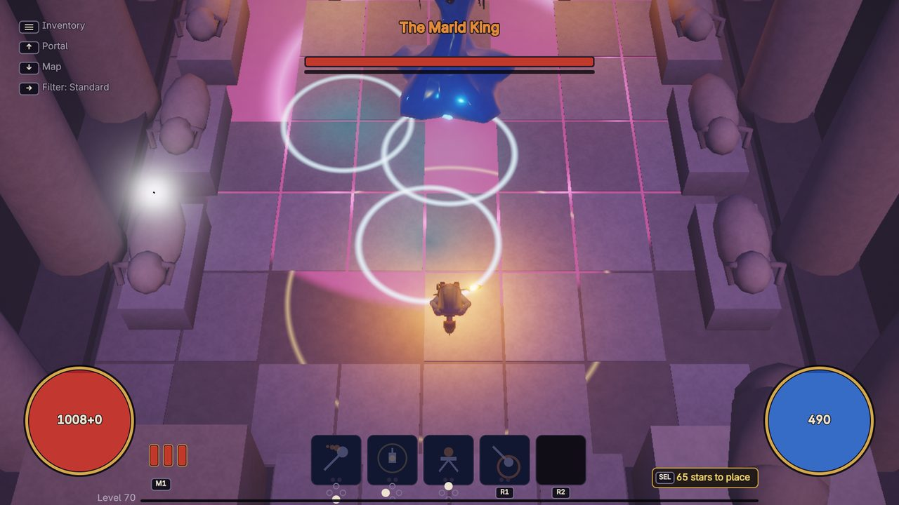 | |

**Known gaps (carried forward)**
- **Hero power stops growing after Act V.** The best bases are level 27 to 40 (the Warrior's Sultan's Maul is 27) and
  Talismans stop at level 20, while monster life keeps growing a level at a time. So the Reaches are a level a tier, and
  the Marid King is sized like Aisha Qandisha. At level 70 the bots' Ranger, Mercenary, Shadow and Templar have 180-270
  DPS and do not beat him (the Warrior and the Sorcerer do). Higher-level weapon and armour bases, and Talisman levels
  past 20, are Slice 10's.
- The site masks are 32 bits and the map now has 32 sites: another site needs 64-bit masks and a character file bump.
- The Marid King is the marid's rig, grown and tinted; he has no model or voice of his own yet.
- The Rift Lord's court costs the `rifts` bot 4 deaths and 5.5 minutes now (it was 1.5 minutes in Slice 8). The build
  from before the Reaches went in does the same, so it came with Slice 9's earlier work. Not yet looked into.
- Audio is stored as 16-bit WAV: the pack is 170 MB.
