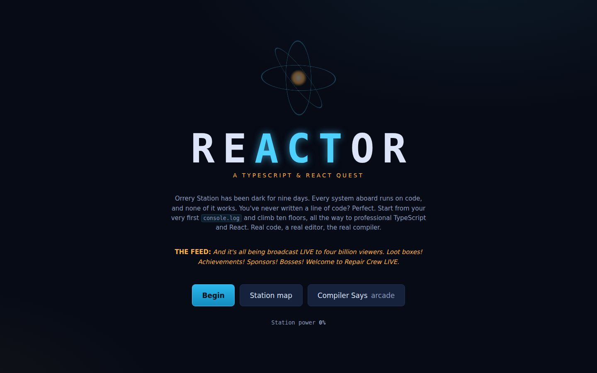
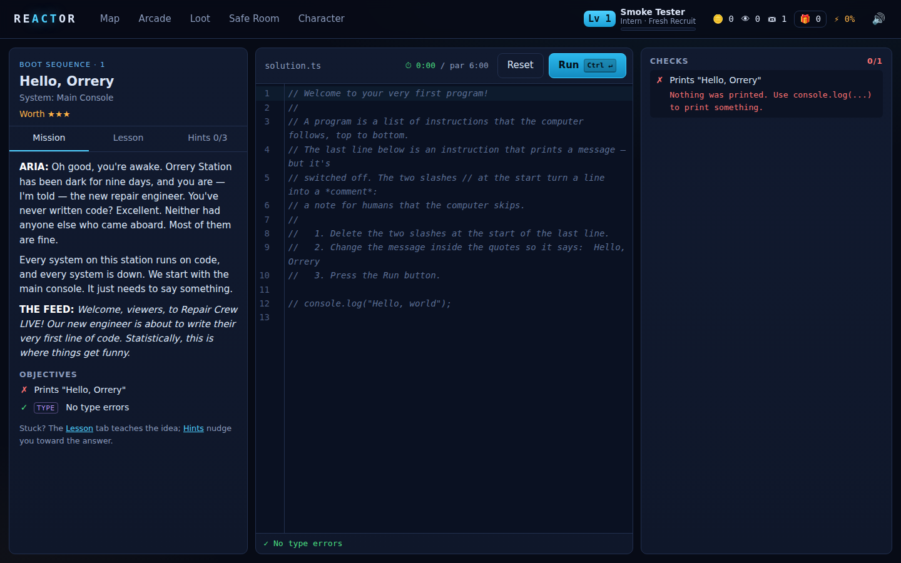
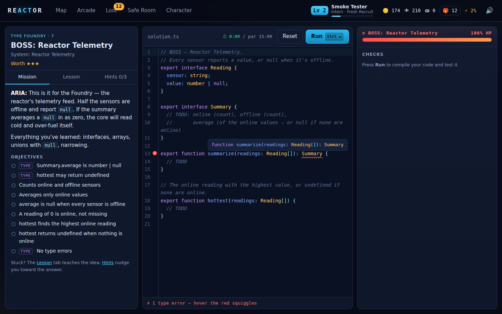
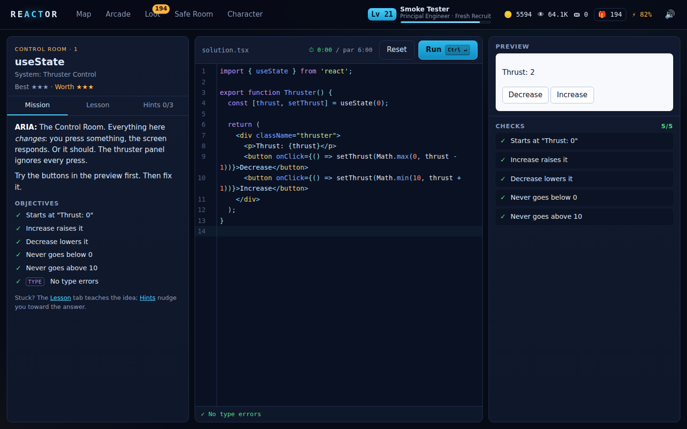
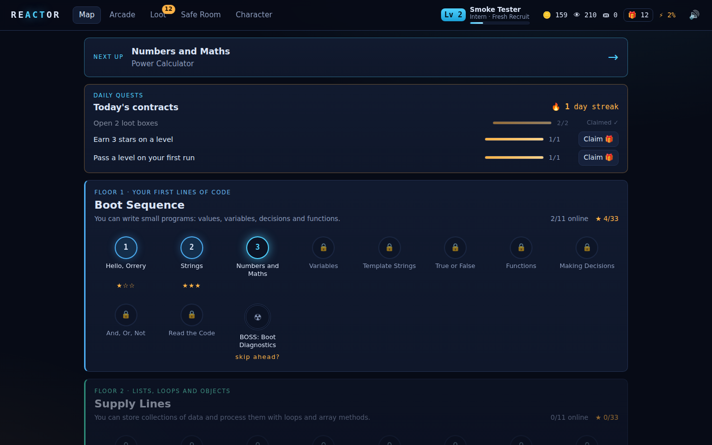
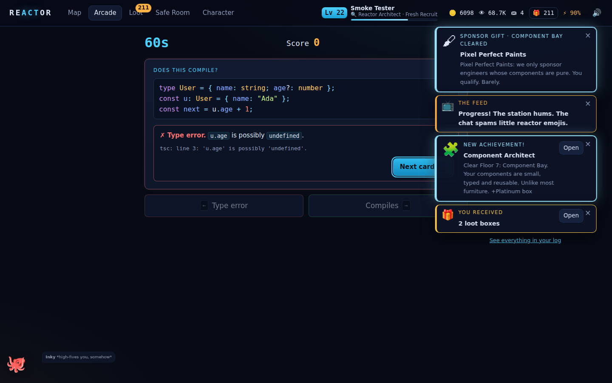
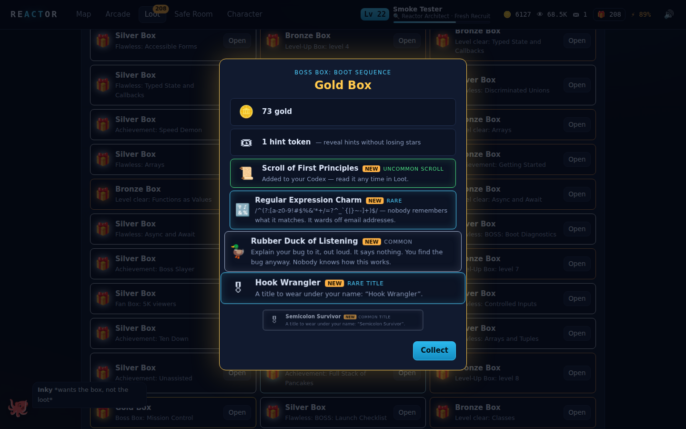
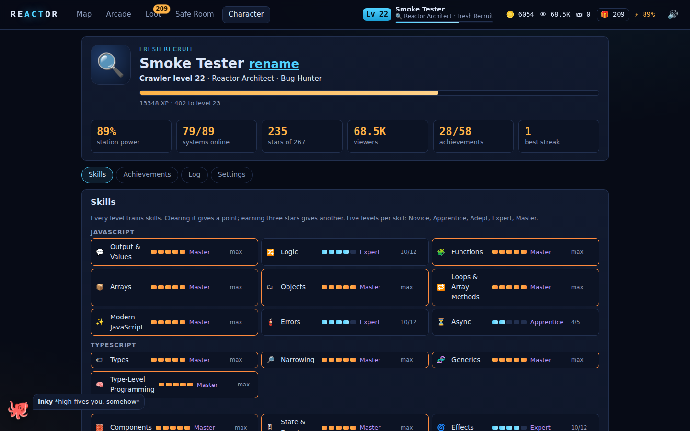
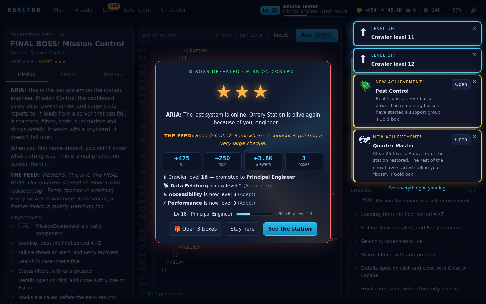

# Reactor — a TypeScript & React quest

An interactive game that takes you from **never having written a line of code**
to writing **professional TypeScript and React**, one small step at a time.
Orrery Station has been dark for nine days. Every system aboard runs on code,
and none of it works. You climb ten floors of the station, restoring one system
at a time in a real editor, against the **real TypeScript compiler** and the
**real React runtime**, both running in your browser.

And, in the spirit of *Dungeon Crawler Carl*, the whole repair job is being
broadcast live. **THE FEED** narrates your every move, viewers pile in when you
show off, sponsors send gifts, and there are loot boxes. So many loot boxes.

It runs on macOS and opens in your browser.



## Setup (macOS)

You only do this once.

1. **Install Node.js 20.19 or newer.** Download the macOS installer from
   [nodejs.org](https://nodejs.org/en/download), or, if you use Homebrew, run
   `brew install node`. To check, open Terminal and run `node --version`. It
   should print `v20.19` or higher.
2. **Get the code.** In Terminal:

   ```bash
   git clone https://github.com/keldessouky/completed-projects.git
   cd completed-projects/reactor-quest
   ```

   (No git? Download the repository as a ZIP from GitHub, unzip it, and open the
   `reactor-quest` folder.)
3. **Install and build.** Still in the `reactor-quest` folder:

   ```bash
   npm install
   npm run build
   ```

   You can skip this step if you launch with the `.command` file below. It
   does this for you the first time.

## Start the game

Pick one of these. Each one opens the game in your default browser at
`http://localhost:4310`.

- **Double-click `Reactor Quest.command`** in Finder (inside `reactor-quest`).
  A Terminal window opens. The first run installs and builds the game, which
  takes about a minute, then your browser opens. Leave the Terminal window
  open while you play, and close it when you're done.
- **Or run `npm start`** in Terminal from the `reactor-quest` folder. It does
  the same thing. Press `Ctrl+C` to stop.
- **Or make a Mac app:** run `npm run app:mac`. This creates
  **`Reactor Quest.app`** in the `reactor-quest` folder. Drag it to
  Applications and open it like any other app, from Launchpad, Spotlight or the
  Dock. It opens the game in your browser, runs quietly in the background, and
  quits on its own about a minute after you close the game's tab.

If you got the code with `git clone`, macOS opens the `.command` and the `.app`
you build without complaint. If you downloaded a ZIP instead (of the repository,
or of the ready-made app from CI), macOS may refuse the first time because it's
"from an unidentified developer":

- **macOS 15 (Sequoia) or newer:** click **Done** in the warning, open
  **System Settings → Privacy & Security**, scroll down to the message about
  Reactor Quest, and click **Open Anyway**.
- **macOS 14 or older:** right-click the file, choose **Open**, then click
  **Open** again.

You only have to do this once.

Your progress (stars, XP, loot, achievements, and the code you've typed in
every level) saves automatically in your browser. Use the same browser each time to
keep it.

### If something goes wrong

| Problem | Fix |
|---|---|
| "Reactor needs Node.js" | Install Node.js (step 1), then launch again. |
| "Reactor needs Node.js 20.19 or newer" | Update Node: download the latest version from nodejs.org, or run `brew upgrade node`. |
| The browser didn't open | Open `http://localhost:4310` yourself. If that port was taken, the Terminal window prints the address it used instead. |
| "Loading compiler…" stays for a few seconds | That's normal on the first level you open. The browser is loading the TypeScript compiler (about 7 MB). |
| You want to start over | **Character → Settings → Reset all progress**. |

## How to play



1. **Start.** On the title screen, click **Begin** and sign the crew register
   with your name. Floor 1, level 1 opens. Once you have progress, the button
   says **Continue** and takes you to your next level.
2. **Read the mission.** The left panel has three tabs:
   - **Mission:** the story, plus the list of **objectives** your code must meet.
   - **Lesson:** teaches the idea you need, with examples. The first floors
     assume you know nothing at all, so read this first whenever a topic is new.
   - **Hints:** three hints, revealed one at a time. A hint costs a star, unless
     you pay for it with a **hint token** (you start with one, and earn more
     from loot boxes and the shop).
3. **Write code** in the editor in the middle. The starter code is broken or
   unfinished. Comments in it tell you what to build. Type errors get **red
   squiggles** as you type. Hover over one to read the compiler's message. The
   bar under the editor says whether your file currently has type errors.
   - **Hover over any name** to see the type TypeScript gave it, like
     `let count: number` or `const setN: React.Dispatch<React.SetStateAction<number>>`.
     It's the fastest way to learn what the compiler infers.
   - **Autocomplete** pops up as you type: members after a `.`, names in
     scope, and a component's props inside JSX. Press **Ctrl+Space** to open it
     yourself. It comes from the same compiler, so it only offers what's valid.

   
4. **Run** with the **Run** button, or press **⌘↵** (Cmd+Return; Ctrl+Return
   works too). The shortcut works anywhere on the level screen. The right
   panel then shows:
   - **Checks:** every objective, ticked ✓ or crossed ✗, with the reason for each
     failure. Checks tagged **TYPE** test your *types* (for example, "strings must
     be rejected"). The others test what your code *does*.
   - **Preview** (React levels): your component, live. Click it and type into
     it like a real web page.
   - **Console:** anything your code prints with `console.log`.
5. **Pass every check with no type errors** and the system comes back online.
   You get stars, XP, gold, viewers and a loot box. Click **Next system →**, or
   press Return, to go on.



**Stars.** A level is worth ★★★ if you solve it without help. Each hint you
reveal for free drops it a star (hints bought with a token don't). Looking at
the reference solution (**Hints → Show the solution…**) caps it at ★. You can
**replay** any level later to earn all three. Your best result is kept, and
replays only pay out for stars you improve.

**Par time.** Each level shows a clock and a par time. Clear it under par on the
first try for a speed bonus.

**The station map** (**Map** at the top) shows all ten floors, your stars, what
each floor makes you able to do, and today's **daily quests**. Levels open in
order. Each floor ends with a **boss** (☢) that combines everything on that
floor, with an HP bar that drops as your checks pass. A floor's boss is open as
soon as you reach the floor: already know the material? Beat the boss and skip
straight to the next floor. Or go to **Character → Settings** and turn on
**Open every system** to roam freely.



**Quizzes** (the **?** levels) are multiple choice, and each answer comes with
an explanation. Every wrong answer costs a star, but you always get at least one.

**Arcade: Compiler Says** (**Arcade** at the top). You have 60 seconds. Each
card shows a snippet of TypeScript. Decide whether it compiles:

| Key | Answer |
|---|---|
| `→` or `Y` | It compiles |
| `←` or `N` | It's a type error |
| `Return` | Next card, after a wrong answer |

A wrong answer pauses the clock and shows why, along with the compiler's real
error message. Your score earns XP and gold, and your best score is kept.



The whole game is keyboard-friendly: **⌘↵** runs your code, **Return**
continues after a win, and **Esc** closes dialogs. The speaker icon at the top
right mutes sound effects.

## Rewards: why you'll keep playing

Something good happens every few minutes, and most of it is announced by
**THE FEED**, the show's breathless announcer, in a stack of cards at the top
right.

- **Crawler levels and career titles.** XP from every level, quiz and arcade
  round fills your crawler level. The curve is gentle: your first clears level
  you up almost every time, and later levels arrive steadily. Your career title
  climbs with you: Intern → Junior Developer → Developer → Senior Developer →
  Staff Engineer → Principal Engineer → **Reactor Architect** (which clearing
  the whole station earns) → Living Legend.
- **Loot boxes** in six tiers, Bronze, Silver, Gold, Platinum, Legendary and
  Celestial. You get one for every first clear, every level-up, every
  achievement and every daily quest, and better ones for bosses, flawless runs
  and milestones. Open them one by one for the reveal, or all at once from
  **Loot**. Inside: gold, hint tokens, XP boosts, collectibles, titles, editor
  themes and hats for your companion.
- **58 achievements**, each with its own Feed quip, from "Hello, World" to
  "Living Legend": first tries, flawless floors, speedruns, streaks, debugging
  persistence, late-night coding, hoarding boxes and more. See them all under
  **Character → Achievements**.
- **Viewers and fan boxes.** Every clear grows your audience, more on higher
  floors and for showing off (first tries, three stars, speed bonuses). At 100,
  1K, 5K, 25K, 100K, 500K, 1M and 5M viewers your fans send a Fan Box.
- **Sponsors.** Clearing a floor brings a sponsor gift: gold, a good box, and a
  message from a sponsor with opinions.
- **Your companion.** Beat Floor 1's boss and a companion offers to join you:
  a Maintenance Drone, Ship's Cat, Octo, Debug Owl, Station Fox or Pocket
  Dragon. Name it, dress it in hats, and it cheers (or commiserates) as you work.
- **Your class.** Beat Floor 3's boss and choose a class with a real perk:
  **Type Sorcerer** (+25% XP on TypeScript), **Component Artificer** (+25% XP
  on React), **Bug Hunter** (+20% gold, free hint tokens from bosses),
  **Speedrunner** (longer par times, double speed bonuses) or **Crowd
  Favourite** (+50% viewers, better Fan Boxes). You can retrain later for gold.
- **21 skills**, from Output & Values and Logic through Generics, Effects,
  Performance, Accessibility and Testing. Each level trains the skills it
  teaches, and each skill ranks up from Novice to Master, so your character
  sheet shows exactly what you've learned.
- **Daily quests and streaks.** Three contracts a day ("clear 2 levels", "get 8
  cards right in Compiler Says") each pay a Silver box and gold. Play on
  consecutive days to build a streak.
- **The Safe Room** (the shop). Spend gold on hint tokens, XP boosts, boxes,
  titles, editor themes and companion hats.
- **Codex scrolls.** Every boss guarantees a scroll: a cheat sheet of that
  floor's material that you keep forever and can reread any time under
  **Loot → Codex**. Collect all fifteen.





## What you'll learn: 10 floors, 89 levels

The first three floors teach programming itself, assuming no prior knowledge.
The rest take you through TypeScript and React to the standard professional
teams expect. Each floor's outcome is shown on the map.

| Floor | You'll be able to… | Teaches | Boss |
|---|---|---|---|
| **1. Boot Sequence** | write small programs | `console.log`, strings, numbers and maths, variables, template strings, booleans, functions, `if`/`else`, `&&` `\|\|` `!` | Boot Diagnostics |
| **2. Supply Lines** | process collections of data | arrays, `for`/`while` loops, objects, lists of objects, `map`, `filter`, `find`/`some`/`every`, `reduce` | Inventory Audit |
| **3. Modern Systems** | write JavaScript like a professional | functions as values, destructuring, spread/rest, optional chaining, closures, string methods, errors and `try`/`catch`, classes, `async`/`await` | Comms Decoder |
| **4. Type Foundry** | describe data precisely with types | annotations, return types, inference, reading compiler errors, arrays and tuples, interfaces, unions and narrowing | Reactor Telemetry |
| **5. Generics Lab** | write reusable, type-safe code | literal types, discriminated unions, generics, constraints and `keyof`, utility types | a fully typed event bus |
| **6. Type Vault** | model untrusted data and whole APIs in types | type guards, parsing `unknown`, errors as values (`Result`), mapped, conditional and template literal types, `satisfies` and `as const` | Schema Forge |
| **7. Component Bay** | build UIs from typed components | components and JSX, typed props, `children` and composition, lists and keys, conditional rendering | Crew Roster |
| **8. Control Room** | build interactive screens | `useState`, typed state and callbacks, controlled inputs, forms, immutable updates, lifting state up | Launch Checklist |
| **9. Reactor Core** | wire components to timers, the DOM and shared state | `useEffect` and cleanup, `useRef`, `useReducer`, custom hooks, context, generic components | Core Reboot |
| **10. Production Deck** | build React apps the way professional teams do | loading and error states, race conditions, debouncing, memoization, accessible forms, keyboard navigation, error boundaries, writing good tests | Mission Control |

79 of the levels are code, written and run for real. The other 10 are quizzes
("Read the Code", "Predict the Output", "JSX Inspection"…) that train you to read
code and predict what it does. The arcade holds 40 compile-or-not cards.

## How it works

```
 editor ──► Web Worker: TypeScript 6 LanguageService over a virtual file system
            (lib.es2022 + lib.dom + @types/react, ~3.8 MB, mounted read-only)
              │  diagnostics for the player's file and each hidden type test
              │  + the file transpiled to CommonJS (loops get a runaway guard)
              ▼
 main thread: evaluate it in a sandbox (console + timers are intercepted;
              only `react` can be imported) ──► behaviour checks with a small
              testing kit (render · click · type · key · submit · expect · logs)
              ──► live preview in its own React root, behind an error boundary
```

- **Real type checking.** `tools/gen-typings.mjs` collects every declaration file
  the compiler needs at build time. The worker's language service keeps the parsed
  library ASTs, so the first check takes about a second and later ones take tens
  of milliseconds. The same language service answers the editor's hover types
  (`getQuickInfoAtPosition`) and autocomplete (`getCompletionsAtPosition`).
- **Type tests.** A level can require that your *types* are right, not just your
  output. Each type check is a hidden `.tsx` file that imports your module and
  marks lines your types must reject with `// @ts-expect-error`. If your types are
  too loose (say, `any`), the directive goes unused and the check fails with
  "This should be rejected by the compiler, but your types allow it."
- **Behaviour checks** run your code or render your component with the real
  `react-dom`, dispatch real DOM events, and read the result. The kit catches the
  things beginners trip on and says so plainly: nothing printed, infinite loops
  (a compiler transform guards every loop), errors thrown in event handlers,
  unhandled promise rejections, forms that would reload the page, timers still
  running after unmount, and reducers that mutate frozen state.
- **The reward engine** (`src/game/rewards.ts`) is a set of pure functions over
  the save file with an injectable random number generator, so every payout,
  loot roll and Feed line is unit-tested and repeatable.
- **Safety.** Your code runs in the page, so the sandbox clears every timer it
  started on each run, a guard stops any form from reloading the game, and the
  preview lives in a separate React root, so a crash in your component can't take
  the game down.
- The **title, map, and every screen** are themselves React + TypeScript (Vite 8,
  React 19, CodeMirror 6). All sound is synthesized with WebAudio. The `.app` icon
  is drawn by `tools/icon.mjs` and encoded to PNG/ICNS with nothing but `node:zlib`.

## Proven playable

```bash
npm test        # 378 tests
npm run smoke   # 96 checks in headless Chromium/Chrome
```

- **`npm test`** checks every one of the 79 code levels both ways: the reference
  solution compiles cleanly and passes every type and behaviour check, *and* the
  starter code does not, so every level has something to do. Every arcade card's
  verdict is checked against the real compiler. Every quiz answer is valid. Every
  lesson renders without stray markdown. The reward engine (XP curve, loot, quests,
  shop, classes, achievements, save migration), grading kit and sandbox have their
  own tests too.
- **`npm run smoke`** is a bot that plays the built game through its UI. It signs
  the crew register, fails with the starter, buys a hint with a token, wins at ★
  with the solution, opens its loot boxes, solves the next level by typing for
  ★★★, claims a daily quest, and checks locking. Then it opens *every* code
  level, types the solution into the editor, presses Run and waits for the
  victory screen, which covers the effect and timer levels in a real browser.
  It adopts a companion, picks a class, opens a boss box and reads its Codex
  scroll, shops in the Safe Room, hovers a name for its type, checks
  autocomplete, plays a quiz and an arcade round, checks the phone layout for
  horizontal scroll, exercises the launcher server, and fails on any uncaught
  page error. Screenshots land in `test-results/`. `SMOKE_PLATFORM=mac npm run
  smoke` makes the page believe it's on macOS, so the ⌘ keyboard paths can be
  tested from any machine.



CI (`.github/workflows/reactor-quest.yml`) runs all of this on **macOS**, packages
`Reactor Quest.app`, checks that its bundled server serves the game, and uploads
the zipped app as an artifact.

## Development

```bash
npm install
npm run dev      # http://localhost:5173, with hot reload
npm run build    # typecheck + production build → dist/
npm start        # build if stale, serve dist/, open the browser
```

```
src/
  content/         the curriculum: floor1–10.ts, arcade.ts, helpers.ts
    code/<level>/  starter + reference solution for every code level, as real .ts/.tsx
  engine/          checker.ts (TS language service), compiler.worker.ts, runtime.ts
                   (sandbox + test kit), grade.ts
  game/            types, progress (save, stars, XP curve, unlocking), rewards
                   (loot, achievements, quests, shop, classes, pets, THE FEED),
                   items, skills, store, sound
  screens/         Title, Map, CodeLevel, Quiz, Arcade, Loot, Shop, Character
  ui/              CodeEditor, Preview, Announcer, BoxOpener, Offers, Companion,
                   Hud, Victory, Markdown, Modal, router
tools/             gen-typings, launch, server (zero-dependency), make-mac-app, icon, smoke
tests/             levels, arcade, progress, rewards, runtime, checker, markdown
```

### Adding a level

1. Write `src/content/code/<id>/starter.tsx` and `solution.tsx`.
2. Add an entry to a floor with a brief, a lesson, three hints, the `skills` it
   trains, `checks` (behaviour) and optionally `typeChecks`
   (`@ts-expect-error` files) and a `preview`.
3. Run `npm test`. The level suite fails until the solution passes everything and
   the starter doesn't.
