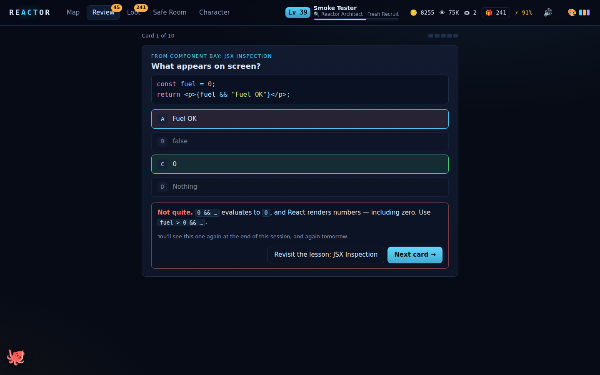
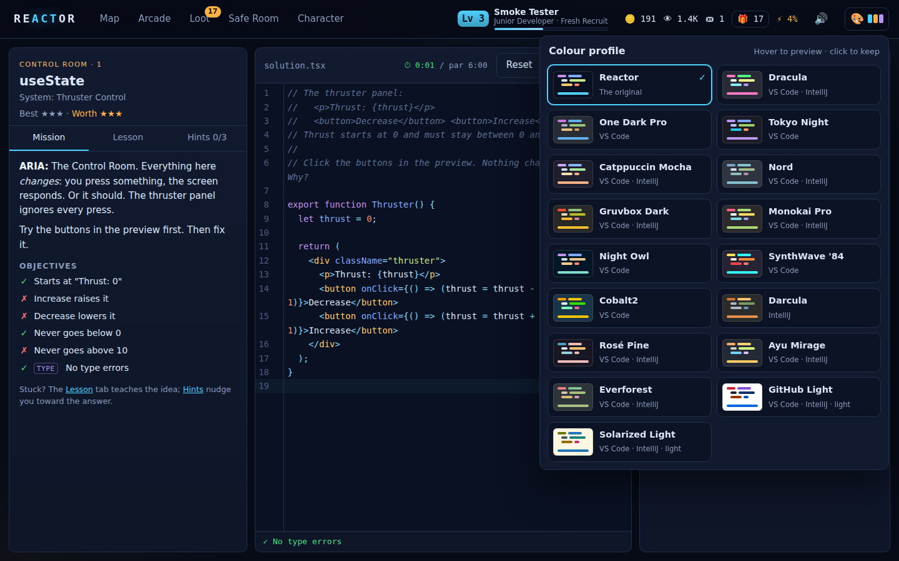
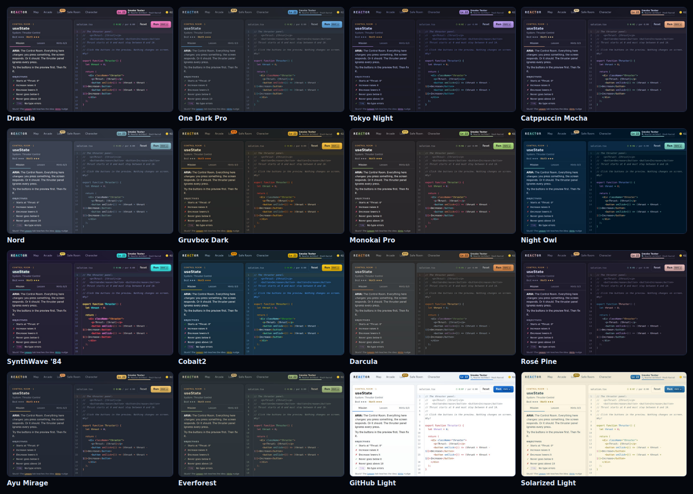

# Reactor — a TypeScript & React quest

An interactive game that takes you from **never having written a line of code**
to writing **professional TypeScript and React**, one small step at a time.
Orrery Station has been dark for nine days. Every system aboard runs on code,
and none of it works. You climb ten floors of the station, restoring one system
at a time in a real editor, against the **real TypeScript compiler** and the
**real React runtime**, both running in your browser.

And, in the spirit of *Dungeon Crawler Carl*, the whole repair job is being
broadcast live. **THE FEED** narrates your every move, viewers pile in when you
show off, sponsors send gifts, and there are loot boxes. So many loot boxes.

It runs on **macOS, Windows and Linux** and opens in your browser. Pick from
16 colour profiles modelled on the best VS Code and IntelliJ themes.


## Setup

You only do this once.

1. **Install Node.js 20.19 or newer.** To check whether you already have it,
   open a terminal (Terminal on macOS, PowerShell on Windows) and run
   `node --version`. It should print `v20.19` or higher.

   | System | How to install Node.js |
   |---|---|
   | **macOS** | The installer from [nodejs.org](https://nodejs.org/en/download), or `brew install node` |
   | **Windows** | The installer from [nodejs.org](https://nodejs.org/en/download), or `winget install OpenJS.NodeJS.LTS` in PowerShell. Open a *new* terminal afterwards. |
   | **Linux** | Ubuntu and friends: `sudo snap install node --classic`. Fedora: `sudo dnf install nodejs`. Arch: `sudo pacman -S nodejs npm`. Or [nvm](https://github.com/nvm-sh/nvm). Some distros' own `apt` packages are too old. |

2. **Get the code:**

   ```bash
   git clone https://github.com/keldessouky/completed-projects.git
   cd completed-projects/reactor-quest
   ```

   (No git? Download the repository as a ZIP from GitHub, unzip it, and open the
   `reactor-quest` folder.)
3. **Install and build.** Still in the `reactor-quest` folder:

   ```bash
   npm install
   npm run build
   ```

   You can skip this step if you launch with the double-click launchers below.
   They do it for you the first time.

## Start the game

Each of these opens the game in your default browser at
`http://localhost:4310`. The first run installs and builds the game, which
takes about a minute.

### macOS

- **Double-click `Reactor Quest.command`** in Finder (inside `reactor-quest`).
  A Terminal window opens, then your browser. Leave the Terminal window open
  while you play, and close it when you're done.
- **Or make a Mac app:** run `npm run app:mac`. This creates
  **`Reactor Quest.app`**. Drag it to Applications and open it like any other
  app, from Launchpad, Spotlight or the Dock. It runs quietly in the background
  and quits on its own about a minute after you close the game's tab.

If you got the code with `git clone`, macOS opens these without complaint. If
you downloaded a ZIP instead (of the repository, or of the ready-made app from
CI), macOS may refuse the first time because it's "from an unidentified
developer":

- **macOS 15 (Sequoia) or newer:** click **Done** in the warning, open
  **System Settings → Privacy & Security**, scroll down to the message about
  Reactor Quest, and click **Open Anyway**.
- **macOS 14 or older:** right-click the file, choose **Open**, then click
  **Open** again.

### Windows

- **Double-click `Reactor Quest.cmd`** in File Explorer (inside
  `reactor-quest`). A console window opens, then your browser. Leave the window
  open while you play, and close it when you're done.
- **Or make a Windows app:** run `npm run app:win`. This creates the folder
  **`Reactor Quest (Windows)`**, which you can zip up and copy to any PC with
  Node.js. Inside it:
  - **`Reactor Quest.cmd`** plays, with no console window. The game's server
    runs quietly in the background and stops on its own about a minute after
    you close the game's tab.
  - **`Install.cmd`** adds **Reactor Quest** (with its icon) to the Start menu
    and the desktop. No administrator rights needed. **`Uninstall.cmd`** removes
    it.

If Windows shows **"Windows protected your PC"** the first time (it does for
files downloaded from the internet), click **More info**, then **Run anyway**.

### Linux

- **Run `./reactor-quest.sh`** from the `reactor-quest` folder (or, in your file
  manager, right-click it and choose **Run as a Program**). Press `Ctrl+C` to
  stop.
- **Or make a Linux app:** run `npm run app:linux`. This creates the folder
  **`reactor-quest-linux`**. Inside it:
  - **`./reactor-quest`** plays. The server runs in the background and stops on
    its own about a minute after you close the game's tab.
  - **`./install.sh`** adds **Reactor Quest** (with its icon) to your desktop's
    app menu (GNOME, KDE, Xfce and others) and puts a `reactor-quest` command
    in `~/.local/bin`. No `sudo` needed. **`./uninstall.sh`** removes it.

### Any system

- **`npm start`** in a terminal from the `reactor-quest` folder does the same as
  the double-click launchers. Press `Ctrl+C` to stop.
- CI builds the packages for all three systems on every push: download
  `reactor-quest-macos`, `reactor-quest-windows` or `reactor-quest-linux` from
  the workflow run's **Artifacts**.

Your progress (stars, XP, loot, achievements, and the code you've typed in
every level) saves automatically in your browser. Use the same browser each time to
keep it.

### If something goes wrong

| Problem | Fix |
|---|---|
| "Reactor needs Node.js" | Install Node.js (step 1), then launch again. |
| "Reactor needs Node.js 20.19 or newer" | Update Node: download the latest version from nodejs.org, or `brew upgrade node` (macOS), `winget upgrade OpenJS.NodeJS.LTS` (Windows), `sudo snap refresh node` (Linux). |
| Windows: "node is not recognized" right after installing Node | Close the window and open a new one, so it picks up the new PATH. |
| The browser didn't open | Open `http://localhost:4310` yourself. |
| "Port 4310 is being used by another program" | Close that program and launch again. Reactor always uses port 4310: your progress is saved for that address, so it never moves to another one. The app versions log to `~/Library/Logs/reactor-quest.log` (macOS), `%LOCALAPPDATA%\Reactor Quest\reactor-quest.log` (Windows) and `~/.local/state/reactor-quest/reactor-quest.log` (Linux). |
| "Loading compiler…" stays for a few seconds | That's normal on the first level you open. The browser is loading the TypeScript compiler (about 7 MB). |
| You want to keep your progress safe, or move it to another computer | **Character → Settings → Download a backup**, then **Restore from a backup…** on the other side. Progress lives in your browser, so clearing its site data erases it: keep a backup. |
| You want to start over | **Character → Settings → Reset all progress**. |

## How to play


1. **Start.** On the title screen, click **Begin** and sign the crew register
   with your name. Floor 1, level 1 opens. Once you have progress, the button
   says **Continue** and takes you to your next level.
2. **Read the mission.** The left panel has three tabs:
   - **Mission:** the story, what you'll learn, and the list of **objectives**
     your code must meet.
   - **Lesson:** teaches the idea you need, with examples. The first floors
     assume you know nothing at all, so read this first whenever a topic is new.
   - **Hints:** three hints, revealed one at a time. The first is always free:
     asking for help is part of learning. After that a hint costs a star, unless
     you pay for it with a **hint token** (you start with one, and earn more
     from loot boxes and the shop). The reference solution opens only after all
     three, and until you've solved the level you rebuild it yourself rather
     than paste it.
3. **Write code** in the editor in the middle. The starter code is broken or
   unfinished. Comments in it tell you what to build. Type errors get **red
   squiggles** as you type. Hover over one to read the compiler's message, with
   a plain-English line underneath for the common ones ("`x` might be
   `undefined`. Check it first…"). The bar under the editor says whether your
   file currently has type errors.
   - **Hover over any name** to see the type TypeScript gave it, like
     `let count: number` or `const setN: React.Dispatch<React.SetStateAction<number>>`.
     It's the fastest way to learn what the compiler infers.
   - **Autocomplete** pops up as you type: members after a `.`, names in
     scope, and a component's props inside JSX. Press **Ctrl+Space** to open it
     yourself. It comes from the same compiler, so it only offers what's valid.

   
4. **Run** with the **Run** button, or press **⌘↵** (Cmd+Return; Ctrl+Return
   works too). The shortcut works anywhere on the level screen. The right
   panel then shows:
   - **Checks:** every objective, ticked ✓ or crossed ✗, with the reason for each
     failure. Checks tagged **TYPE** test your *types* (for example, "strings must
     be rejected"). The others test what your code *does*.
   - **Preview** (React levels): your component, live. Click it and type into
     it like a real web page.
   - **Console:** anything your code prints with `console.log`.
   If two runs fail and you haven't opened the lesson yet, a note suggests it.
5. **Pass every check with no type errors** and the system comes back online.
   You get stars, XP, gold and viewers (bosses also drop a loot box). Before moving on, you can
   **explain it back**: a sentence or two on what was wrong and why your fix
   works. It goes in your **Notebook** (under **Character**), shows up again
   when you revisit the level. (It earns nothing but understanding, on purpose.)
   Click **Next system →**, or press Return, to go on.


**Stars.** A level is worth ★★★ if you solve it with at most one hint. Each
hint after the first drops it a star (hints bought with a token don't). Looking at
the reference solution (**Hints → Show the solution…**) caps it at ★. You can
**replay** any level later to earn all three. Your best result is kept, and
replays only pay out for stars you improve.

**Par time.** Clearing a level under par on the first try earns a speed bonus.
There's no clock on screen while you work, though: time pressure gets in the
way of thinking, so the bonus is a surprise, never a race.

**The station map** (**Map** at the top) shows all ten floors, your stars, what
each floor makes you able to do, and today's **daily quests**. Levels open in
order. Each floor ends with a **boss** (☢) that combines everything on that
floor, with an HP bar that drops as your checks pass. A floor's boss is open as
soon as you reach the floor: already know the material? Beat the boss and skip
straight to the next floor. Or go to **Character → Settings** and turn on
**Open every system** to roam freely.


**Quizzes** (the **?** levels) are multiple choice, and each answer comes with
an explanation. A question you get wrong comes back at the end of the quiz, so
you always finish knowing every answer. Each first-try mistake costs a star,
but you always get at least one.

**Review** (**Review** at the top, with a badge when cards are due). Learning
something once isn't enough to keep it. When you finish a quiz, or a level whose
idea has a "does this compile?" card, those questions join your review deck.
Each card comes back the next day, then after 3 days, a week, two weeks, a
month and two months, as long as you keep remembering it. Miss one and it comes
back at the end of the session (so you finish having got it right) and again
tomorrow. A session is at most ten cards, takes a few minutes, has no timer,
and every answer links back to the lesson it came from.



The whole game is keyboard-friendly: **⌘↵** runs your code, **Return**
continues after a win, and **Esc** closes dialogs. The speaker icon at the top
right mutes sound effects.

## Colour profiles

Click **🎨** at the top right of any screen (the title screen too) to restyle
the whole game, its code editor included. Hover over a profile, or move through
the list with the arrow keys, to preview it live. Click it, or press Return, to
keep it. Esc puts the old one back. Your choice is remembered on this computer,
and **Reset all progress** leaves it alone.



There are 16 profiles, each modelled on a much-loved VS Code or IntelliJ theme,
plus **Reactor**, the game's original look. They were picked to look different
from each other: no two share a background, signature colour and syntax palette
(a test checks this, and also checks that every profile's text, buttons and code
are readable).

| Profile | From | Feel |
|---|---|---|
| Dracula | VS Code · IntelliJ | Hot pink and electric purple on vampire grey |
| One Dark Pro | VS Code | Atom's classic: calm slate and soft blue |
| Tokyo Night | VS Code | Neon signs reflected in a midnight street |
| Catppuccin Mocha | VS Code · IntelliJ | Soothing pastels on warm, dark mocha |
| Nord | VS Code · IntelliJ | Arctic frost and polar night |
| Gruvbox Dark | VS Code · IntelliJ | Retro groove: earthy browns, toasted yellow |
| Monokai Pro | VS Code · IntelliJ | Lime, pink and lemon on charcoal |
| Night Owl | VS Code | Deep ocean blue and sea-glass teal |
| SynthWave '84 | VS Code | Neon on a purple horizon, and the code glows |
| Cobalt2 | VS Code | Punchy yellow on cobalt blue |
| Darcula | IntelliJ | JetBrains' own: orange keywords, olive strings |
| Rosé Pine | VS Code · IntelliJ | Muted rose, pine and gold |
| Ayu Mirage | VS Code · IntelliJ | Dusky blue-grey with a marigold glow |
| Everforest | VS Code · IntelliJ | A comfortable green forest |
| GitHub Light | VS Code · IntelliJ | Crisp white, like reading code on GitHub |
| Solarized Light | VS Code · IntelliJ | Warm parchment for daylight coding |



The **editor skins** you win in loot boxes (Phosphor Terminal, Nebula and the
rest) still work: a skin repaints just the code editor, on top of whichever
profile you've picked.

## Rewards: why you'll keep playing

Something good happens every few minutes, and most of it is announced by
**THE FEED**, the show's breathless announcer, one card at a time at the top
right. While you're working on a level, the news waits until you finish.

- **Crawler levels and career titles.** XP from every level, quiz and review
  fills your crawler level. The curve is tuned so that every floor, the
  first or the last, brings a level-up every two or three clears. Your career
  title climbs with you: Intern → Junior Developer → Developer → Senior
  Developer → Staff Engineer → Principal Engineer → **Reactor Architect**
  (which clearing the whole station earns, around level 41) → Living Legend
  (level 45, for those who keep going).
- **Loot boxes** in six tiers, Bronze, Silver, Gold, Platinum, Legendary and
  Celestial. They're for moments that matter: every level-up, achievement,
  daily quest and boss, and better ones for flawless bosses, sponsors and
  milestones. (Not for every level: a box per level piled up faster than
  anyone opened them.) Open them one by one for the reveal, or all at once from
  **Loot**. Inside: gold, hint tokens, XP boosts, collectibles, titles, editor
  skins and hats for your companion.
- **58 achievements**, each with its own Feed quip, from "Hello, World" to
  "Living Legend": first tries, flawless floors, speedruns, streaks, debugging
  persistence, late-night coding, hoarding boxes and more. See them all under
  **Character → Achievements**.
- **Viewers and fan boxes.** Every clear grows your audience, more on higher
  floors and for showing off (first tries, three stars, speed bonuses). At 100,
  1K, 5K, 25K, 100K, 500K, 1M and 5M viewers your fans send a Fan Box.
- **Sponsors.** Clearing a floor brings a sponsor gift: gold, a good box, and a
  message from a sponsor with opinions.
- **Your companion.** Beat Floor 1's boss and a companion offers to join you:
  a Maintenance Drone, Ship's Cat, Octo, Debug Owl, Station Fox or Pocket
  Dragon. Name it, dress it in hats, and it cheers (or commiserates) as you work.
- **Your class.** Beat Floor 3's boss and choose a class with a real perk:
  **Type Sorcerer** (+25% XP on TypeScript), **Component Artificer** (+25% XP
  on React), **Bug Hunter** (+20% gold, free hint tokens from bosses),
  **Archivist** (+50% XP from spaced review) or **Crowd
  Favourite** (+50% viewers, better Fan Boxes). You can retrain later for gold.
- **21 skills**, from Output & Values and Logic through Generics, Effects,
  Performance, Accessibility and Testing. Each level trains the skills it
  teaches, and each skill ranks up from Novice to Master, so your character
  sheet shows exactly what you've learned.
- **Daily quests and streaks.** Three contracts a day ("clear 2 levels", "get 8
  cards", "explain a level back in your own words") each pay a Silver box and gold. Play on
  consecutive days to build a streak.
- **The Safe Room** (the shop). Spend gold on hint tokens, XP boosts, boxes,
  titles, editor skins and companion hats.
- **Codex scrolls.** Every boss guarantees a scroll: a cheat sheet of that
  floor's material that you keep forever and can reread any time under
  **Loot → Codex**. Collect all fifteen.


## What you'll learn: 10 floors, 106 levels

The first three floors teach programming itself, assuming no prior knowledge.
The rest take you through TypeScript and React to the standard professional
teams expect. Each floor's outcome is shown on the map.

| Floor | You'll be able to… | Teaches | Boss |
|---|---|---|---|
| **1. Boot Sequence** | write small programs | `console.log`, strings, numbers and maths, variables, template strings, booleans, functions, `if`/`else`, `&&` `\|\|` `!` | Boot Diagnostics |
| **2. Supply Lines** | process collections of data | lists and indexes, arrays, `for…of` and `for`/`while` loops, objects, lists of objects, `map`, `filter`, `find`/`some`/`every`, `reduce` | Inventory Audit |
| **3. Modern Systems** | write JavaScript like a professional | functions as values, destructuring, spread/rest, optional chaining, closures, string methods, errors and `try`/`catch`, classes, `async`/`await` | Comms Decoder |
| **4. Type Foundry** | describe data precisely with types | annotations, return types, inference, reading compiler errors, arrays and tuples, interfaces, unions and narrowing | Reactor Telemetry |
| **5. Generics Lab** | write reusable, type-safe code | literal types, discriminated unions, generics, constraints and `keyof`, utility types | a fully typed event bus |
| **6. Type Vault** | model untrusted data and whole APIs in types | `unknown` instead of `any`, type guards, parsing `unknown`, errors as values (`Result`), mapped, conditional and template literal types, `satisfies` and `as const` | Schema Forge |
| **7. Component Bay** | build UIs from typed components | components and JSX, typed props, `children` and composition, lists and keys, conditional rendering | Crew Roster |
| **8. Control Room** | build interactive screens | `useState`, typed state and callbacks, controlled inputs, forms, immutable updates, lifting state up | Launch Checklist |
| **9. Reactor Core** | wire components to timers, the DOM and shared state | `useEffect` and cleanup, `useRef`, `useReducer` and reducers with rules, custom hooks, context, generic components | Core Reboot |
| **10. Production Deck** | build React apps the way professional teams do | fetching data, loading and error states, race conditions, debouncing, memoization, labels and ARIA errors, accessible forms, ARIA states and keys, keyboard navigation, error boundaries, writing good tests | Mission Control |

96 of the levels are code, written and run for real. One on every floor,
marked **From Scratch**, starts from an empty file and a spec, like real work. The other 10 are quizzes
("Read the Code", "Predict the Output", "JSX Inspection"…) that train you to read
code and predict what it does. Spaced review draws on every quiz question plus
40 compile-or-not cards, each unlocked by the level that teaches its idea.

## How it teaches

The game is built around a few well-established findings about how people
learn, especially people learning to program for the first time.

- **One new idea at a time, in order.** Every level teaches one concept and
  only uses what earlier levels taught; where a step was big (lists, loops,
  reducers, fetching data, accessible forms, keyboard widgets) a smaller
  bridge level comes first. A floor's boss mixes the floor's ideas together.
- **Know what you're about to learn.** Each level lists what it teaches before
  you start, and the lesson is one click away (and suggested if you get stuck).
- **Support that fades.** The first floors explain everything in the starter
  code. From Floor 4 on, starters say *what* to build and leave the *how* to
  you (the first level of each new idea still guides you through it), and every
  floor has a **From Scratch** level: an empty file, a spec, and nothing else.
  Passing those means you can build it, not just follow along.
- **Struggle a little, with support.** Hints come one at a time, each a little
  more specific. The solution waits until you've seen them all, and you rebuild
  it rather than paste it: working it out is what makes it stick.
- **Fast, specific feedback.** Every check says exactly what failed and why;
  compiler errors come with a plain-English line for the common ones.
- **Retrieval, spaced out.** Remembering something on purpose strengthens it
  far more than rereading. Quizzes check understanding right away, missed
  questions come back until you get them, and spaced review brings each idea
  back at growing intervals for months.
- **Explain it back.** Putting what you just did into your own words is one of
  the most reliable ways to understand it, and to notice what you don't.
- **Mastery, not speed.** Every level's solution is proven to pass and its
  starter to fail. You can replay any level for full marks, test out of a floor
  by beating its boss, and there's no clock ticking while you work.
- **Rewards follow learning.** Achievements and quests reward reviewing,
  explaining, clearing without hints and coming back to improve, not late nights
  or reflexes.

## How it works

```
 editor ──► Web Worker: TypeScript 6 LanguageService over a virtual file system
            (lib.es2022 + lib.dom + @types/react, ~3.8 MB, mounted read-only)
              │  diagnostics for the player's file and each hidden type test
              │  + the file transpiled to CommonJS (loops get a runaway guard)
              ▼
 main thread: evaluate it in a sandbox (console + timers are intercepted;
              only `react` can be imported) ──► behaviour checks with a small
              testing kit (render · click · type · key · submit · expect · logs)
              ──► live preview in its own React root, behind an error boundary
```

- **Real type checking.** `tools/gen-typings.mjs` collects every declaration file
  the compiler needs at build time. The worker's language service keeps the parsed
  library ASTs, so the first check takes about a second and later ones take tens
  of milliseconds. The same language service answers the editor's hover types
  (`getQuickInfoAtPosition`) and autocomplete (`getCompletionsAtPosition`).
- **Type tests.** A level can require that your *types* are right, not just your
  output. Each type check is a hidden `.tsx` file that imports your module and
  marks lines your types must reject with `// @ts-expect-error`. If your types are
  too loose (say, `any`), the directive goes unused and the check fails with
  "This should be rejected by the compiler, but your types allow it."
- **Behaviour checks** run your code or render your component with the real
  `react-dom`, dispatch real DOM events, and read the result. The kit catches the
  things beginners trip on and says so plainly: nothing printed, infinite loops
  (a compiler transform guards every loop), errors thrown in event handlers,
  unhandled promise rejections, forms that would reload the page, timers still
  running after unmount, and reducers that mutate frozen state.
- **The reward engine** (`src/game/rewards.ts`) is a set of pure functions over
  the save file with an injectable random number generator, so every payout,
  loot roll and Feed line is unit-tested and repeatable.
- **Safety.** Your code runs in the page, so the sandbox clears every timer it
  started on each run, a guard stops any form from reloading the game, and the
  preview lives in a separate React root, so a crash in your component can't take
  the game down.
- **Colour profiles** are data (`src/ui/themes.ts`): about two dozen colours
  each, set as CSS custom properties on `<html>` before the first paint. The
  stylesheet derives everything else from them (gradients, glows, tints, the
  dark or light scheme), so a new profile is one object.
- The **title, map, and every screen** are themselves React + TypeScript (Vite 8,
  React 19, CodeMirror 6). All sound is synthesized with WebAudio. The app icon
  is drawn by `tools/icon.mjs` and encoded to PNG, ICNS (macOS) and ICO (Windows)
  with nothing but `node:zlib`.

## Proven playable

```bash
npm test        # 473 tests
npm run smoke   # 117 checks in headless Chromium/Chrome
```

- **`npm test`** checks every one of the 96 code levels both ways: the reference
  solution compiles cleanly and passes every type and behaviour check, *and* the
  starter code does not, so every level has something to do. Every review card's
  verdict is checked against the real compiler. Every quiz answer is valid. Every
  lesson renders without stray markdown. The reward engine (XP curve, loot, quests,
  shop, classes, achievements, save migration), grading kit and sandbox have their
  own tests too.
- **`npm run smoke`** is a bot that plays the built game through its UI. It signs
  the crew register, fails with the starter, buys a hint with a token, wins at ★
  with the solution, opens its loot boxes, solves the next level by typing for
  ★★★, claims a daily quest, and checks locking. Then it opens *every* code
  level, types the solution into the editor, presses Run and waits for the
  victory screen, which covers the effect and timer levels in a real browser.
  It adopts a companion, picks a class, opens a boss box and reads its Codex
  scroll, shops in the Safe Room, hovers a name for its type, checks
  autocomplete, plays a quiz (missing a question on purpose to see it come back),
  runs a spaced-review session, writes a notebook entry, switches colour profiles
  (hover preview, Esc to revert, click and keyboard to choose, remembered after
  a reload) and photographs all sixteen, checks the phone layout for horizontal
  scroll, exercises the launcher server, and fails on any uncaught page error. Screenshots land in `test-results/`. `SMOKE_PLATFORM=mac npm run
  smoke` makes the page believe it's on macOS, so the ⌘ keyboard paths can be
  tested from any machine.


CI (`.github/workflows/reactor-quest.yml`) runs all of this on **macOS, Windows
and Linux**. On each one it also starts the game with that system's double-click
launcher and builds its package. Then it **installs** the package, launches the
installed copy the way the Start menu or app menu would, checks that the game is
served, and **uninstalls** it again. (On macOS it plays a second time as a Mac,
with ⌘ shortcuts, and lints the `.app`'s Info.plist.) The packages are uploaded
as artifacts: `reactor-quest-macos.zip`, `reactor-quest-windows.zip` and
`reactor-quest-linux.tar.gz`.

## Development

To rebuild the whole game from nothing, without this repository, follow [`recipe.md`](recipe.md). It holds the full source of the engine, the rules, the editor, the launchers, the packagers, the tests and CI, plus specs for the screens and every level.

```bash
npm install
npm run dev      # http://localhost:5173, with hot reload
npm run build    # typecheck + production build → dist/
npm start        # build if stale, serve dist/, open the browser
npm run app:mac  # or app:win, app:linux: package for that system
```

```
src/
  content/         the curriculum: floor1–10.ts, review.ts (spaced review), helpers.ts
    code/<level>/  starter + reference solution for every code level, as real .ts/.tsx
  engine/          checker.ts (TS language service), compiler.worker.ts, explain.ts
                   (plain-English compiler errors), runtime.ts
                   (sandbox + test kit), grade.ts
  game/            types, progress (save, stars, XP curve, unlocking), rewards
                   (loot, achievements, quests, shop, classes, pets, THE FEED),
                   items, skills, store, sound
  screens/         Title, Map, CodeLevel, Quiz, Review, Loot, Shop, Character
  ui/              CodeEditor, Preview, Announcer, BoxOpener, Offers, Companion,
                   Hud, ThemePicker + themes (the colour profiles), Victory,
                   Markdown, Modal, router
tools/             gen-typings, launch, server (zero-dependency), packaging,
                   make-mac-app, make-win-app, make-linux-app, icon, smoke
Reactor Quest.command · Reactor Quest.cmd · reactor-quest.sh   double-click launchers
tests/             levels, review, explain, progress, rewards, themes, runtime, checker, markdown
```

### Adding a level

1. Write `src/content/code/<id>/starter.tsx` and `solution.tsx`.
2. Add an entry to a floor with a brief, a lesson, three hints, the `skills` it
   trains, `checks` (behaviour) and optionally `typeChecks`
   (`@ts-expect-error` files) and a `preview`.
3. Run `npm test`. The level suite fails until the solution passes everything and
   the starter doesn't.
