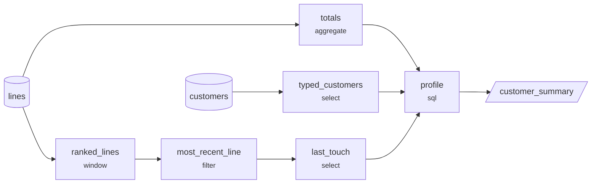
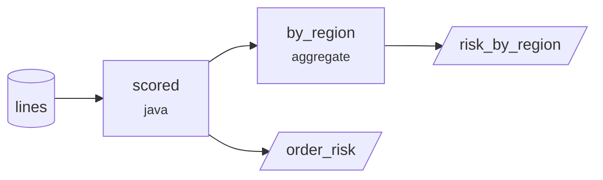
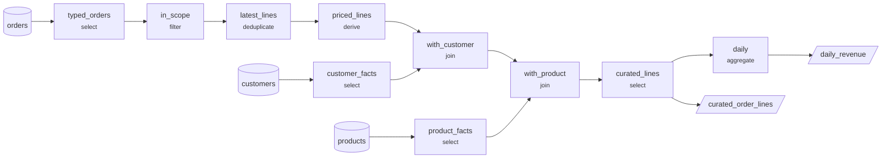

# Data catalogue

Generated by `foundry docs` from the metadata in `examples/retail/metadata`. Do not edit by hand.

Metadata fingerprint: `sha256:bca72548a9f04ff333ae1217859f05327fde9a6c4aac00bb730ac8bb6d9e2825`

## Contents

- [Pipelines](#pipelines)
  - [customer_profile](#pipeline-customer-profile)
  - [order_risk](#pipeline-order-risk)
  - [orders_daily](#pipeline-orders-daily)
- [Datasets](#datasets)
- [Schemas](#schemas)
- [Transform reference](#transform-reference)
- [Quality rule reference](#quality-rule-reference)

## Pipelines

### Pipeline: customer_profile

Builds the customer summary mart from the order line table that orders_daily produces. A second pipeline reading the first one's output is the ordinary case, and the only thing binding them together is the name of a dataset - each can be planned, checked and reasoned about on its own.

Defined in `pipelines/customer_profile.yaml`

#### Parameters

| Name | Type | Required | Default | Description |
| --- | --- | --- | --- | --- |
| `min_orders` | `int` | no | `1` | Customers with fewer orders than this are left out of the mart. |

#### Steps

| Step | Type | Reads | Produces | Detail |
| --- | --- | --- | --- | --- |
| `typed_customers` | `select` | `customers` | 4 columns | - |
| `ranked_lines` | `window` | `lines` | 16 columns | - |
| `most_recent_line` | `filter` | `ranked_lines` | 16 columns | - |
| `last_touch` | `select` | `most_recent_line` | 2 columns | - |
| `totals` | `aggregate` | `lines` | 5 columns | - |
| `profile` | `sql` | `totals`, `typed_customers`, `last_touch` | 9 columns | - |

Column detail

**`typed_customers`** - The customer attributes the mart shows, typed.

| Column | Planned type | Derived from |
| --- | --- | --- |
| `customer_id` | `string` | `customers.customer_id` |
| `full_name` | `string` | `customers.full_name` |
| `region` | `string` | `customers.region` |
| `segment` | `string` | `customers.segment` |

**`ranked_lines`** - Rank each customer's lines by recency so the most recent one can be picked out below. The window is declared once, at the step, and applies to every column it produces.

| Column | Planned type | Derived from |
| --- | --- | --- |
| `order_id` | `string` | `lines.order_id` |
| `line_sku` | `string` | `lines.line_sku` |
| `customer_id` | `string` | `lines.customer_id` |
| `order_date` | `date` | `lines.order_date` |
| `ordered_at` | `timestamp` | `lines.ordered_at` |
| `quantity` | `int` | `lines.quantity` |
| `unit_price` | `decimal(12,2)` | `lines.unit_price` |
| `discount` | `decimal(12,2)` | `lines.discount` |
| `line_total` | `decimal(14,2)` | `lines.line_total` |
| `status` | `string` | `lines.status` |
| `channel` | `string` | `lines.channel` |
| `region` | `string` | `lines.region` |
| `segment` | `string` | `lines.segment` |
| `category` | `string` | `lines.category` |
| `product_name` | `string` | `lines.product_name` |
| `recency_rank` | `int` | `row_number()` |

**`most_recent_line`**

| Column | Planned type | Derived from |
| --- | --- | --- |
| `order_id` | `string` | `ranked_lines.order_id` |
| `line_sku` | `string` | `ranked_lines.line_sku` |
| `customer_id` | `string` | `ranked_lines.customer_id` |
| `order_date` | `date` | `ranked_lines.order_date` |
| `ordered_at` | `timestamp` | `ranked_lines.ordered_at` |
| `quantity` | `int` | `ranked_lines.quantity` |
| `unit_price` | `decimal(12,2)` | `ranked_lines.unit_price` |
| `discount` | `decimal(12,2)` | `ranked_lines.discount` |
| `line_total` | `decimal(14,2)` | `ranked_lines.line_total` |
| `status` | `string` | `ranked_lines.status` |
| `channel` | `string` | `ranked_lines.channel` |
| `region` | `string` | `ranked_lines.region` |
| `segment` | `string` | `ranked_lines.segment` |
| `category` | `string` | `ranked_lines.category` |
| `product_name` | `string` | `ranked_lines.product_name` |
| `recency_rank` | `int` | `ranked_lines.recency_rank` |

**`last_touch`** - Just the part of the most recent line the mart shows.

| Column | Planned type | Derived from |
| --- | --- | --- |
| `customer_id` | `string` | `most_recent_line.customer_id` |
| `last_category` | `inferred` | `category` |

**`totals`** - Each customer's trading history, in one pass.

| Column | Planned type | Derived from |
| --- | --- | --- |
| `customer_id` | `string` | `grouping key` |
| `order_count` | `bigint` | `count(distinct order_id)` |
| `lifetime_spend` | `decimal(20,2)` | `sum(line_total)` |
| `first_order_at` | `timestamp` | `min(ordered_at)` |
| `last_order_at` | `timestamp` | `max(ordered_at)` |

**`profile`** - The escape hatch, and still under contract. The query names its inputs, which are registered as views under exactly those names, and it declares the columns it produces - so the runner checks its result like any other step's, and nothing downstream can be surprised by it.

| Column | Planned type | Derived from |
| --- | --- | --- |
| `customer_id` | `string` | `declared as string` |
| `full_name` | `string` | `declared as string` |
| `region` | `string` | `declared as string` |
| `segment` | `string` | `declared as string` |
| `order_count` | `bigint` | `declared as bigint` |
| `lifetime_spend` | `decimal(20,2)` | `declared as decimal(20,2)` |
| `first_order_at` | `timestamp` | `declared as timestamp` |
| `last_order_at` | `timestamp` | `declared as timestamp` |
| `last_category` | `string` | `declared as string` |

#### Quality rules

| Expectation | Applied to | Rule | If broken |
| --- | --- | --- | --- |
| `one_row_per_customer` | `profile` | `unique` | fail |
| `spend_is_not_negative` | `profile` | `range` | fail |
| `every_customer_is_in_the_master` | `profile` | `referential` | fail |

#### Column lineage

Every written column, traced back through the graph to the sources it reads.

**`customer_summary`**

| Column | Comes from |
| --- | --- |
| `customer_id` | `customers.customer_id`, `lines.customer_id` |
| `full_name` | `customers.full_name` |
| `region` | `customers.region` |
| `segment` | `customers.segment` |
| `order_count` | `lines.order_id` |
| `lifetime_spend` | `lines.line_total` |
| `first_order_at` | `lines.ordered_at` |
| `last_order_at` | `lines.ordered_at` |
| `last_category` | `lines.category` |

### Pipeline: order_risk

Scores order lines with a transform written in Java, then rolls the result up declaratively. The point of this pipeline is the division of labour: the scoring rules live in a class where they can be argued about and unit tested, and everything about the shape of the data - what the step reads, what it produces, what types, and what each column derives from - stays here, where it is reviewable and where the framework can check it.

Defined in `pipelines/order_risk.yaml`

#### Parameters

| Name | Type | Required | Default | Description |
| --- | --- | --- | --- | --- |
| `high_value_threshold` | `decimal` | no | `100.00` | What counts as a large line for scoring. Passed into the transform's options, so the same class can score strictly in one environment and leniently in another without a recompile. |

#### Steps

| Step | Type | Reads | Produces | Detail |
| --- | --- | --- | --- | --- |
| `scored` | `java` | `lines` | 10 columns | `com.example.retail.OrderRiskScore` |
| `by_region` | `aggregate` | `scored` | 4 columns | - |

Column detail

**`scored`** - The escape hatch, under contract. The class is resolved when this pipeline is validated, so a rename catches in a pre-commit hook; what it returns is checked against the schema below on every run.

| Column | Planned type | Derived from |
| --- | --- | --- |
| `order_id` | `string` | `schema retail.orders.risk` |
| `line_sku` | `string` | `schema retail.orders.risk` |
| `customer_id` | `string` | `schema retail.orders.risk` |
| `order_date` | `date` | `schema retail.orders.risk` |
| `region` | `string` | `schema retail.orders.risk` |
| `channel` | `string` | `schema retail.orders.risk` |
| `line_total` | `decimal(14,2)` | `schema retail.orders.risk` |
| `risk_score` | `int` | `schema retail.orders.risk` |
| `risk_band` | `string` | `schema retail.orders.risk` |
| `risk_reasons` | `array<string>` | `schema retail.orders.risk` |

**`by_region`** - Ordinary declarative work, downstream of the custom step. It is only checkable because 'scored' declared its shape: the planner knows 'risk_band' and 'line_total' will be there, and of what type.

| Column | Planned type | Derived from |
| --- | --- | --- |
| `region` | `string` | `grouping key` |
| `risk_band` | `string` | `grouping key` |
| `lines` | `bigint` | `count(1)` |
| `value_at_risk` | `decimal(18,2)` | `sum(line_total)` |

#### Quality rules

| Expectation | Applied to | Rule | If broken |
| --- | --- | --- | --- |
| `every_line_is_scored` | `scored` | `not_null` | fail |
| `scores_are_in_range` | `scored` | `range` | fail |
| `bands_are_known` | `scored` | `accepted_values` | fail |
| `lines_are_accounted_for` | `scored` | `unique` | fail |

#### Column lineage

Every written column, traced back through the graph to the sources it reads.

**`order_risk`**

| Column | Comes from |
| --- | --- |
| `order_id` | `lines.order_id` |
| `line_sku` | `lines.line_sku` |
| `customer_id` | `lines.customer_id` |
| `order_date` | `lines.order_date` |
| `region` | `lines.region` |
| `channel` | `lines.channel` |
| `line_total` | `lines.line_total` |
| `risk_score` | `lines.category`, `lines.channel`, `lines.discount`, `lines.line_total`, `lines.quantity`, `lines.status`, `lines.unit_price` |
| `risk_band` | `lines.category`, `lines.channel`, `lines.discount`, `lines.line_total`, `lines.quantity`, `lines.status`, `lines.unit_price` |
| `risk_reasons` | `lines.category`, `lines.channel`, `lines.discount`, `lines.line_total`, `lines.quantity`, `lines.status`, `lines.unit_price` |

**`risk_by_region`**

| Column | Comes from |
| --- | --- |
| `region` | `lines.region` |
| `risk_band` | `lines.category`, `lines.channel`, `lines.discount`, `lines.line_total`, `lines.quantity`, `lines.status`, `lines.unit_price` |
| `lines` | _a constant_ |
| `value_at_risk` | `lines.line_total` |

### Pipeline: orders_daily

Turns the storefront's raw order export into the warehouse's order line table and the daily revenue mart. Everything this pipeline knows about the shape of its data is declared here or in the schemas it references; there is no Java to read alongside it.

Defined in `pipelines/orders_daily.yaml`

#### Parameters

| Name | Type | Required | Default | Description |
| --- | --- | --- | --- | --- |
| `run_date` | `date` | yes | - | Orders placed after this date are left for a later run. Passing it explicitly is what makes a re-run of an old day reproduce that day. |
| `min_line_total` | `decimal` | no | `0.01` | Lines worth less than this are treated as data errors, not as sales. |

#### Steps

| Step | Type | Reads | Produces | Detail |
| --- | --- | --- | --- | --- |
| `typed_orders` | `select` | `orders` | 10 columns | - |
| `in_scope` | `filter` | `typed_orders` | 10 columns | - |
| `latest_lines` | `deduplicate` | `in_scope` | 10 columns | - |
| `priced_lines` | `derive` | `latest_lines` | 12 columns | - |
| `customer_facts` | `select` | `customers` | 3 columns | - |
| `product_facts` | `select` | `products` | 3 columns | - |
| `with_customer` | `join` | `priced_lines`, `customer_facts` | 14 columns | - |
| `with_product` | `join` | `with_customer`, `product_facts` | 17 columns | - |
| `curated_lines` | `select` | `with_product` | 15 columns | - |
| `daily` | `aggregate` | `curated_lines` | 6 columns | - |

Column detail

**`typed_orders`** - The one place raw text becomes typed data. Naming each column and its type here means a storefront that starts sending "N/A" in a numeric column breaks this step, loudly, instead of quietly nulling a revenue figure.

| Column | Planned type | Derived from |
| --- | --- | --- |
| `order_id` | `inferred` | `nullif(trim(order_id), '')` |
| `customer_id` | `inferred` | `nullif(trim(customer_id), '')` |
| `sku` | `inferred` | `upper(trim(sku))` |
| `quantity` | `int` | `quantity` |
| `unit_price` | `decimal(12,2)` | `unit_price` |
| `discount` | `decimal(12,2)` | `coalesce(nullif(trim(discount), ''), '0')` |
| `ordered_at` | `timestamp` | `ordered_at` |
| `status` | `inferred` | `lower(trim(status))` |
| `channel` | `inferred` | `lower(trim(channel))` |
| `received_at` | `timestamp` | `received_at` |

**`in_scope`** - Hold back anything the run date says has not happened yet.

| Column | Planned type | Derived from |
| --- | --- | --- |
| `order_id` | `inferred` | `typed_orders.order_id` |
| `customer_id` | `inferred` | `typed_orders.customer_id` |
| `sku` | `inferred` | `typed_orders.sku` |
| `quantity` | `int` | `typed_orders.quantity` |
| `unit_price` | `decimal(12,2)` | `typed_orders.unit_price` |
| `discount` | `decimal(12,2)` | `typed_orders.discount` |
| `ordered_at` | `timestamp` | `typed_orders.ordered_at` |
| `status` | `inferred` | `typed_orders.status` |
| `channel` | `inferred` | `typed_orders.channel` |
| `received_at` | `timestamp` | `typed_orders.received_at` |

**`latest_lines`** - The storefront re-delivers corrected lines under the same identifiers, so the newest delivery of each line wins. Which version is authoritative is a business decision, and this is where it is written down.

| Column | Planned type | Derived from |
| --- | --- | --- |
| `order_id` | `inferred` | `in_scope.order_id` |
| `customer_id` | `inferred` | `in_scope.customer_id` |
| `sku` | `inferred` | `in_scope.sku` |
| `quantity` | `int` | `in_scope.quantity` |
| `unit_price` | `decimal(12,2)` | `in_scope.unit_price` |
| `discount` | `decimal(12,2)` | `in_scope.discount` |
| `ordered_at` | `timestamp` | `in_scope.ordered_at` |
| `status` | `inferred` | `in_scope.status` |
| `channel` | `inferred` | `in_scope.channel` |
| `received_at` | `timestamp` | `in_scope.received_at` |

**`priced_lines`** - What each line was actually worth, and the day it belongs to.

| Column | Planned type | Derived from |
| --- | --- | --- |
| `order_id` | `inferred` | `latest_lines.order_id` |
| `customer_id` | `inferred` | `latest_lines.customer_id` |
| `sku` | `inferred` | `latest_lines.sku` |
| `quantity` | `int` | `latest_lines.quantity` |
| `unit_price` | `decimal(12,2)` | `latest_lines.unit_price` |
| `discount` | `decimal(12,2)` | `latest_lines.discount` |
| `ordered_at` | `timestamp` | `latest_lines.ordered_at` |
| `status` | `inferred` | `latest_lines.status` |
| `channel` | `inferred` | `latest_lines.channel` |
| `received_at` | `timestamp` | `latest_lines.received_at` |
| `line_total` | `decimal(14,2)` | `quantity * unit_price - discount` |
| `order_date` | `date` | `to_date(ordered_at)` |

**`customer_facts`** - Only the customer attributes the order table needs.

| Column | Planned type | Derived from |
| --- | --- | --- |
| `customer_id` | `string` | `customers.customer_id` |
| `region` | `string` | `customers.region` |
| `segment` | `string` | `customers.segment` |

**`product_facts`** - Only the product attributes the order table needs.

| Column | Planned type | Derived from |
| --- | --- | --- |
| `line_sku` | `inferred` | `upper(trim(sku))` |
| `category` | `string` | `products.category` |
| `product_name` | `string` | `products.product_name` |

**`with_customer`** - An inner join is safe here only because the referential expectation above has already set aside the lines whose customer is unknown. Without it this join would silently drop them.

| Column | Planned type | Derived from |
| --- | --- | --- |
| `customer_id` | `inferred` | `join key` |
| `order_id` | `inferred` | `priced_lines.order_id` |
| `sku` | `inferred` | `priced_lines.sku` |
| `quantity` | `int` | `priced_lines.quantity` |
| `unit_price` | `decimal(12,2)` | `priced_lines.unit_price` |
| `discount` | `decimal(12,2)` | `priced_lines.discount` |
| `ordered_at` | `timestamp` | `priced_lines.ordered_at` |
| `status` | `inferred` | `priced_lines.status` |
| `channel` | `inferred` | `priced_lines.channel` |
| `received_at` | `timestamp` | `priced_lines.received_at` |
| `line_total` | `decimal(14,2)` | `priced_lines.line_total` |
| `order_date` | `date` | `priced_lines.order_date` |
| `region` | `string` | `customer_facts.region` |
| `segment` | `string` | `customer_facts.segment` |

**`with_product`** - A left join: a product missing from the catalogue is a gap in the catalogue, not a reason to lose the sale.

| Column | Planned type | Derived from |
| --- | --- | --- |
| `customer_id` | `inferred` | `with_customer.customer_id` |
| `order_id` | `inferred` | `with_customer.order_id` |
| `sku` | `inferred` | `with_customer.sku` |
| `quantity` | `int` | `with_customer.quantity` |
| `unit_price` | `decimal(12,2)` | `with_customer.unit_price` |
| `discount` | `decimal(12,2)` | `with_customer.discount` |
| `ordered_at` | `timestamp` | `with_customer.ordered_at` |
| `status` | `inferred` | `with_customer.status` |
| `channel` | `inferred` | `with_customer.channel` |
| `received_at` | `timestamp` | `with_customer.received_at` |
| `line_total` | `decimal(14,2)` | `with_customer.line_total` |
| `order_date` | `date` | `with_customer.order_date` |
| `region` | `string` | `with_customer.region` |
| `segment` | `string` | `with_customer.segment` |
| `line_sku` | `inferred` | `product_facts.line_sku` |
| `category` | `string` | `product_facts.category` |
| `product_name` | `string` | `product_facts.product_name` |

**`curated_lines`** - States the order line table's columns in the order the schema declares them. Without this step the table's shape would be whatever the joins happened to produce.

| Column | Planned type | Derived from |
| --- | --- | --- |
| `order_id` | `inferred` | `with_product.order_id` |
| `line_sku` | `inferred` | `sku` |
| `customer_id` | `inferred` | `with_product.customer_id` |
| `order_date` | `date` | `with_product.order_date` |
| `ordered_at` | `timestamp` | `with_product.ordered_at` |
| `quantity` | `int` | `with_product.quantity` |
| `unit_price` | `decimal(12,2)` | `with_product.unit_price` |
| `discount` | `decimal(12,2)` | `with_product.discount` |
| `line_total` | `decimal(14,2)` | `with_product.line_total` |
| `status` | `inferred` | `with_product.status` |
| `channel` | `inferred` | `with_product.channel` |
| `region` | `string` | `with_product.region` |
| `segment` | `string` | `with_product.segment` |
| `category` | `string` | `with_product.category` |
| `product_name` | `string` | `with_product.product_name` |

**`daily`** - The daily revenue mart.

| Column | Planned type | Derived from |
| --- | --- | --- |
| `order_date` | `date` | `grouping key` |
| `region` | `string` | `grouping key` |
| `category` | `string` | `grouping key` |
| `revenue` | `decimal(18,2)` | `sum(line_total)` |
| `units` | `bigint` | `sum(quantity)` |
| `orders` | `bigint` | `count(distinct order_id)` |

#### Quality rules

| Expectation | Applied to | Rule | If broken |
| --- | --- | --- | --- |
| `order_identifiers_present` | `priced_lines` | `not_null` | quarantine |
| `lines_are_worth_something` | `priced_lines` | `expression` | quarantine |
| `customer_is_known` | `priced_lines` | `referential` | quarantine |
| `status_is_recognised` | `priced_lines` | `accepted_values` | warn |
| `one_row_per_line` | `curated_lines` | `unique` | fail |
| `something_was_loaded` | `curated_lines` | `row_count` | fail |

#### Column lineage

Every written column, traced back through the graph to the sources it reads.

**`curated_order_lines`**

| Column | Comes from |
| --- | --- |
| `order_id` | `orders.order_id` |
| `line_sku` | `orders.sku` |
| `customer_id` | `customers.customer_id`, `orders.customer_id` |
| `order_date` | `orders.ordered_at` |
| `ordered_at` | `orders.ordered_at` |
| `quantity` | `orders.quantity` |
| `unit_price` | `orders.unit_price` |
| `discount` | `orders.discount` |
| `line_total` | `orders.discount`, `orders.quantity`, `orders.unit_price` |
| `status` | `orders.status` |
| `channel` | `orders.channel` |
| `region` | `customers.region` |
| `segment` | `customers.segment` |
| `category` | `products.category` |
| `product_name` | `products.product_name` |

**`daily_revenue`**

| Column | Comes from |
| --- | --- |
| `order_date` | `orders.ordered_at` |
| `region` | `customers.region` |
| `category` | `products.category` |
| `revenue` | `orders.discount`, `orders.quantity`, `orders.unit_price` |
| `units` | `orders.quantity` |
| `orders` | `orders.order_id` |

## Datasets

| Dataset | Schema | Format | Location | Enforcement |
| --- | --- | --- | --- | --- |
| `curated_order_lines` | [`retail.orders.curated`](#schema-retail-orders-curated) | `parquet` | `${data}/curated/order_lines` | strict |
| `daily_revenue` | [`retail.revenue.daily`](#schema-retail-revenue-daily) | `parquet` | `${data}/marts/daily_revenue` | strict |
| `customer_summary` | [`retail.customers.summary`](#schema-retail-customers-summary) | `parquet` | `${data}/marts/customer_summary` | strict |
| `rejected_rows` | [`retail.quarantine`](#schema-retail-quarantine) | `parquet` | `${data}/quarantine/rows` | strict |
| `landing_orders` | [`retail.orders.landing`](#schema-retail-orders-landing) | `csv` | `${data}/landing/orders` | additive |
| `landing_customers` | [`retail.customers.landing`](#schema-retail-customers-landing) | `csv` | `${data}/landing/customers` | additive |
| `landing_products` | [`retail.products.landing`](#schema-retail-products-landing) | `csv` | `${data}/landing/products` | additive |
| `order_risk` | [`retail.orders.risk`](#schema-retail-orders-risk) | `parquet` | `${data}/marts/order_risk` | strict |
| `risk_by_region` | [`retail.risk.by_region`](#schema-retail-risk-by-region) | `parquet` | `${data}/marts/risk_by_region` | strict |

**`curated_order_lines`** - The warehouse's order line table. Strict enforcement: this table is owned by this warehouse, so a column appearing in it that nobody declared is a mistake, not a feature.

**`daily_revenue`** - Revenue by day, region and category, partitioned for the reporting layer.

**`customer_summary`** - One row per trading customer.

**`rejected_rows`** - Every row any pipeline turned away, with the rule that turned it away. Appended to rather than overwritten, because the history of what was rejected is as much a part of the record as the data that got through.

**`landing_orders`** - The storefront's nightly order export. Enforcement is additive because the storefront team adds columns without telling anyone - the ones this warehouse depends on must be there and be right, and anything else is allowed through and ignored.

**`landing_customers`** - The customer master export.

**`landing_products`** - The product catalogue export.

**`order_risk`** - Scored order lines, one row per line.

**`risk_by_region`** - Value at risk by region and band.

## Schemas

### Schema: retail.customers.summary (v1)

One row per customer who has ever ordered, with their trading history.

| Column | Type | Nullable | Tags | Description |
| --- | --- | --- | --- | --- |
| `customer_id` | `string` | no | `key` | Stable customer identifier. |
| `full_name` | `string` | yes | `pii:name` | Customer's name. |
| `region` | `string` | yes | - | Sales region. |
| `segment` | `string` | yes | - | Commercial segment. |
| `order_count` | `bigint` | yes | - | Distinct orders placed. |
| `lifetime_spend` | `decimal(20,2)` | yes | - | Everything this customer has spent, net of discounts. |
| `first_order_at` | `timestamp` | yes | - | When they first ordered. |
| `last_order_at` | `timestamp` | yes | - | When they last ordered. |
| `last_category` | `string` | yes | - | The category of their most recent order line. |

### Schema: retail.customers.landing (v1)

The customer master export, untyped as delivered.

| Column | Type | Nullable | Tags | Description |
| --- | --- | --- | --- | --- |
| `customer_id` | `string` | yes | `key` | Stable customer identifier. |
| `full_name` | `string` | yes | `pii:name` | Customer's name as given at sign-up. |
| `email` | `string` | yes | `pii:email` | Contact address. |
| `region` | `string` | yes | - | Sales region the customer belongs to. |
| `segment` | `string` | yes | - | Commercial segment - retail, trade or wholesale. |
| `signed_up_at` | `string` | yes | - | When the customer account was created, ISO-8601. |

### Schema: retail.orders.curated (v1)

One row per order line, typed, deduplicated, and enriched with the customer's region and the product's category. This is the table the rest of the warehouse is built from.

| Column | Type | Nullable | Tags | Description |
| --- | --- | --- | --- | --- |
| `order_id` | `string` | no | `key` | Storefront order identifier. |
| `line_sku` | `string` | no | `key` | Product code, normalised to upper case. |
| `customer_id` | `string` | no | - | Customer who placed the order. |
| `order_date` | `date` | yes | - | Calendar date the order was placed, in the warehouse time zone. |
| `ordered_at` | `timestamp` | yes | - | Exact time the order was placed. |
| `quantity` | `int` | yes | - | Units ordered on this line. |
| `unit_price` | `decimal(12,2)` | yes | - | Price per unit at the time of ordering. |
| `discount` | `decimal(12,2)` | yes | - | Absolute discount applied to this line, zero when none was given. |
| `line_total` | `decimal(14,2)` | yes | - | What this line was actually worth - quantity times price, less discount. |
| `status` | `string` | yes | - | Order status, lower-cased. |
| `channel` | `string` | yes | - | Where the order came from. |
| `region` | `string` | yes | - | Sales region, from the customer master. |
| `segment` | `string` | yes | - | Commercial segment, from the customer master. |
| `category` | `string` | yes | - | Merchandising category, from the product catalogue. |
| `product_name` | `string` | yes | - | Display name of the product. |

### Schema: retail.orders.risk (v1)

Each order line with a risk score, the band it falls into, and the reasons it scored what it did. Produced by a transform written in Java - the shape is declared here so that everything downstream of it can still be checked statically, and so that a reader knows what the table holds without opening the implementation.

| Column | Type | Nullable | Tags | Description |
| --- | --- | --- | --- | --- |
| `order_id` | `string` | no | `key` | Storefront order identifier. |
| `line_sku` | `string` | no | `key` | Product code. |
| `customer_id` | `string` | yes | - | Customer who placed the order. |
| `order_date` | `date` | yes | - | Calendar date the order was placed. |
| `region` | `string` | yes | - | Sales region. |
| `channel` | `string` | yes | - | Where the order came from. |
| `line_total` | `decimal(14,2)` | yes | - | Net value of the line. |
| `risk_score` | `int` | yes | - | Sum of the weights of every rule that matched, 0 to 110. |
| `risk_band` | `string` | yes | - | low, elevated or high, from the score. |
| `risk_reasons` | `array<string>` | yes | - | The code of every rule that matched, so a score can be explained rather than only reported. |

### Schema: retail.risk.by_region (v1)

How much value sits in each risk band, by region.

| Column | Type | Nullable | Tags | Description |
| --- | --- | --- | --- | --- |
| `region` | `string` | yes | `key` | Sales region. |
| `risk_band` | `string` | yes | `key` | low, elevated or high. |
| `lines` | `bigint` | yes | - | Order lines in this band. |
| `value_at_risk` | `decimal(18,2)` | yes | - | Total net value of those lines. |

### Schema: retail.orders.landing (v1)

Order lines exactly as the storefront exports them. Every column is a string, because that is what a CSV actually contains - typing happens in the pipeline, where it is reviewable, rather than by inference at read time.

| Column | Type | Nullable | Tags | Description |
| --- | --- | --- | --- | --- |
| `order_id` | `string` | yes | `key` | Storefront order identifier. Repeated across the lines of one order. |
| `customer_id` | `string` | yes | `foreign-key` | Identifier of the customer who placed the order. |
| `sku` | `string` | yes | - | Product code, as typed by the storefront and not always upper case. |
| `quantity` | `string` | yes | - | Units ordered on this line. |
| `unit_price` | `string` | yes | - | Price per unit at the time of ordering, in the order's currency. |
| `discount` | `string` | yes | - | Absolute discount applied to this line. Blank means none. |
| `ordered_at` | `string` | yes | - | When the order was placed, ISO-8601. |
| `status` | `string` | yes | - | Order status, in whatever case the storefront felt like. |
| `channel` | `string` | yes | - | Where the order came from - web, mobile or store. |
| `received_at` | `string` | yes | - | When this version of the line reached the landing zone. The storefront re-delivers corrected lines, so this is what decides which one wins. |

### Schema: retail.products.landing (v1)

The product catalogue export, untyped as delivered.

| Column | Type | Nullable | Tags | Description |
| --- | --- | --- | --- | --- |
| `sku` | `string` | yes | `key` | Product code. |
| `product_name` | `string` | yes | - | Display name of the product. |
| `category` | `string` | yes | - | Merchandising category. |
| `list_price` | `string` | yes | - | Catalogue price, before any order-level discount. |

### Schema: retail.quarantine (v1)

Rows turned away by a quality rule. One table serves every pipeline and every step, so the offending row is kept as JSON alongside the labels that say where it came from and which rule rejected it.

| Column | Type | Nullable | Tags | Description |
| --- | --- | --- | --- | --- |
| `pipeline` | `string` | no | - | The pipeline that rejected the row. |
| `step` | `string` | no | - | The step whose output the row was in. |
| `expectation` | `string` | no | - | The name of the expectation that rejected it. |
| `rule` | `string` | no | - | The rule behind that expectation. |
| `detected_at` | `timestamp` | no | - | When the rejection happened. |
| `row` | `string` | no | - | The rejected row, as JSON. |

### Schema: retail.revenue.daily (v1)

Revenue rolled up by day, region and category.

| Column | Type | Nullable | Tags | Description |
| --- | --- | --- | --- | --- |
| `order_date` | `date` | yes | `key` | Calendar date the orders were placed. |
| `region` | `string` | yes | `key` | Sales region. |
| `category` | `string` | yes | `key` | Merchandising category. |
| `revenue` | `decimal(18,2)` | yes | - | Sum of line totals. |
| `units` | `bigint` | yes | - | Total units sold. |
| `orders` | `bigint` | yes | - | Distinct orders contributing to this row. |

## Transform reference

| `type:` | Configuration keys | What it does |
| --- | --- | --- |
| `select` | `columns`, `from` | Produce exactly the listed columns, each from an expression over the input. |
| `derive` | `columns`, `from` | Add or replace columns, carrying the rest of the input through unchanged. |
| `filter` | `condition`, `from` | Keep only the rows matching a condition. |
| `rename` | `columns`, `from` | Rename columns, written as oldName: newName. |
| `drop` | `columns`, `from` | Remove the named columns from the input. |
| `cast` | `columns`, `from` | Change column types, written as column: type. |
| `join` | `condition`, `how`, `left`, `on`, `right` | Join two inputs on shared key columns or an explicit condition. |
| `union` | `allowMissingColumns`, `byName`, `inputs` | Stack several inputs into one, matched by column name. |
| `aggregate` | `from`, `groupBy`, `measures` | Group by columns and compute measures over each group. |
| `distinct` | `columns`, `from` | Remove duplicate rows, optionally after projecting to a subset of columns. |
| `deduplicate` | `from`, `keys`, `orderBy` | Keep one row per key, chosen by an explicit ordering. |
| `window` | `columns`, `frame`, `from`, `orderBy`, `partitionBy` | Add columns computed over a window: running totals, ranks, lag and lead. |
| `sql` | `inputs`, `lineage`, `outputs`, `query`, `schema` | Run Spark SQL over the declared inputs, producing the declared columns. |
| `java` | `class`, `from`, `inputs`, `lineage`, `options`, `outputs`, `schema` | Run a transformation written in Java, against the output contract the step declares. |

## Quality rule reference

| `rule:` | Configuration keys | Can quarantine | What it checks |
| --- | --- | --- | --- |
| `not_null` | `columns` | yes | Every listed column has a value on every row. |
| `unique` | `columns` | yes | No two rows share the same combination of the listed columns. |
| `accepted_values` | `allowNull`, `column`, `values` | yes | A column only holds one of a fixed set of values. |
| `range` | `allowNull`, `column`, `max`, `maxInclusive`, `min`, `minInclusive` | yes | A column stays between the given bounds. |
| `regex` | `allowNull`, `column`, `pattern` | yes | A column matches a regular expression. |
| `expression` | `expr` | yes | An arbitrary boolean expression holds for every row. |
| `row_count` | `max`, `min` | no | The step produces a row count within the given bounds. |
| `referential` | `columns`, `referencedColumns`, `references` | yes | Every key in this step exists in another step's result. |

